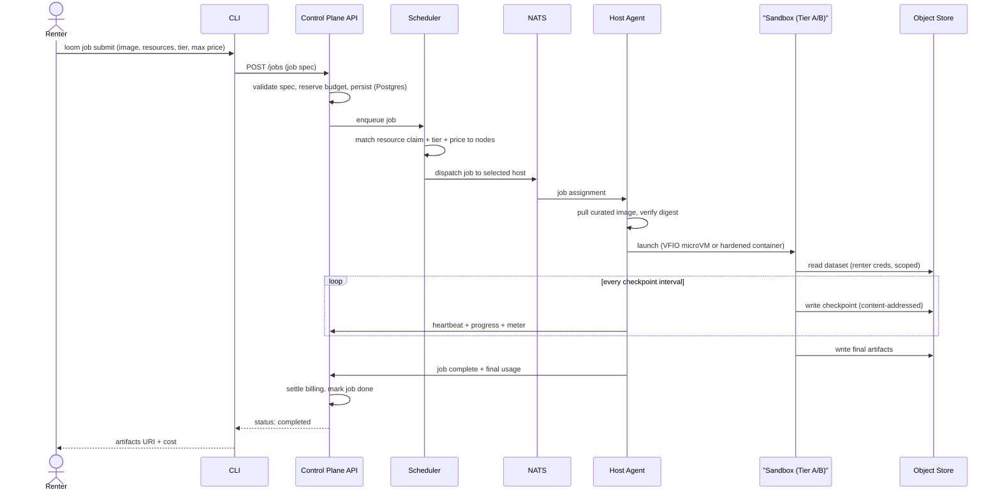
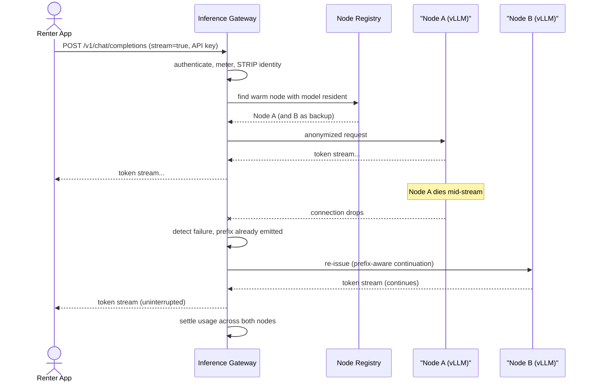
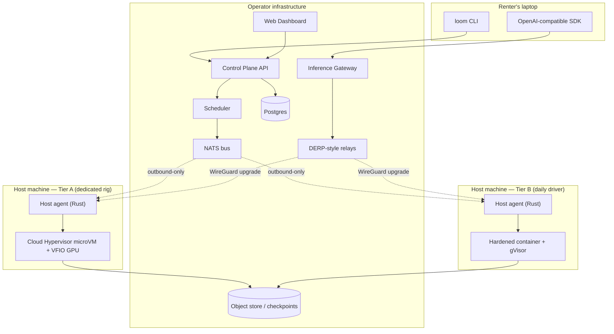

# Loom Architecture Overview

Loom is a distributed GPU compute marketplace. Individuals install a lightweight host agent and rent out idle consumer and prosumer GPUs; renters run ML workloads — testing, training, fine-tuning — in managed sandboxes, or serve models behind a serverless, OpenAI-compatible inference API. The defining constraint is that supply lives on *other people's machines*: residential connections behind NAT, daily-driver desktops that also play games, and headless rigs in a closet. Every architectural decision in this document flows from that constraint.

This is the top-level map. It defines the actors, names every component, walks two end-to-end flows, records the technology bets, and — just as importantly — states plainly what Loom is *not*. Sibling documents go deep on each subsystem: the [host agent](../platform/host-agent.md), [isolation](../platform/isolation.md), the [control plane](../platform/control-plane.md), [networking](../platform/networking.md), and [security](../platform/security.md); and on the ML side, [data](../ml-lifecycle/data.md), [training](../ml-lifecycle/training.md), [evaluation](../ml-lifecycle/evaluation.md), [serving](../ml-lifecycle/serving.md), and [environments](../ml-lifecycle/environments.md).

## Actors and products

**Hosts** supply GPUs. A host downloads a single binary, runs it, and enrolls one or more machines. The agent inventories hardware, benchmarks it, advertises capacity subject to an idle-time policy, and earns per-second while workloads run. Hosts range from a student with one RTX 4070 that's idle overnight to a small operator with a rack of dedicated 3090s. Loom treats these differently only through *isolation tiers* (below), never through trust in the host's honesty.

**Renters** consume GPUs, and split cleanly into two products:

- **Managed compute jobs.** A renter submits a job — a curated runtime image, a resource claim (GPU class, VRAM, CPU, disk), an isolation tier, and a max price — and Loom schedules it onto a matching host, runs it sandboxed, streams logs, and checkpoints to object storage so the job survives a host vanishing. This is the fine-tuning / training / batch-eval product. See [training](../ml-lifecycle/training.md) and [environments](../ml-lifecycle/environments.md).
- **Serverless inference.** A renter (or their application) sends an OpenAI-compatible request to a gateway. Loom authenticates, bills, strips identity, and routes it to a warm node running [vLLM](../ml-lifecycle/serving.md) with the requested model resident. Tokens stream back through the gateway. The renter never learns which host served them, and the host never learns who the renter is.

**Operators** are us: the Loom team running the control plane, gateways, relay infrastructure, and marketplace. Operator infrastructure is deliberately small and boring — it is a coordination layer, not a datacenter. Operators also curate the runtime image catalog, set trust-tier labeling policy, and adjudicate the [marketplace](../product/marketplace.md) (pricing floors, payouts, dispute handling).

## Component inventory

**Host agent.** A single statically-linked Rust binary, a few megabytes, a few MB of RAM at idle. It makes only *outbound* connections — a QUIC control channel with a WSS fallback for hostile middleboxes, while bulk data (images, weights) moves over HTTP range requests and P2P chunk sharing ([networking.md](../platform/networking.md)) — so a host never opens an inbound port or touches their router. At enrollment it inventories hardware via NVML (`nvidia-container-toolkit` stack) or `rocm-smi`, runs a short benchmark to produce a performance fingerprint that anchors the machine's advertised class, and registers with the control plane. At runtime it enforces the idle-time policy, launches workloads inside the machine's isolation tier, meters usage per second, and reports health. It holds no long-lived renter data: scratch is `tmpfs`, VRAM is scrubbed between tenants, and nothing renter-owned is written in plaintext to the host disk. Full detail in [host-agent.md](../platform/host-agent.md).

**Control plane.** API + scheduler + state, running on operator infrastructure. Technology is deliberately unexciting: a stateless API service, a scheduler, **Postgres** as the source of truth (jobs, users, nodes, billing ledger), and **NATS** as the message bus between control plane and the host fleet. A job spec is `image + resource claim + isolation tier + max price`; billing is per-second. Nodes are cattle — checkpoint, requeue, and failover are core paths, not afterthoughts, because a consumer host disappearing mid-job is the *expected* case. See [control-plane.md](../platform/control-plane.md).

**Relay network.** Hosts are behind NAT and never accept inbound connections, so Loom runs a DERP-style relay mesh: every session starts relayed through an operator-run relay server, and Loom attempts to upgrade to a direct **WireGuard** connection via NAT hole-punching whenever the two ends can reach each other. Relays are dumb pipes for end-to-end-encrypted ciphertext; they never see plaintext. This is the same architecture Tailscale uses in production — start relayed, upgrade to direct, fall back to relay under hard/symmetric NAT ([Tailscale connection types](https://tailscale.com/docs/reference/connection-types), [DERP servers](https://tailscale.com/docs/reference/derp-servers)). See [networking.md](../platform/networking.md).

**Inference gateway.** The front door for serverless inference. It terminates the OpenAI-compatible API, authenticates and meters the caller, and — critically — **strips renter identity** before routing so the serving host receives an anonymized request. It picks a warm node with the model resident, proxies the streaming response, and performs **mid-stream failover**: if the serving node dies while emitting tokens, the gateway reissues the request to another node and continues the stream. See [serving.md](../ml-lifecycle/serving.md).

**Weight cache.** Model weights are large and residential upload is slow, so weights are content-addressed and distributed **peer-to-peer** between nodes: the gateway pre-places a model onto candidate nodes ahead of demand, and nodes fetch chunks from each other rather than all pulling from a central origin. The first-generation policy is **whole-model-per-node** — each serving node holds the entire model — because cross-node tensor/pipeline disaggregation (NVIDIA Dynamo-style) is unsuitable over residential links today. See [serving.md](../ml-lifecycle/serving.md).

**Web dashboard + CLI.** Two thin clients over the control-plane API. The dashboard is where hosts enroll machines, set idle policy, and watch earnings, and where renters submit jobs, browse the marketplace, and read logs. The CLI (`loom`) is the primary renter surface for real work — submit a job, tail logs, pull checkpoints, manage inference deployments and API keys — and is scriptable for CI. Neither client holds authority; both are stateless front-ends to the API.

## Flow A — fine-tuning job, submit to completion

The renter submits a job spec through the CLI. The API validates it, reserves budget against the renter's account so a runaway job can't overspend `max price`, and persists it to Postgres. The scheduler matches the resource claim, requested isolation tier, and price ceiling against advertised, idle-eligible nodes, then dispatches over NATS to the winning host. The agent pulls the requested **curated** image (arbitrary Dockerfiles are not accepted at launch — see [environments](../ml-lifecycle/environments.md)) and verifies its digest before running anything.

The workload runs inside the machine's isolation tier: on a dedicated rig this is a **Cloud Hypervisor** microVM with **VFIO** GPU passthrough; on a daily-driver machine it's a container via `nvidia-container-toolkit`, hardened with gVisor `runsc` + `nvproxy` where the workload tolerates it (see [isolation.md](../platform/isolation.md)). The sandbox pulls the dataset from object storage using scoped, short-lived renter credentials, and — this is the load-bearing part — checkpoints to the **object store**, not the host disk, on a fixed interval. Because state lives off-host, a host that powers down mid-job costs the renter a requeue and a few minutes of recomputation, not the run. When the job finishes, the agent reports final usage, the API settles per-second billing, and the renter gets an artifacts URI and a cost. If the host had died instead, the scheduler would have requeued from the last checkpoint onto a fresh node — the same path, just triggered by a missed heartbeat.

## Flow B — inference request with mid-stream failover

An application calls the OpenAI-compatible endpoint with an API key and `stream=true`. The gateway authenticates the caller, opens a metering record, and **strips renter identity** so nothing that reaches a host can attribute the request to a person or account — this identity-stripping is structural, the *primary* renter-from-host protection, not an add-on (see [security.md](../platform/security.md)). The gateway consults the node registry for a warm node with the requested model already resident (thanks to the weight cache's pre-placement), routes the anonymized request to Node A, and proxies tokens straight back to the caller as they arrive.

Then Node A dies — someone opened a game, the machine slept, the residential link dropped. The gateway detects the broken connection, knows exactly which prefix it has already emitted to the client, and re-issues a prefix-aware continuation to Node B, which also holds the model. Tokens resume; from the caller's perspective the stream never broke. Usage is settled across both nodes for the segments each actually served. This is why the first-generation policy is **whole-model-per-node**: any warm node is a complete failover target, with no cross-node coordination on the critical path. Disaggregated serving would make every request depend on multiple flaky residential nodes staying up simultaneously — the opposite of what we want.

## Technology decisions at a glance

| Component | Choice | Rejected alternatives | Why |
|---|---|---|---|
| Tier A isolation | Cloud Hypervisor microVM + VFIO passthrough | Firecracker; bare QEMU | Firecracker [has no GPU/PCI passthrough by design](https://northflank.com/blog/firecracker-vs-cloud-hypervisor); Cloud Hypervisor [supports VFIO GPU passthrough](https://github.com/cloud-hypervisor/cloud-hypervisor/blob/main/docs/vfio.md) with a smaller attack surface than QEMU |
| Tier B isolation | Container (`nvidia-container-toolkit`) + gVisor `runsc`/`nvproxy` | Plain Docker; VM-per-container | On a daily-driver we can't monopolize the card; a hardened container is the honest ceiling and we label it as such |
| Control plane | Postgres + NATS + custom scheduler | Kubernetes; Nomad; Ray | Hosts are single machines behind NAT, not a cluster we administer — K8s assumes a fleet you own and can reach inbound; we need a coordinator for cattle nodes, not an orchestrator (see below) |
| Host agent | Single static Rust binary, outbound-only | Python daemon; sidecar container | Trivial install, tiny footprint, no inbound ports, no runtime deps on a stranger's machine |
| Inference engine | vLLM | SGLang; TGI; raw PyTorch | Widely-adopted [OpenAI-compatible server](https://docs.vllm.ai/en/latest/serving/online_serving/) with [PagedAttention + continuous batching](https://docs.vllm.ai/); SGLang/TGI remain candidates for specific model families |
| Networking | DERP-style relay + WireGuard direct upgrade | Public IP + inbound ports; pure relay | Matches [Tailscale's proven start-relayed-then-upgrade model](https://tailscale.com/docs/reference/connection-types); no host ever exposes a port |
| Weight distribution | Content-addressed + P2P chunk fetch | Central object store fetch per node | Residential upload is scarce; P2P amortizes distribution and enables pre-placement |
| Serving topology | Whole-model-per-node | Dynamo-style disaggregation | Disaggregation over residential links multiplies failure surface; every warm node should be a complete failover target |
| Runtime images | Curated catalog | Arbitrary user Dockerfiles | Reduces supply-chain and escape surface on untrusted hosts at launch; opens up later |

On **not building the host fleet on Kubernetes**: this is a deliberate, load-bearing decision. Kubernetes models a cluster of machines an operator owns, can reach on a private network, and administers as one pool. Loom's supply is the exact opposite — thousands of independently-owned single machines, each behind residential NAT, each of which can vanish without notice and which we can only reach via outbound connections they initiate. A Kubernetes kubelet expects a controllable node on a flat network; our "node" is a stranger's gaming PC. So the control plane is a lightweight coordinator (Postgres for truth, NATS for dispatch, a scheduler that treats disappearance as normal), not a cluster orchestrator. This keeps operator infrastructure small and makes checkpoint/requeue/failover first-class rather than bolted on. See [control-plane.md](../platform/control-plane.md).

## Deployment topology

The split is clean. **Operator infrastructure** runs the coordination layer only: API, scheduler, Postgres, NATS, inference gateway, relay servers, dashboard, and the object store for datasets and checkpoints. **Host machines** run just the Rust agent plus whatever sandbox the tier dictates — a Cloud Hypervisor microVM on a dedicated rig, a hardened container on a daily driver — and connect *outbound* to the operator's NATS and relays. The **renter's laptop** runs only thin clients: the `loom` CLI and any OpenAI-compatible SDK pointed at the gateway. No compute or authority lives on the renter's laptop, and no inbound reachability is ever required of a host. Deployment specifics are in [deployment.md](../product/deployment.md).

## What Loom is not

We are honest about the boundaries, because pretending otherwise would ship bugs and break trust.

- **Not a hyperscaler replacement.** Loom is not AWS/GCP/Azure and does not aim to be. There is no managed Postgres, no VPC peering, no 99.99% single-instance SLA on a consumer GPU that might be turned off to play a game. Loom is a price/availability play on *idle* consumer and prosumer silicon, in the spirit of marketplaces like Vast.ai and RunPod's community cloud — cheaper capacity with weaker single-node guarantees, which is [exactly the tradeoff those community/peer-to-peer tiers make](https://www.runpod.io/articles/alternatives/vastai). Our answer to flakiness is architectural (checkpoint, requeue, failover), not a promise that hosts won't disappear.
- **Not for multi-node WAN distributed training of large models.** Residential uplinks are slow and jittery; synchronous gradient exchange or tensor/pipeline parallelism across hosts on the public internet is a non-starter today. Loom targets jobs that fit on a single card (or a single multi-GPU rig on a LAN): fine-tuning, LoRA/PEFT, evaluation, batch inference. Whole-model-per-node serving reflects the same reality.
- **Not confidential compute on consumer cards.** Consumer GPUs have no TEE silicon, so in-use encryption of renter data against a malicious host is *impossible* on this hardware — we will not claim it. Our renter-from-host protections are structural and honest: gateway identity-stripping (primary), ephemeral-everything (VRAM scrub, `tmpfs` scratch, no plaintext on host disk), and honest tier labeling so renters know what they're getting. A future **confidential tier** on AMD SEV-SNP / Intel TDX CPUs paired with NVIDIA H100/Blackwell Confidential Computing, with remote attestation and attestation-gated key release, is the real answer — and the wire protocol already reserves trust-tier and attestation fields so we can add it without a breaking change. See [security.md](../platform/security.md).
- **Not a whole-card timeshare.** Consumer GPUs have no SR-IOV/vGPU, so allocation is whole-card only. There is no fractional-GPU multi-tenancy on a single consumer card in Loom.

## Open questions

- **Idle-policy fairness vs. availability.** How aggressively can we preempt a Tier B host when its owner returns, without making the marketplace unusable for renters? What's the right eviction grace period, and does it need to be per-job-tier?
- **Benchmark fingerprint drift.** Enrollment benchmarks anchor a machine's advertised class, but thermals, driver versions, and background load shift real performance. How often do we re-fingerprint, and how do we detect a host quietly under-delivering against its advertised class?
- **P2P weight distribution under churn.** Whole-model-per-node plus P2P chunk fetch assumes enough warm peers to seed from. What's the cold-start behavior for a rarely-used model, and when does pre-placement cost exceed its benefit?
- **Failover accounting edge cases.** In mid-stream inference failover, how do we bill fairly across two nodes for partially-served requests, and how do we prevent double-charging or gaming via induced failover?
- **Trust-tier disclosure UX.** Honest tier labeling only works if renters understand it. How do we surface "this ran on an unencryptable consumer card" without either burying it or scaring off the mainstream?
- **Curated-image escape valve.** Curated-only images are safe but limiting. What's the graduation path to trusted custom images (attested base layers? reputation-gated hosts? confidential tier only?) and when do we open it?
