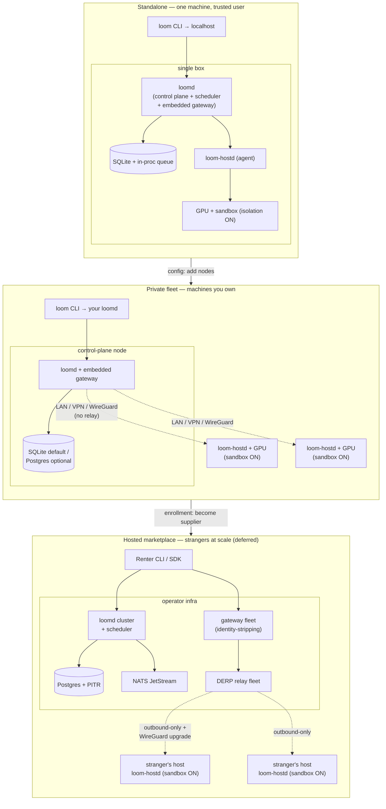

# Deployment profiles

Loom's core product is a **self-hostable GPU compute stack**: anyone can deploy the entire backend — data, training, evaluation, inference/serving — on their own GPUs and get the full ML lifecycle without renting a thing. The operator-run marketplace is an *optional layer on top*, not the ground floor. This document defines the three profiles that shape ships, what collapses out of the stack in each, and how you move between them.

The design pressure is the same one that shapes the whole system — **hosts are single machines, isolation is defense-in-depth, nodes are cattle** — but the *trust environment* changes profile to profile, and most of the marketplace apparatus (billing, identity-stripping, reputation, relay fleet) exists only to make *strangers* safely transact. When there are no strangers, that apparatus is dead weight, so we compile or config it out.

Three profiles, in increasing order of trust boundary:

1. **Standalone** — one machine, one trusted user. Your gaming PC or a new GPU server runs the whole stack on itself.
2. **Private fleet** — several machines you own, one control plane, the rest agents, over your LAN/VPN.
3. **Hosted marketplace** — the operator-run service in the existing docs: strangers renting to strangers, with billing, identity-stripping, reputation, and a relay fleet. **Deferred focus.**

The first two are the self-host story and the current build priority. The third is fully specified across the rest of `docs/` and remains valid, but its development is deferred (see [ADR-0014](../adr/0014-deployment-profiles-marketplace-optional.md)). See [`../platform/backend.md`](../platform/backend.md) for the single-binary internals, [`../product/self-host.md`](../product/self-host.md) for the operator's how-to, [`control-plane.md`](../platform/control-plane.md) for the coordinator, and [`../platform/security.md`](../platform/security.md) for the trust model these profiles select from.

## The single-binary core

Everything below rests on one decision ([ADR-0013](../adr/0013-single-binary-self-host-control-plane.md)): the control plane is **`loomd`**, a single lightweight Rust binary. Storage sits behind a **repository trait** — SQLite embedded by default, Postgres behind a feature flag — and the message bus sits behind a **bus trait** — an in-process queue by default, NATS optional at marketplace scale. The host agent is **`loom-hostd`**, unchanged from [`host-agent.md`](../platform/host-agent.md). "Lightweight" is a hard product constraint: `loomd` targets < 100 MB RSS idle, `loom-hostd` < 30 MB, no JVM or Python in the core stack (Python lives only inside job images), no Kubernetes, no Docker required for `loomd` itself. The same two binaries serve all three profiles; the profile only decides which modules light up and what they're pointed at.

## The three profiles

### Standalone — one machine

`loomd` and `loom-hostd` run side-by-side on the same box. The control plane, the scheduler, and an embedded inference gateway all live inside `loomd`; the agent claims the local GPU. Storage is embedded SQLite; the job queue is in-process. There is no billing, no identity-stripping, no relay — everything is localhost, so there is nothing to anonymize and no NAT to traverse. There is a **single trusted user**, and the `loom` CLI simply points at `localhost`.

This is the "install it on my gaming PC and fine-tune tonight" experience. The whole backend is two processes (arguably one box's worth of one binary plus an agent), a SQLite file, and a CLI. On **macOS/Apple silicon** standalone (e.g. an M3 Max), jobs run via the **`ProcessDriver`** — a plain host process, no container isolation, acceptable precisely because standalone is a single trusted user — and the **MLX backend is first-class** there (the only path to Metal); see [../platform/compute-backends.md](../platform/compute-backends.md) ([ADR-0015](../adr/0015-pluggable-compute-backends.md)).

### Private fleet — machines you own

You own several machines. One runs `loomd`; the rest run `loom-hostd` pointed at it over your LAN, VPN, or WireGuard mesh. SQLite is still the default and comfortably carries a handful of nodes; Postgres is available (flip the feature) if the fleet grows enough to want concurrent-writer headroom. Trust between your own machines is *implicit* — you own all of them — but the **isolation tiers remain available** as defense-in-depth: a bad dependency in a job image is a threat to your fleet whether or not the operator is a stranger.

This is a lab, a startup's GPU closet, or a research group pooling rigs. No money changes hands, so the marketplace modules stay dark, but the coordinator earns its keep: real scheduling across several nodes, checkpoint/requeue when a node reboots, and one gateway fronting several serving replicas.

### Hosted marketplace — strangers at scale

The operator-run service already specified across `docs/`: billing and metering-for-money, gateway identity-stripping, reputation scoring, benchmark-fingerprint fraud defense, and the DERP-style relay fleet. Storage is Postgres; the bus is NATS. This is where every marketplace-only module turns on, because now the parties are mutually untrusting strangers and the whole apparatus exists to make that safe. **Development deferred** — the docs stand, the code waits.

## Component-collapse table

What runs where, and what's disabled, per profile. "Core" modules are always present; "marketplace" modules are compile-time/config-gated and off unless the marketplace profile turns them on.

| Component | Standalone | Private fleet | Hosted marketplace |
|---|---|---|---|
| `loomd` (control plane + scheduler) | ✅ same box as agent | ✅ one dedicated node | ✅ operator infra, scaled |
| Embedded inference gateway | ✅ in-process, localhost | ✅ in-process, fronts fleet | ✅ standalone gateway fleet |
| `loom-hostd` agent | ✅ same box | ✅ every worker node | ✅ every host, self-serve enrolled |
| Storage | SQLite (embedded) | SQLite default / Postgres optional | Postgres (+ replicas, PITR) |
| Message bus | in-process queue | in-process queue | NATS JetStream |
| Isolation tiers (sandbox) | ✅ **on by default** | ✅ **on by default** | ✅ on, tier-labeled |
| Checkpoint / requeue / failover | ✅ (single-node requeue) | ✅ across your nodes | ✅ across the fleet |
| Billing / metering-for-money | ❌ disabled | ❌ disabled | ✅ enabled |
| Gateway identity-stripping | ❌ n/a (trusted user) | ❌ n/a (you own it) | ✅ **structural** |
| Reputation / reliability scoring | ❌ | ⚙️ optional, informational | ✅ feeds scheduling + pricing |
| Benchmark-fingerprint fraud defense | ❌ | ❌ (trust implicit) | ✅ enrollment + re-bench |
| Relay fleet + WireGuard NAT traversal | ❌ localhost | ⚙️ LAN/VPN/WireGuard, no relay | ✅ DERP relay + direct upgrade |
| Web dashboard | ⚙️ optional local | ⚙️ optional local | ✅ full console |
| CLI (`loom`) | ✅ → localhost | ✅ → your `loomd` | ✅ → operator API |

Legend: ✅ on, ❌ off/not applicable, ⚙️ optional.

The load-bearing observation: **isolation stays on everywhere.** The marketplace mechanisms (identity-stripping, ephemeral-everything as a privacy claim, benchmark fingerprinting) defend the *renter from a malicious host* and the *host's earnings from fraud* — threats that only exist among strangers. Sandbox isolation defends against a different adversary entirely: **malicious workload code** — a poisoned dependency, a compromised training script, an escape attempt from inside a job image. That adversary is present even on your own single machine, so isolation is defense-in-depth we do **not** switch off just because trust is implicit. This is the "malicious workload vs host" direction of the [threat model](../platform/security.md) (Direction 1), which is orthogonal to the profile.

## Security mechanisms per profile

The security doc ([`../platform/security.md`](../platform/security.md)) specifies two threat directions and several mechanisms. Profiles select among them:

- **Sandbox isolation (Tier A/B):** on by default in **all three** profiles. Defends host against malicious *workload code*. Never gated by trust environment. In the self-host profiles, "isolation on by default" means the **container sandbox** — runc hardening: seccomp, dropped capabilities, and the egress policy — because a self-hoster runs their own code (a trusted user); **gVisor `runsc`/`nvproxy` is a qualification-gated upgrade**, config-selectable but mandatory only when running strangers' code (the marketplace / untrusted-workload case), not a day-one requirement for running your own jobs on your own box.
- **Gateway identity-stripping** ([security.md](../platform/security.md) §4): a **marketplace** mechanism. Standalone and private-fleet have no untrusted renter to anonymize, so it's not applicable. Structural and primary only in the hosted profile.
- **Ephemeral-everything** (VRAM scrub, `tmpfs` scratch, no plaintext on disk — [security.md](../platform/security.md) §5): the *hygiene* value (don't leave renter data lying around) is a marketplace concern, but the mechanics are cheap and stay on by default everywhere as good hygiene; only their role as a *renter-from-host privacy claim* is marketplace-specific.
- **Benchmark-fingerprint fraud defense:** a **marketplace** mechanism — it exists to catch a host *lying about hardware to earn more money*. Meaningless when you own the hardware; off in standalone and private-fleet.
- **Reputation / reliability scoring:** marketplace-gated for money and scheduling; optionally surfaced as informational fleet health in private-fleet, never authoritative there.
- **Honest tier labeling:** a marketplace disclosure mechanism (telling a renter what assurance they bought). Irrelevant when you are your own renter.

Rule of thumb: **if a mechanism protects a stranger from another stranger, it's marketplace-gated; if it protects a machine from the code it runs, it's always on.**

## Storage and bus per profile

The repository and bus traits let one binary span three orders of magnitude of scale:

| | Storage | Bus |
|---|---|---|
| Standalone | SQLite file, embedded | in-process channel queue |
| Private fleet | SQLite default; Postgres optional | in-process queue |
| Hosted marketplace | Postgres (primary + replicas, PITR) | NATS JetStream |

SQLite + in-process queue is the default because it needs **zero external services** — the self-host promise is "one binary and a data file," not "stand up Postgres and NATS first." Postgres buys concurrent-writer throughput and the operational maturity (PITR, streaming replicas) the money path wants; NATS buys durable cross-process streams and req/reply at fleet scale. Neither is on the critical path for self-hosting, which is exactly the amendment [ADR-0013](../adr/0013-single-binary-self-host-control-plane.md) makes to [ADR-0004](../adr/0004-no-kubernetes-control-plane.md): Postgres+NATS is the *marketplace-scale configuration*, not the core requirement.

## Networking per profile

Networking collapses hardest of all:

- **Standalone — localhost.** `loomd`, `loom-hostd`, and the gateway all talk over loopback. No relay, no NAT traversal, no WireGuard. Nothing leaves the box.
- **Private fleet — LAN / VPN / WireGuard, no relay.** Agents reach `loomd` directly over your own network. If your nodes are behind separate NATs (e.g. a home rig and a colo box), a WireGuard mesh connects them — but there is **no operator relay fleet**, because you control both ends and can route directly. The outbound-only agent posture ([`../platform/networking.md`](../platform/networking.md)) still holds if you want it, but on a trusted LAN it's optional.
- **Hosted marketplace — relay fleet.** Strangers' hosts are behind residential NAT and never accept inbound connections, so the full DERP-style relay mesh with WireGuard direct-upgrade ([overview.md](./overview.md), [networking.md](../platform/networking.md)) is required. This is the heaviest networking configuration and exists only because the parties can't reach each other directly and don't trust the path.

## Upgrade path between profiles

The profiles are a ladder, and each rung up is cheap:

- **Standalone → private fleet is configuration.** Keep `loomd` where it is, install `loom-hostd` on the new machines, point them at the existing `loomd` over your LAN/VPN, and (optionally) flip storage to Postgres if the node count warrants it. No data migration beyond the storage backend swap; no new trust model. The scheduler that was placing jobs on one local node now places across several.
- **Private fleet → hosted marketplace is enrollment.** This is the real boundary, because it crosses from *implicit trust* to *strangers*. Turning on the marketplace means enabling the gated modules (billing, identity-stripping, reputation, fingerprinting, relay fleet), moving to Postgres+NATS, and — critically — **enrolling as a supplier** into an operator-run marketplace: your fleet becomes advertised supply, subject to the marketplace's reputation, payout, and fraud machinery. This is not a config flip; it's opting into a different trust environment with a different operator. It's deferred, and it's where the [roadmap](../product/roadmap.md) marketplace phases pick up.

The asymmetry is deliberate: going from one machine to a fleet you own should feel like adding a node, and it does. Going from a private fleet to a public marketplace is a genuine trust-boundary crossing, and the friction there is honest.

## Topologies

The three topologies share the same two binaries and the same core logic. What changes left to right is the trust boundary — trusted user, trusted fleet, mutually-untrusting strangers — and the machinery each boundary demands. Self-host lives in the first two columns; the marketplace is the deferred third.

---

*Related: [`../platform/backend.md`](../platform/backend.md) · [`../product/self-host.md`](../product/self-host.md) · [`../platform/control-plane.md`](../platform/control-plane.md) · [`../platform/security.md`](../platform/security.md) · [`../platform/networking.md`](../platform/networking.md) · [ADR-0013](../adr/0013-single-binary-self-host-control-plane.md) · [ADR-0014](../adr/0014-deployment-profiles-marketplace-optional.md)*
