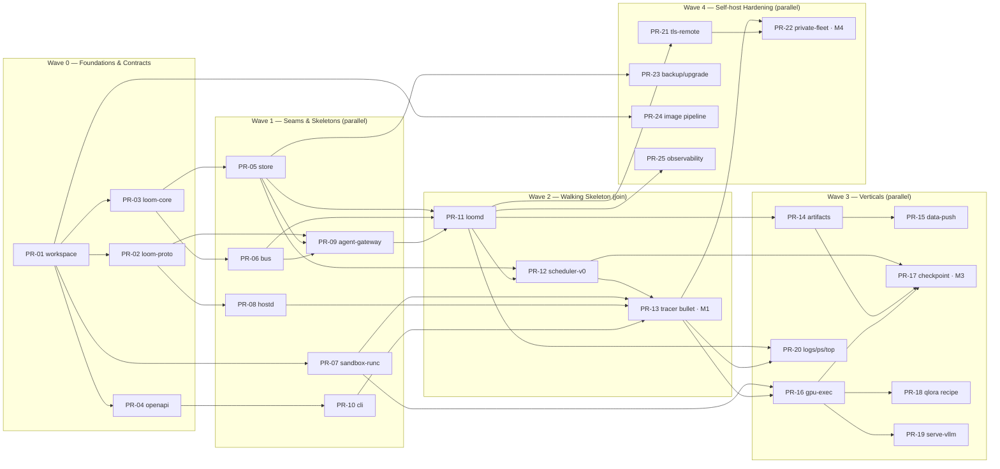

# Build plan — Phase 1 (self-hostable core)

**Status:** Implementation plan · July 2026 · owner: platform
**Scope:** How we actually build [Phase 1](../product/roadmap.md#phase-1--self-hostable-core) — the self-hostable compute stack (`loomd` + `loom-hostd` + `loom` CLI, embedded SQLite, one golden path). This document is the **authoritative PR DAG**: it names every pull request, its dependencies, what it can be built in parallel with, and how it proves itself. The sibling docs expand facets of it and reference these PR IDs; they never redefine them.

- [milestones.md](./milestones.md) — the five milestones (M0–M4), their exit criteria, and the demo that closes each.
- [parallelization.md](./parallelization.md) — the staffing models, the critical path, the sync points, and how to run this with N engineers or N agents.
- [workspace-setup.md](./workspace-setup.md) — PR-01 in detail: the Cargo workspace, CI matrix, `xtask`, and the test conventions everything else inherits.
- [research-tracks.md](./research-tracks.md) — the parallel, non-blocking validation spikes (T1–T4) and what each feeds.

---

## 1. The five hard calls (read this before the table)

A build plan is mostly a set of refusals. Here are the ones that matter, stated so they can be argued with.

**1. The walking skeleton ships before any feature.** The default failure mode for a system of ten cooperating crates is to build each one to "completeness" in isolation and discover at the end that they have never spoken — three weeks of integration hell with no working product in between. We refuse that shape outright. **Milestone M1 ([PR-13](#wave-2--walking-skeleton-the-join)) is a no-GPU `echo` job flowing through the entire spine** — API → store → scheduler → agent-gateway → wire protocol → agent → container → log stream back → terminal state. Every crate exists in skeletal form and is *wired* before any crate is *finished*. If we cannot run `loom run -- echo hi` end-to-end, nothing else we build is real.

**2. Two contracts are frozen first, and they are the only thing the whole team waits on.** [`loom-proto`](../platform/backend.md) (the wire schema, [PR-02](#wave-0--foundations--contracts)) and the [OpenAPI spec](../platform/renter-api.md) ([PR-04](#wave-0--foundations--contracts)) are the interfaces that let the CLI, the server, and the agent be built by different people at the same time without blocking each other. They land in Wave 0 and evolve **additively only** thereafter (the deprecation-window discipline of [agent-protocol.md §2.3](../platform/agent-protocol.md)). Contracts-first is the single decision that makes the rest of this plan parallelizable at all — remove it and every wave collapses into a queue.

**3. We do not parallelize the invariant core.** The scheduler loop, the lease/fencing rules, and the `attempts`/`leases` schema that backs them are **one owner's responsibility, built as a single coherent unit** ([PR-03](#wave-0--foundations--contracts) → [PR-05](#wave-1--seams--skeletons) → [PR-09](#wave-1--seams--skeletons) → [PR-12](#wave-2--walking-skeleton-the-join)). Split-brain correctness — never letting two nodes run and bill the same attempt — is exactly the class of bug a divided team ships and never fully closes. Everything *around* the core parallelizes freely behind trait seams; the core itself does not.

**4. The scope is one golden path, and we defend it viciously.** Per the [roadmap](../product/roadmap.md#phase-1--self-hostable-core) and the [external review](../architecture/external-review.md): `qlora-sft` + the `loom run` escape hatch, **three** curated images, adapter checkpoint/resume, local vLLM deploy. Every "it'd be easy to also add `diffusion-lora` / ROCm / P2P distribution while we're here" is a Phase-2 issue, full stop. The design docs describe a *target state* the size of a platform; building toward that target instead of the golden path is the number-one way Phase 1 slips a quarter. The [image pipeline](#wave-4--self-host-hardening) builds three images, not eight, and the catalog docs already say so.

**5. Checkpoint-resume is the riskiest thing we build, so it is built early on fakes, not late on real GPUs.** It is the [roadmap's stated biggest risk](../product/roadmap.md) ("if it's flaky, we have nothing") and it is a Phase-1 *exit criterion*, not a feature. So the checkpoint → requeue → resume machinery — the fencing, the lineage, the exact-step restore — is built and chaos-tested in the [simulated-fleet harness](../platform/backend.md) (fake agents, **zero GPUs**) during the walking-skeleton phase ([PR-12](#wave-2--walking-skeleton-the-join)/[PR-17](#wave-3--thicken-verticals)). Proving correctness against fakes first means the real-GPU version ([PR-16](#wave-3--thicken-verticals) → [PR-17](#wave-3--thicken-verticals)) is a seam-swap, not a from-scratch build under GPU cost and scarcity.

Two corollaries fall out of these five:

- **Real GPUs enter late, behind a hardware-gated seam.** The scheduler, store, protocol, gateway logic, CLI, data-push, and even the checkpoint *mechanics* are all provable with fakes and no GPU. Real-GPU integration is deferred to a single vertical ([PR-16](#wave-3--thicken-verticals)) so that GPU scarcity never bottlenecks the ~80% of the backend that doesn't need one.
- **Isolation research runs from day one but gates nothing in the core.** The self-host core ships on plain hardened-runc (correct for a trusted user on their own hardware — [isolation.md](../platform/isolation.md)); the [gVisor/nvproxy qualification](./research-tracks.md) is a parallel track ([T1](./research-tracks.md)) that feeds `loom-sandbox`'s second driver and gates the *future untrusted tier*, not this phase.

---

## 2. Shape of the plan

Five waves. Wave 0 and Wave 2 are narrow (foundations, then the integration join); Waves 1, 3, and 4 fan out wide. Research tracks run alongside all of it.

---

## 3. The authoritative PR DAG

Every PR below is one reviewable pull request. **Depends on** = must be merged first. **Parallel with** = no dependency either way; can be in flight simultaneously. **Owner constraint** flags the pieces that a single person must own for correctness (see hard call #3). Sizes are S/M/L as a planning aid, not a commitment.

### Wave 0 — Foundations & Contracts

*Narrow and fast. These unblock everything; keep them small and land them first. Low parallelism by nature — the workspace is the root of the tree.*

| PR | Title | Scope (one line) | Depends on | Parallel with | Owner | Size | Proves itself by |
|----|-------|------------------|------------|---------------|-------|------|------------------|
| PR-01 | `workspace-scaffold` | Cargo workspace, all 10 crate stubs compiling empty, shared lints, `rust-toolchain`, CI (fmt/clippy/test), `xtask` stub, license headers | — | — | any | S | `cargo build && cargo clippy -D warnings` green in CI on the empty workspace |
| PR-02 | `proto-contract` | `loom-proto`: `.proto` for `Envelope` + full message catalog ([agent-protocol §2–3](../platform/agent-protocol.md)), `prost-build` codegen, length-prefix codec, golden vectors + `xtask` regen | PR-01 | PR-03, PR-04 | core | M | golden-vector round-trip test; a fake agent and the server both decode the same bytes |
| PR-03 | `core-domain` | `loom-core`: domain types + **pure** state machines (job lifecycle, lease/fencing, scheduler filter→score→commit logic), zero I/O | PR-01 | PR-02, PR-04 | **invariant core** | M | exhaustive FSM unit + property tests, incl. requeue-lineage/fencing cases |
| PR-04 | `openapi-contract` | Committed target OpenAPI spec ([renter-api.md](../platform/renter-api.md)) + CI spec-diff gate harness + a mock server for CLI dev | PR-01 | PR-02, PR-03 | contracts | M | spec validates; diff-gate CI job runs; mock server answers the golden-path routes |

### Wave 1 — Seams & Skeletons

*Maximum fan-out. Each crate sits behind a trait or the frozen contract, so it is built and tested against fakes with no dependency on its siblings. This is where added people convert directly into speed.*

| PR | Title | Scope (one line) | Depends on | Parallel with | Owner | Size | Proves itself by |
|----|-------|------------------|------------|---------------|-------|------|------------------|
| PR-05 | `store-sqlite` | `loom-store`: `Store` trait + `SqliteStore` + migration set (`jobs`/`job_attempts`/`leases`/`usage_records`/`outbox`/`idempotency_keys`) + **file-backed WAL** conformance suite | PR-03 | PR-06, PR-07, PR-08, PR-10 | **invariant core** | L | conformance suite green on file-backed WAL SQLite (not `:memory:`) |
| PR-06 | `bus-inproc` | `loom-bus`: `Bus` trait + `InProcBus` + outbox-relay task | PR-03, PR-05 | PR-07, PR-08, PR-10 | core | M | at-least-once delivery + reconcile-from-store tests; relay drains the outbox |
| PR-07 | `sandbox-runc` | `loom-sandbox`: `SandboxDriver` trait + hardened `RuncDriver` (seccomp, dropped caps, cgroup v2 limits, default-deny egress netns). **No GPU yet** | PR-01 | PR-05, PR-06, PR-08, PR-10 | agent | L | runs `echo` locked-down; egress-deny test; a fake driver for CI-without-root |
| PR-08 | `hostd-skeleton` | `loom-hostd`: config, control-channel client (**WSS baseline**), enrollment CSR handshake, agent state machine, heartbeat, spool | PR-02, PR-03 | PR-05, PR-06, PR-07, PR-10 | agent | L | connects to a fake gateway, enrolls, heartbeats, drives its FSM |
| PR-09 | `agentgateway` | `loom-agentproto`: server-side quinn/WSS terminator, mTLS identity, 4-stream demux, bridge to `Bus`, cert issuance on enroll | PR-02, PR-05, PR-06 | PR-10 | **invariant core** | L | a fake agent enrolls and exchanges messages through the real terminator onto the bus |
| PR-10 | `cli-skeleton` | `loom` CLI: `clap` tree, auth/local-token, HTTP client against the OpenAPI contract, JSON mode, resumable/streaming output | PR-04 | PR-05…PR-09 | contracts | M | every golden-path command hits the mock server and renders correctly |

### Wave 2 — Walking Skeleton (the join)

*The one place the plan deliberately serializes. PR-11 and PR-12 converge, PR-13 is the integration that proves the spine. This is a sync point — it cannot be parallelized away, and it is the most important milestone in the phase.*

| PR | Title | Scope (one line) | Depends on | Parallel with | Owner | Size | Proves itself by |
|----|-------|------------------|------------|---------------|-------|------|------------------|
| PR-11 | `loomd-skeleton` | `loomd`: process wiring (Store + Bus + axum app with **real, store-backed** job submit/get/list + agent-gateway), `loom.toml`, lazy start, `loomd init`/`doctor` | PR-04, PR-05, PR-06, PR-09 | early PR-12 design | core | L | `loomd` boots standalone, serves the API on SQLite, accepts an agent connection |
| PR-12 | `scheduler-v0` | `loomd` scheduler: **single-writer** reconciliation loop (submitted→scheduled→dispatched), lease-with-fencing, requeue-on-lost | PR-05, PR-11 | — | **invariant core** | L | simulated-fleet chaos test: every lost attempt requeues with a strictly-greater fence; no double-lease; no double-bill |
| PR-13 | `tracer-bullet` **· M1** | End-to-end **no-GPU** job: `loom run -- echo hi` → loomd → store → scheduler → agent-gateway → hostd → runc → log stream → terminal state | PR-07, PR-08, PR-10, PR-11, PR-12 | — | integration | M | the [M1 demo](./milestones.md) passes in CI: loomd + hostd in one test, container runs `echo`, logs return, job = `Succeeded` |

### Wave 3 — Thicken Verticals

*Fan-out again. Each PR is a full-stack slice through the now-working skeleton, owned end-to-end. The invariant-core owner takes PR-17; the rest distribute freely.*

| PR | Title | Scope (one line) | Depends on | Parallel with | Owner | Size | Proves itself by |
|----|-------|------------------|------------|---------------|-------|------|------------------|
| PR-14 | `artifact-store` | Local content-addressed on-disk store + presign-style local URLs + GC/keep-last-N | PR-11 | PR-16, PR-20 | core | M | put/get by digest; local presigned round-trip; GC keeps last N |
| PR-15 | `data-push` | `loom data push`: manifest + chunking + upload to artifact store + node prefetch + `name@vN` refs | PR-14, PR-10 | PR-16, PR-18 | contracts | M | push→manifest; a job references the dataset; warm re-run is a cache hit |
| PR-16 | `gpu-execution` | Real-GPU job: NVML inventory in hostd, driver-floor enrollment gate, GPU injection into the sandbox (nvidia-container-toolkit), **hardware-gated** GPU smoke suite | PR-07, PR-13 | PR-14, PR-15 | agent (**GPU box**) | L | a real tiny CUDA job runs + teardown/verify-clean; skips cleanly with no GPU present |
| PR-17 | `checkpoint-resume` **· M3** | `loom-ckpt` helper (HF Trainer callback), checkpoint-now-on-eject with grace, incremental upload, resume-from-checkpoint requeue w/ fencing + exact-step/RNG restore | PR-12, PR-14, PR-16 | PR-18, PR-19 | **invariant core** | L | kill a job mid-run → resumes to completion elsewhere (fake fleet, then real) — the [Phase-1 exit criterion](../product/roadmap.md#phase-1--self-hostable-core) |
| PR-18 | `qlora-recipe` | `qlora-sft` recipe manifest + config schema + VRAM/cost estimator + the `train` image; `loom train --recipe qlora-sft` | PR-16 | PR-19 | ML | L | a real small `qlora-sft` run yields an adapter + lineage record + eval stub |
| PR-19 | `serve-vllm` | Embedded `loom-gateway` SSE proxy + replica table from heartbeats + `loom deploy adapter:` + `serve-vllm` image + **restart-visible** failover | PR-13, PR-16 | PR-18 | ML | M | deploy the PR-18 adapter, curl the local OpenAI endpoint; a killed replica surfaces a visible restart event |
| PR-20 | `logs-ps-top` | End-to-end SSE log streaming + `loom logs`/`ps`/`top` (live GPU telemetry from heartbeats) | PR-13 | PR-14, PR-16 | contracts | M | live logs stream with a resume token; `top` shows real utilization |

### Wave 4 — Self-host Hardening

*Independent polish tracks; almost fully parallel. PR-22 closes the fleet exit criterion; the rest make the self-host story production-honest.*

| PR | Title | Scope (one line) | Depends on | Parallel with | Owner | Size | Proves itself by |
|----|-------|------------------|------------|---------------|-------|------|------------------|
| PR-21 | `tls-remote` | Self-signed cert at `loom init`, CLI fingerprint pinning, non-loopback bind requires TLS; one-TCP-port story (WSS 8443, QUIC optional 8444) | PR-10, PR-11 | PR-22, PR-23, PR-25 | contracts | M | remote CLI over TLS with pinned fingerprint; plain HTTP refused off-loopback |
| PR-22 | `private-fleet` **· M4** | `loom-hostd enroll --server`, multi-node scheduling fan-out, LAN/WireGuard data plane | PR-13, PR-21 | PR-23, PR-25 | core | L | 3 machines, `loom run --gpu all` fans out; a mid-job node death resumes elsewhere ([fleet exit criterion](../product/roadmap.md#phase-1--self-hostable-core)) |
| PR-23 | `backup-upgrade` | `loom backup`/`restore` (`VACUUM INTO` + verify), N−1 migration contract, staged `loomd upgrade` + auto-rollback + pre-upgrade snapshot | PR-05, PR-11 | PR-21, PR-25 | invariant core | M | backup→restore round-trip verified; a crash-looping upgrade auto-rolls-back |
| PR-24 | `image-pipeline` | The **3** curated images (`base-cuda`/`train`/`serve-vllm`): reproducible builds, `uv` lockfiles, digest pinning, SBOM + scan in CI, direct pull + local cache (**no P2P**) | PR-01 | everything (own track) | ML/infra | L | 3 images build reproducibly in CI, pinned by digest, scanned clean |
| PR-25 | `observability` | `tracing` spans across crates, optional `/metrics` (off by default in standalone), structured logs, `loomd doctor` completeness | PR-11 | PR-21, PR-23 | core | M | one job yields a coherent trace; metrics endpoint gated by config |

---

## 4. Critical path (the real delivery floor)

Parallelism cannot beat the longest dependency chain. For Phase 1 that chain is:

> **PR-01 → PR-03 → PR-05 → PR-06 → PR-09 → PR-11 → PR-12 → PR-13 (M1) → PR-16 → PR-17 (M3)** — and for the serve demo, **PR-16 → PR-19**.

That is **ten sequential PRs** (nine dependency edges — the longest chain in the DAG), five of them owned by the same invariant-core person (PR-03/05/09/12/17), and it sets the floor on how fast Phase 1 can land regardless of headcount. The consequence, spelled out honestly in [parallelization.md](./parallelization.md): **adding engineers past ~4 does not speed Phase 1**, because the spine is inherently sequential and single-owned. Extra hands help the *width* (Wave 1 seams, Wave 3 verticals, Wave 4 polish, the image pipeline, the research tracks) — they finish the surrounding work sooner, but they cannot shorten the core chain.

The three deliberate sync points — the two frozen contracts (Wave 0), the walking-skeleton join (PR-13), and the fleet integration (PR-22) — are where the whole team's work must line up. Everything else is designed to *not* need coordination, which is the entire point of the trait seams.

## 5. How this maps to milestones and exit criteria

| Milestone | PRs | Closes |
|-----------|-----|--------|
| **M0** scaffold | PR-01…PR-04 | Contracts frozen; workspace + CI green; a new engineer can `cargo build` and read the OpenAPI |
| **M1** walking skeleton | PR-05…PR-13 | `loom run -- echo hi` works end-to-end, no GPU — the spine is proven |
| **M2** real GPU | PR-14, PR-16, PR-20, PR-24 | A real CUDA job runs sandboxed on your own GPU; logs stream; images pull |
| **M3** train + resume | PR-15, PR-17, PR-18 | `qlora-sft` fine-tune with **checkpoint-resume across a killed process** — the [roadmap's headline Phase-1 exit criterion](../product/roadmap.md#phase-1--self-hostable-core) |
| **M4** serve + self-host | PR-19, PR-21, PR-22, PR-23, PR-25 | Deploy the adapter to a local OpenAI endpoint; TLS remote; private fleet; backup/upgrade — the full self-host story |

Detailed exit criteria and the demo script that closes each milestone are in [milestones.md](./milestones.md).
