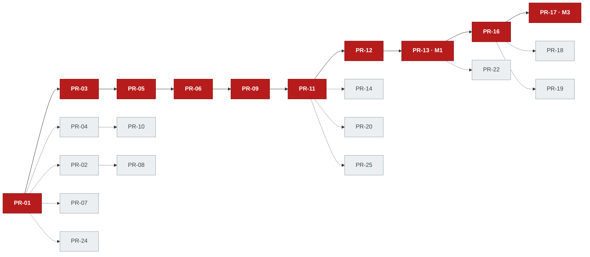

# Parallelization & staffing — Phase 1

**Status:** Implementation plan · July 2026 · owner: platform
**Scope:** The honest staffing model for the [Phase 1 PR DAG](./README.md). How many people (or agents) can work this plan at once, where they cannot, and why the wall-clock floor is the [critical path](./README.md#4-critical-path-the-real-delivery-floor) regardless of headcount. This doc adds no new PRs and redefines none — it references [README.md](./README.md)'s PR IDs as the single source of truth.

Related: [README.md](./README.md) (the authoritative DAG), [milestones.md](./milestones.md) (M0–M4 exit criteria), [research-tracks.md](./research-tracks.md) (T1–T4 spikes), [../platform/backend.md](../platform/backend.md) (the library-vs-binary split that creates the seams).

---

## 1. Why this DAG is parallelizable at all

Parallelism between people is not a scheduling trick; it is a *property of the interfaces*. Two engineers can build against each other simultaneously only if neither has to read the other's code to make progress. Phase 1 buys that property with two frozen contracts and four trait seams. Everything downstream codes against an interface and a fake — never against a sibling's half-finished crate.

**The two frozen contracts (Wave 0).** These are the only artifacts the whole team waits on ([hard call #2](./README.md#1-the-five-hard-calls-read-this-before-the-table)):

- **[PR-02](./README.md#wave-0--foundations--contracts) `loom-proto`** — the wire schema (`Envelope` + message catalog). Once its golden vectors pass, a fake agent and the real server encode/decode identical bytes. This decouples **`loom-hostd` (the agent) from `loom-agentproto` (the gateway)**: [PR-08](./README.md#wave-1--seams--skeletons) and [PR-09](./README.md#wave-1--seams--skeletons) are built by different people at the same time, each testing against a fake on the other side of the wire.
- **[PR-04](./README.md#wave-0--foundations--contracts) OpenAPI spec** + mock server. Once committed, the CLI has a server to talk to that isn't the server. This decouples **the CLI ([PR-10](./README.md#wave-1--seams--skeletons)) from `loomd` ([PR-11](./README.md#wave-2--walking-skeleton-the-join))**: every golden-path command is built and tested against the mock months before the real API exists.

**The four trait seams** (all from [backend.md §1](../platform/backend.md), "library-first"):

| Seam | Trait | What it decouples | Fake used against it |
|------|-------|-------------------|----------------------|
| **Store** | `Store` ([PR-05](./README.md#wave-1--seams--skeletons)) | Persistence from everything that reads/writes state — scheduler, gateway, artifact service all hold `Box<dyn Store>` | in-memory / file-backed SQLite |
| **Bus** | `Bus` ([PR-06](./README.md#wave-1--seams--skeletons)) | Event emission from event consumption — a "placement" event looks identical whether it's a function call or a NATS hop | `InProcBus` |
| **SandboxDriver** | `SandboxDriver` ([PR-07](./README.md#wave-1--seams--skeletons)) | Running a container from the code that decides *to* run one — and, critically, real GPUs from the ~80% of the backend that needs none | fake driver (CI-without-root) |
| **agent-gateway** | `loom-agentproto` terminator ([PR-09](./README.md#wave-1--seams--skeletons)) | The server's view of an agent from a real host — a fake agent drives the real terminator onto the `Bus` | fake agent harness |

The mechanism is concrete: because `loomd` is *assembled* from these libraries rather than written as a monolith ([backend.md "Why library-first"](../platform/backend.md)), any one of them can be swapped for a fake behind the same trait. That is the whole game. Remove contracts-first and every wave collapses into a queue; remove the trait seams and every crate has to wait for its neighbours to be real before it can be tested. With them, most of Wave 1 is genuinely independent work.

---

## 2. Three staffing models

The same DAG, driven at three widths. Pick by how many coherent authors you actually have.

### 2a. Solo — one builder (or one human + AI agents)

With a single owner there is no parallelism to exploit *between people*, so the order is simply the critical path, with the surrounding width picked up opportunistically whenever a dependency is already merged and the spine is blocked on review or thought. The linear order:

```
PR-01 → PR-02 → PR-03 → PR-04        (Wave 0: contracts first, always)
      → PR-05 → PR-06                 (spine: store, then bus)
      → PR-07, PR-08, PR-10           (fill the width: sandbox, hostd, CLI — needed for the join)
      → PR-09 → PR-11                 (agent-gateway, then loomd wiring)
      → PR-12 → PR-13 (M1)            (scheduler, then the walking skeleton)
      → PR-16 → PR-17 (M3)            (real GPU, then checkpoint-resume)
      → PR-14, PR-15, PR-18, PR-19, PR-20   (Wave 3 verticals)
      → PR-21 → PR-22 (M4) → PR-23, PR-24, PR-25   (Wave 4 hardening)
```

A solo builder is *always* on or near the critical path; the width work (PR-14, PR-20, PR-24, the research tracks) is slack-filler done between spine PRs, not a speedup. This is the mode where AI agents earn their keep — see §6.

### 2b. Two-to-three engineers — the realistic default

This is the [roadmap's sizing assumption](../product/roadmap.md#phase-1--self-hostable-core) (2–3 strong engineers: systems-Rust, distributed-systems, ML-infra). Split by **ownership, not by wave** — each engineer owns a coherent slice of the tree end-to-end, so the trait seams fall on *ownership boundaries* and the syncs are few and legible.

| Owner | Slice | PR chain |
|-------|-------|----------|
| **Eng A — invariant core** | The correctness spine ([hard call #3](./README.md#1-the-five-hard-calls-read-this-before-the-table)): domain FSM, store schema, gateway, loomd wiring, scheduler, checkpoint, fleet | PR-03 → PR-05 → PR-09 → PR-11 → PR-12 → **PR-13 (join)** → PR-17 → PR-22, plus PR-23 |
| **Eng B — agent + sandbox + GPU** | Everything host-side and hardware-facing | PR-07 → PR-08 → PR-16 → PR-18, plus the [T1](./research-tracks.md) isolation research |
| **Eng C — contracts + edges** | The two contracts, the CLI, the user-facing verticals, the polish | PR-02 / PR-04 → PR-10 → PR-14 → PR-15 → PR-19 → PR-20 → PR-21 → PR-24 → PR-25 |

A rough wave-by-wave sequence (read left-to-right as elapsed build order, not weeks):

| Wave | Eng A (core) | Eng B (agent/GPU) | Eng C (contracts/edges) | **SYNC** |
|------|--------------|-------------------|--------------------------|----------|
| **0** | PR-03 core-domain | (helps PR-01 / picks up PR-07 early) | PR-02 proto **+** PR-04 openapi | **contracts frozen** |
| **1** | PR-05 store → PR-09 gateway | PR-07 sandbox → PR-08 hostd | PR-10 CLI (vs mock) | — |
| **2** | PR-11 loomd → PR-12 scheduler | (finishing PR-08; T1 research) | (feeds fakes; readies PR-14) | **PR-13 join (M1)** |
| **3** | PR-17 checkpoint | PR-16 gpu-exec → PR-18 qlora | PR-14 artifacts → PR-15 data → PR-19/20 | — |
| **4** | PR-22 fleet → PR-23 backup | (supports PR-22 multi-node) | PR-21 TLS → PR-24 images → PR-25 obs | **PR-22 fleet (M4)** |

Note PR-06 (bus) and PR-11 (loomd wiring) sit naturally with Eng A because they bolt directly onto the store and scheduler; if Eng A is saturated on the spine, PR-06 is small enough to hand to whoever has slack. The three columns rarely block each other *within* a wave — that's the point of the ownership split — and they line up only at the three declared sync points (§4).

### 2c. Max fan-out — N agents

The theoretical ceiling is the width of the widest wave, because that is the largest set of PRs with all dependencies already satisfied and no dependency on each other:

| Wave | Concurrent width | The PRs |
|------|-------------------|---------|
| **0** | **3** (after PR-01) | PR-02, PR-03, PR-04 all fan from PR-01 and are mutually independent; PR-05/06 then wait on PR-03 |
| **1** | **4** | PR-05, PR-07, PR-08, PR-10 are mutually independent and start together; PR-06 then chains behind PR-05, and PR-09 behind PR-06 — so the *six* Wave-1 PRs are not six-wide, they are four-wide with a two-deep tail |
| **2** | 1 | the join is a deliberate serialization — no width |
| **3** | **up to 6** | PR-14, PR-15, PR-16, PR-17, PR-18, PR-19, PR-20 (minus internal deps: PR-17←16, PR-18←16, PR-15←14) |
| **4** | **5** | PR-21, PR-22, PR-23, PR-24, PR-25 (PR-22←21, so effectively 4 truly-free) |

So the honest maximum is **four concurrent tracks at the start of Wave 1** (PR-05/07/08/10), with PR-06 then PR-09 staggering in behind PR-05 — six PRs flow through the wave, but never six at once. It drops to one at the join, rises to ~five across Wave 3, ~four in Wave 4. But — and this is the whole of §3 — even infinite agents cannot beat the critical path, because the spine PRs depend on *each other* in series. A fifth agent in early Wave 1 just waits for PR-05 to land before it can start PR-06; a seventh has nothing to do at all.

---

## 3. The critical path is the floor

Echoing [README §4](./README.md#4-critical-path-the-real-delivery-floor): the longest dependency chain is

> **PR-01 → PR-03 → PR-05 → PR-06 → PR-09 → PR-11 → PR-12 → PR-13 (M1) → PR-16 → PR-17 (M3)**

That is **10 serialized PRs** (the longest chain in the DAG — nine dependency edges), five of them owned by the same invariant-core person, and it sets the wall-clock floor no matter how many people you add. The reason is structural, not organizational:

1. **The spine is inherently sequential.** You cannot fence leases (PR-12) before the store schema that holds `leases` exists (PR-05); you cannot resume a checkpoint (PR-17) before there is a real GPU job to checkpoint (PR-16); you cannot run a real GPU job before the skeleton proves the spine (PR-13). Each link *needs the previous one's output*. No amount of concurrency reorders a dependency.
2. **The spine is single-owned by design** ([hard call #3](./README.md#1-the-five-hard-calls-read-this-before-the-table)). Split-brain correctness — never letting two nodes run and bill the same attempt — is exactly the bug a divided team ships and never closes. So PR-03/05/09/12/17 are one owner's coherent unit *on purpose*, which means they also cannot be parallelized *away* even in principle.

The practical consequence, stated plainly: **adding people past ~4 does not speed Phase 1.** It only finishes the *width* sooner — Wave 1 seams, Wave 3 verticals, Wave 4 polish, the image pipeline, the research tracks. Those hide *behind* the spine; they do not compress it. A fourth engineer means Wave 3's six verticals land in two batches instead of three; it does not make PR-17 arrive before PR-16.



The solid red chain is the floor. Everything dotted is width — parallelizable, useful, and unable to move the finish line.

---

## 4. The three sync points

Three places the whole team must line up. Everything else is engineered *not* to need coordination — that is the entire purpose of the trait seams. These three cannot be seamed away.

### (a) Contracts frozen — end of Wave 0

**What must be true to pass:** [PR-02](./README.md#wave-0--foundations--contracts)'s golden vectors round-trip (fake agent and server decode identical bytes); [PR-04](./README.md#wave-0--foundations--contracts)'s spec validates, the diff-gate CI job runs, and the mock server answers the golden-path routes. From here the contracts evolve **additively only** ([agent-protocol §2.3 deprecation window](../platform/agent-protocol.md)).

**What happens if someone jumps it early:** every downstream PR built against a *moving* contract has to be rewritten when the contract settles. PR-08, PR-09, and PR-10 are the immediate victims — they are literally defined as "build against the frozen wire schema / OpenAPI." Start them against a draft and you pay for it twice. This is why the contracts get a single owner each (§5).

### (b) The walking-skeleton join — PR-13 (M1)

**What must be true to pass:** all six Wave-1 seams must be *real*, not fake, at the same moment. [PR-13](./README.md#wave-2--walking-skeleton-the-join) wires PR-07 (sandbox), PR-08 (hostd), PR-10 (CLI), PR-11 (loomd), PR-12 (scheduler) into one process and runs `loom run -- echo hi` end-to-end, no GPU, to a `Succeeded` terminal state in CI ([the M1 demo](./milestones.md)).

**What happens if someone jumps it early:** you get the exact failure the walking-skeleton discipline exists to prevent ([hard call #1](./README.md#1-the-five-hard-calls-read-this-before-the-table)) — a set of crates each "complete" in isolation that have never spoken, discovered at integration time to disagree on some seam the fakes papered over. The join is the moment the fakes are retired against each other. If PR-09's real terminator was only ever tested against a fake agent and PR-08's real agent only against a fake gateway, PR-13 is where any drift surfaces. It must be a genuine sync: no vertical (Wave 3) starts until the spine is proven.

### (c) Fleet integration — PR-22 (M4)

**What must be true to pass:** [PR-22](./README.md#wave-4--self-host-hardening) needs PR-13 (a working single-node spine) and PR-21 (TLS remote) both merged, then proves multi-node fan-out: 3 machines, `loom run --gpu all` distributes, and a mid-job node death resumes elsewhere — the [fleet exit criterion](../product/roadmap.md#phase-1--self-hostable-core).

**What happens if someone jumps it early:** PR-22 exercises the checkpoint-resume machinery (PR-17) across *real network partitions and node death*, not the in-process fake fleet. Attempting it before PR-17's fencing/lineage is proven on fakes means debugging distributed correctness and single-node correctness simultaneously — the two-variables-at-once trap the whole "fakes first" strategy exists to avoid.

---

## 5. What must NOT be parallelized

Two things are single-owner on purpose. Not because they're hard to split, but because splitting them ships a specific, unfixable class of bug.

**The invariant core is one owner.** `loom-core`'s lease/fencing FSM ([PR-03](./README.md#wave-0--foundations--contracts)) + `loom-store`'s `attempts`/`leases` schema ([PR-05](./README.md#wave-1--seams--skeletons)) + `loom-agentproto` ([PR-09](./README.md#wave-1--seams--skeletons)) + the scheduler ([PR-12](./README.md#wave-2--walking-skeleton-the-join)) are one coherent unit under one author ([hard call #3](./README.md#1-the-five-hard-calls-read-this-before-the-table)). The failure mode this prevents is **split-brain**: two nodes each believe they hold the lease on the same attempt, both run it, both bill it. That bug lives in the *seam between* the FSM's fencing rule and the store's lease row and the scheduler's requeue-on-lost logic — precisely the seam that a divided team gets subtly wrong, because each owner assumes the other enforces the invariant. Give it to one person and the fencing rule, its schema, and its enforcement are designed together as a single monotonic story. PR-12's proof gate — *"every lost attempt requeues with a strictly-greater fence; no double-lease; no double-bill"* — is exactly the invariant a split ownership would fail to hold.

**Each contract has one owner during Wave 0.** [PR-02](./README.md#wave-0--foundations--contracts) (proto) and [PR-04](./README.md#wave-0--foundations--contracts) (OpenAPI) are each authored by a single person while they're being frozen. The failure mode here is **schema-by-committee**: a wire format designed by three people in parallel acquires three mental models of the same message, and the drift surfaces months later at the PR-13 join. One owner per contract, frozen once, additively-only thereafter — then handed out to everyone.

---

## 6. Running it with AI agents

The founder builds with parallel AI agents, so map the model onto agent orchestration directly. The rule is the same as for humans, sharpened: **an agent is safe to run independently exactly when it can code against a fake or a frozen contract and prove itself against a gate the agent cannot fudge.** The [README's "Proves itself by" column](./README.md#3-the-authoritative-pr-dag) is that gate — it is what makes independent agent work merge-safe.

**Safe to hand to independent agents** (each against fakes/contracts, each gated on its own proof):

- **Most of Wave 1** — PR-05 (store, gated on the WAL conformance suite), PR-06 (bus, gated on at-least-once + reconcile tests), PR-07 (sandbox, gated on the egress-deny test + fake driver), PR-08 (hostd, gated on enrolling to a *fake* gateway), PR-10 (CLI, gated on the mock server). Five agents, five fakes, five independent gates.
- **Wave 3 verticals** — PR-14, PR-15, PR-18, PR-19, PR-20 are each a full-stack slice through the *already-proven* skeleton, owned end-to-end, each with a concrete demo gate.
- **Wave 4 polish** — PR-21, PR-23, PR-24, PR-25 are near-independent tracks. **PR-24 (image pipeline)** is the cleanest possible agent job: it depends only on PR-01 and its gate is "3 images build reproducibly, pinned by digest, scanned clean" — fully self-verifying.
- **Research tracks** — [T1–T4](./research-tracks.md) are non-blocking spikes; hand each to an agent that reports findings without touching the core.

**Requires a single coherent author or a human-in-the-loop reviewer:**

- **The invariant core** (PR-03 → PR-05 → PR-09 → PR-12 → PR-17). Even with agents, this is one *conversation* — one coherent author holding the fencing invariant across the FSM, schema, and scheduler — with a human reviewing the split-brain properties. Do not shard split-brain correctness across independent agents; the seam between them is where the bug lives (§5).
- **The PR-13 join.** Integration is where fakes meet reality; it wants a coherent author who understands all six seams and a human confirming the M1 demo actually passes end-to-end, not just that each fake was satisfied.

The safety property is the gate. An agent that builds PR-07 against a fake driver is safe to merge *because* the egress-deny test and the locked-down `echo` run prove it independently of everything else. Never merge an agent-built PR that hasn't cleared its README gate — the gate is the whole reason the parallelism is trustworthy rather than a pile of crates that compile and lie.

---

## 7. Research tracks run alongside

[T1–T4](./research-tracks.md) (drawn from the [design review's spike backlog S1–S8](../architecture/design-review.md#4-recommended-pre-build-spikes)) are **non-blocking** and gate nothing in the core. They run in parallel with all five waves and feed specific PRs when their findings land:

- **T1 — isolation/nvproxy qualification** (design-review S1) feeds `loom-sandbox`'s second driver and the future untrusted tier; it never gates PR-07's hardened-runc default ([hard call, corollary 2](./README.md#1-the-five-hard-calls-read-this-before-the-table)).
- The remaining tracks (NAT-traversal, cold-start, support/economics probes) inform Phase 2+ decisions and the roadmap's open questions — they produce *data*, not blocking dependencies.

The discipline: a research track can *inform* a PR but never *block* the spine. If T1 comes back badly, it changes the untrusted-tier plan; it does not stop `loom run -- echo hi` from shipping on hardened-runc.

---

## 8. Honest limits

The uncomfortable truth this doc exists to state: **with 2–3 engineers the wall-clock is close to the critical path anyway.** The width work fills slack behind the spine; it does not compress the spine.

The methodology, without false precision: the critical path is **10 serialized PRs** (PR-01→03→05→06→09→11→12→13→16→17). At 2–3 engineers, the surrounding width — the other 15 PRs — mostly *hides behind* those 10, because whenever the spine owner is blocked on thought or review, the other engineers are draining Wave 1 seams, Wave 3 verticals, and Wave 4 polish that were going to have to happen anyway. So the phase length is roughly "however long 10 serialized, mostly single-owned PRs take," plus a modest tail where the last width work drains after M3.

This is why we do **not** put week numbers on it: the spine's length is a function of how hard lease-fencing and checkpoint-resume turn out to be (the roadmap's [named biggest risk](../product/roadmap.md#phase-1--self-hostable-core)), not of headcount. A fourth engineer buys you a shorter width tail and more slack coverage; it does not buy you a shorter spine. Staff for **coverage of the width and quality of the core**, not for compressing a critical path that is, by deliberate design, single-owned and sequential.

The one lever that *does* move the floor is making the spine PRs smaller and their proof gates faster — which is exactly what the walking-skeleton discipline ([hard call #1](./README.md#1-the-five-hard-calls-read-this-before-the-table)) and the fakes-first checkpoint strategy ([hard call #5](./README.md#1-the-five-hard-calls-read-this-before-the-table)) already do. The plan is built to shorten the spine by de-risking it early, not to shorten it by throwing bodies at it.
