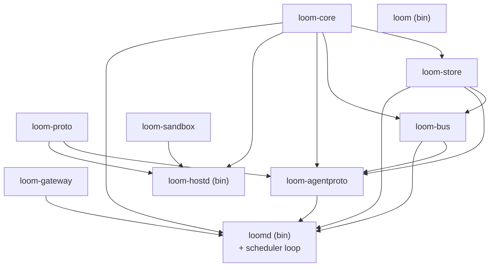

# Workspace setup — PR-01 in detail

**Status:** Implementation plan · July 2026 · owner: platform
**Scope:** The concrete engineering setup that [PR-01 `workspace-scaffold`](./README.md#wave-0--foundations--contracts) lands and that every later PR inherits. This is where the design docs' "we use a Cargo workspace" ([backend.md §1](../platform/backend.md#1-cargo-workspace-layout)) becomes real files: the crate tree and its dependency edges, the pinned toolchain, the shared lints, the framework baseline, the CI jobs that must stay green, `xtask`, and the test conventions the whole team writes against.

This doc **operationalizes** [backend.md](../platform/backend.md) — it does not relitigate its choices. The workspace layout is [§1](../platform/backend.md#1-cargo-workspace-layout); the framework table is [§2](../platform/backend.md#2-frameworks--dependencies); the testing strategy is [§9](../platform/backend.md#9-testing-strategy). The single-binary posture that shapes all of it is [ADR-0013](../adr/0013-single-binary-self-host-control-plane.md). PR-01 is the root of the [PR DAG](./README.md#3-the-authoritative-pr-dag): it depends on nothing and unblocks everything.

**PR-01 proves itself by** `cargo build && cargo clippy -D warnings` green in CI on the empty workspace ([README PR table](./README.md#wave-0--foundations--contracts)). Nothing in this doc adds scope to that gate; it specifies the *shape* the gate runs against.

---

## 1. The workspace tree

Ten crates: **three binaries, seven libraries**, plus `xtask` (a non-shipping helper binary) and the shared `migrations/` set. The library-vs-binary split exists for one property above all — **every service must be embeddable in-process** so an integration test boots the whole backend without spawning processes or opening sockets ([backend.md §1](../platform/backend.md#1-cargo-workspace-layout)). Binaries are thin wiring; behavior lives in libraries behind trait seams.

```
loom/                          # cargo workspace root
├── Cargo.toml                 # [workspace] members + shared deps + shared lints
├── rust-toolchain.toml        # pinned stable (§2)
├── rustfmt.toml               # shared formatting (§2)
├── clippy.toml                # shared clippy config (§2)
├── deny.toml                  # cargo-deny: license + advisory policy (§7)
├── crates/
│   ├── loom-proto/            # LIB  wire schema: prost codegen, envelope codec, golden vectors
│   ├── loom-core/             # LIB  domain types + pure state machines (no I/O)
│   ├── loom-store/            # LIB  Store trait + SqliteStore/PgStore (sqlx), migrations
│   ├── loom-bus/              # LIB  Bus trait + InProcBus/NatsBus, outbox relay
│   ├── loom-gateway/          # LIB  OpenAI-compatible inference proxy (embedded in loomd)
│   ├── loom-sandbox/          # LIB  SandboxDriver trait + RuncDriver (used by loom-hostd)
│   ├── loom-agentproto/       # LIB  server-side agent-gateway session logic (QUIC/WSS terminator)
│   ├── loomd/                 # BIN  the server: API + scheduler + gateway + agent-gateway
│   ├── loom-hostd/            # BIN  the host agent
│   └── loom/                  # BIN  the CLI (clap) — renter + host + admin verbs
├── migrations/                # shared sqlx migration set (dialect notes inline)
├── xtask/                     # BIN  cargo-xtask helper (codegen, golden regen, migrate, images, release)
├── proto/                     #      authoritative .proto sources (prost-build reads these)
├── openapi.json               #      committed OpenAPI spec — the diff-gate's reference (§4)
├── images/                    #      curated image definitions (base-cuda / train / serve-vllm) — PR-24
├── python/loom-ckpt/          #      the checkpoint helper (Python pkg shipped in the train image) — NOT a crate
└── scripts/                   #      install / release scripts (get.loom.dev installer, etc.)
```

**lib vs bin, restated as the buildable fact PR-01 lands:**

| Crate | Kind | Ships in a release binary? |
|---|---|---|
| `loom-proto` | lib | linked into `loomd`, `loom-hostd` |
| `loom-core` | lib | linked into `loomd` (+ `loom-hostd` for shared types) |
| `loom-store` | lib | linked into `loomd` |
| `loom-bus` | lib | linked into `loomd` |
| `loom-gateway` | lib | linked into `loomd` |
| `loom-sandbox` | lib | linked into `loom-hostd` |
| `loom-agentproto` | lib | linked into `loomd` |
| `loomd` | bin | **yes** — the server |
| `loom-hostd` | bin | **yes** — the host agent |
| `loom` | bin | **yes** — the CLI |
| `xtask` | bin | **no** — dev tooling only, never released |

The `scheduler` lives **inside `loomd`** as its single-writer reconciliation loop ([backend.md §3](../platform/backend.md#3-loomd-internal-architecture)), not as a separate crate — its *logic* is pure functions in `loom-core`, its *loop* is a task in `loomd`. That is why the DAG below shows the scheduler's dependency edge as `loom-core → loomd`, matching the invariant-core chain `PR-03 → PR-05 → PR-11 → PR-12` in the [README](./README.md#4-critical-path-the-real-delivery-floor).

### Dependency edges (must match the PR DAG)

The internal edges are load-bearing: they are the same edges the [PR DAG](./README.md#3-the-authoritative-pr-dag) encodes, so a crate cannot depend on a sibling whose PR lands later.



Read against the PR DAG:

- **`loom-proto`** depends on nothing (`PR-02` depends only on `PR-01`) and is depended on by `loom-hostd` (`PR-08`) and `loom-agentproto` (`PR-09`) — one schema compiled into both sides of the wire so agent and server can never drift ([backend.md §1](../platform/backend.md#1-cargo-workspace-layout)).
- **`loom-core`** (`PR-03`, the invariant core) is depended on by `loom-store` (`PR-05`), `loom-bus` (`PR-06`), `loom-agentproto` (`PR-09`), and the scheduler inside `loomd` (`PR-12`). It has **zero I/O deps** — no `tokio`, no `sqlx` — so this edge is types-and-logic only.
- **`loom-store`** (`PR-05`) depends on `loom-core` and is depended on by `loom-bus` (the outbox relay drains store rows), `loom-agentproto`, and `loomd`.
- **`loom`** (the CLI, `PR-10`) depends on **none** of the server libraries — it is a thin HTTP client against the OpenAPI contract (`PR-04`), and deliberately does not link `loom-store` or `loom-bus` ([backend.md §1](../platform/backend.md#1-cargo-workspace-layout)).

### `Cargo.toml` [workspace] sketch

```toml
[workspace]
resolver = "3"
members = [
    "crates/loom-proto",
    "crates/loom-core",
    "crates/loom-store",
    "crates/loom-bus",
    "crates/loom-gateway",
    "crates/loom-sandbox",
    "crates/loom-agentproto",
    "crates/loomd",
    "crates/loom-hostd",
    "crates/loom",
    "xtask",
]

[workspace.package]
edition      = "2024"
rust-version = "1.89"          # MSRV == pinned stable (§2)
license      = "Apache-2.0"
repository   = "https://github.com/loom/loom"

# Every version pin lives here once; crate Cargo.tomls say `tokio.workspace = true`.
[workspace.dependencies]
tokio          = { version = "=1.47", features = ["rt-multi-thread", "macros", "sync", "time", "process", "signal"] }
axum           = { version = "=0.8", features = ["macros", "json"] }
sqlx           = { version = "=0.9", default-features = false, features = ["runtime-tokio", "sqlite", "postgres", "macros", "migrate"] }
quinn          = "=0.11"
rustls         = { version = "=0.23", default-features = false, features = ["aws-lc-rs"] }
tokio-tungstenite = { version = "=0.24", features = ["rustls-tls-native-roots"] }
prost          = "=0.13"
prost-build    = "=0.13"
serde          = { version = "1", features = ["derive"] }
serde_json     = "1"
toml           = "0.8"
clap           = { version = "=4.5", features = ["derive", "env"] }
utoipa         = { version = "=5", features = ["axum_extras"] }
utoipa-axum    = "=0.2"
tracing        = "0.1"
tracing-subscriber = { version = "=0.3", features = ["env-filter", "json"] }
thiserror      = "2"
anyhow         = "1"
# internal crates referenced by path so intra-workspace edges are explicit:
loom-proto     = { path = "crates/loom-proto" }
loom-core      = { path = "crates/loom-core" }
loom-store     = { path = "crates/loom-store" }
loom-bus       = { path = "crates/loom-bus" }
# … remaining internal crates by path …

[workspace.lints.rust]
warnings          = "deny"        # #![deny(warnings)] posture, workspace-wide (§2)
unsafe_code       = "forbid"      # relaxed to "deny" only in loom-sandbox (documented, per-crate)
missing_debug_implementations = "warn"

[workspace.lints.clippy]
all      = { level = "deny", priority = -1 }
pedantic = { level = "warn", priority = -1 }
unwrap_used = "deny"              # panics-on-unwrap are a review failure, not a runtime surprise
```

Every member crate opts in with a one-liner so the policy is enforced from a single place:

```toml
# crates/<name>/Cargo.toml
[lints]
workspace = true

[dependencies]
tokio.workspace = true
```

---

## 2. Pinned toolchain & shared lints

**Pin the current stable; bump deliberately.** `rust-toolchain.toml` pins one exact stable so every developer, CI runner, and reproducible image build compiles with the identical rustc. A toolchain bump is its own small PR (regenerate, re-clippy, note any new lints) — never an ambient drift.

```toml
# rust-toolchain.toml
[toolchain]
channel    = "1.89.0"            # current stable — bump deliberately, in its own PR
components = ["rustfmt", "clippy"]
profile    = "minimal"
```

**MSRV == pinned stable.** We do **not** carry a lower MSRV than the toolchain we build with; `rust-version = "1.89"` in `[workspace.package]` matches the pin. Loom ships binaries, not a library other crates compile against, so there is no downstream to support an older compiler for — the MSRV exists only to make an accidental use of a newer feature fail loudly rather than silently raise the floor.

**`#![deny(warnings)]` posture, via workspace lints, not per-file attributes.** The `[workspace.lints]` block (§1) is the single source; a crate opts in with `[lints] workspace = true`. This is strictly better than sprinkling `#![deny(warnings)]` atop every `lib.rs`: it is set once, it covers clippy as well as rustc, and it cannot be forgotten in a new crate. `unsafe_code = "forbid"` holds everywhere except `loom-sandbox`, where the seccomp/cgroup/netns FFI needs `unsafe` — there it is relaxed to `deny` with an explicit, reviewed per-crate override, so unsafe is never ambient.

```toml
# clippy.toml — shared, repo-root
avoid-breaking-exported-api = false
disallowed-methods = [
    # force the deterministic-time discipline: no wall-clock reads in loom-core
    { path = "std::time::SystemTime::now", reason = "inject a clock; loom-core is pure (backend.md §1)" },
]
```

```toml
# rustfmt.toml — shared, repo-root
edition            = "2024"
max_width          = 100
imports_granularity = "Crate"
group_imports      = "StdExternalCrate"
```

`cargo fmt --check` and `cargo clippy -D warnings` are both hard CI gates (§4). The formatter config is checked in so "it formatted differently on my machine" cannot happen.

---

## 3. Framework / dependency baseline

The choices are already made and justified in [backend.md §2](../platform/backend.md#2-frameworks--dependencies) — tokio for async, axum for HTTP+SSE, sqlx for storage, quinn+tokio-tungstenite over rustls for the agent transport, prost (**not tonic**) for wire codegen, utoipa for code-first OpenAPI, the thiserror/anyhow split. This section only says **how they are pinned** and **why each sits at workspace level** rather than in a single crate.

A dependency lives in `[workspace.dependencies]` when **more than one crate uses it** or when **a single version must be guaranteed across the tree** (a TLS or async-runtime version skew is a class of bug we refuse). The pin policy:

| Dependency | Pin policy | Why |
|---|---|---|
| `tokio` | **exact** (`=1.47`) | one runtime, one version — a mismatched runtime across crates is undefined behavior we never risk; used by every server crate |
| `axum` | **exact** | the `Router` merge is how renter/host/admin/inference sub-apps compose in `loomd`; API-shape stability matters |
| `sqlx` | **exact** | compile-time query checking is version-sensitive; the `.sqlx` offline cache is generated against one exact version ([backend.md §4](../platform/backend.md#4-storage-design)) |
| `quinn` / `rustls` | **exact** | the TLS/QUIC stack is security-load-bearing and shared by axum, quinn, and tokio-tungstenite — one TLS story, pinned together |
| `tokio-tungstenite` | **exact** | baseline WSS agent transport; must share the same rustls as quinn |
| `prost` / `prost-build` | **exact** | generated code and the golden vectors (§5) are tied to the exact prost version; a bump regenerates both, deliberately |
| `serde` / `serde_json` | **caret** (`1`) | universal, stable, ubiquitous — caret is safe and cuts churn |
| `tracing` | **caret** (`0.1`) | stable 0.1 line, spans are the correlation unit across crates |
| `clap` | **exact** (`4.5`) | CLI surface + `loomd`/`loom-hostd` arg parsing; derive-macro behavior is version-sensitive |
| `utoipa` / `utoipa-axum` | **exact** | the OpenAPI **diff gate** (§4) compares generated-vs-committed spec — a utoipa bump can change output and must be an intentional, reviewed regen |
| `thiserror` | **caret** (`2`) | typed library errors in every `loom-*` lib crate |
| `anyhow` | **caret** (`1`) | context-carrying errors in the **binaries** (`loomd`/`loom-hostd`/`loom`) only |

**The thiserror/anyhow split is a convention, not a preference:** library crates (`loom-core`, `loom-store`, …) return typed `thiserror` enums so callers can match on failure modes; binaries (`loomd`, `loom`, `loom-hostd`) use `anyhow` at the top level where the only remaining action is to log-and-exit. A `loom-*` **lib** taking a dependency on `anyhow` is a review smell.

---

## 4. CI pipeline

PR-01 stands up the *fast* gates (fmt/clippy/test) as required from day one; the contract and store gates are wired as jobs in PR-01 but **become required only when their owning PR lands** (a job cannot block merges before the code it checks exists — see the "Lands in / becomes required" column). The split is deliberate — the fast correctness gates block merge from the start; the contract/store gates flip to required as they gain teeth; the slow/hardware/image jobs run nightly or gated so they never bottleneck the merge queue.

| Job | Gate | Lands in | Notes |
|---|---|---|---|
| **a. fmt** | required | PR-01 | `cargo fmt --all --check` |
| **b. clippy** | required | PR-01 | `cargo clippy --all-targets --all-features -- -D warnings` |
| **c. unit tests** | required | PR-01 | `cargo test --workspace` (pure `loom-core` + per-crate units) |
| **d. store-conformance** | required from PR-05 | PR-05 | **Phase 1: SQLite file-backed WAL leg only.** The Postgres service-container leg is added when `PgStore` lands at marketplace scale (Phase 3) — it is *not* a Phase-1 gate, since the core is SQLite-only ([ADR-0013](../adr/0013-single-binary-self-host-control-plane.md), [backend.md §9](../platform/backend.md#9-testing-strategy)) |
| **e. openapi-diff gate** | required | PR-04 | regenerate spec from handlers, diff against committed `openapi.json`; any drift fails ([backend.md §8](../platform/backend.md#8-api-surface-recap)) |
| **f. proto golden-vector check** | required | PR-02 | re-verify checked-in `Envelope` byte vectors round-trip ([backend.md §9](../platform/backend.md#9-testing-strategy)) |
| **g. build 3 images** | **nightly / gated** | PR-24 | reproducible builds of `base-cuda`/`train`/`serve-vllm`, digest-pinned, SBOM+scan ([README PR-24](./README.md#wave-4--self-host-hardening)) |
| **h. GPU smoke** | **hardware-gated** | PR-16 | skips cleanly with no GPU runner ([backend.md §9](../platform/backend.md#9-testing-strategy)) |

Jobs **a–c** land empty-and-green in PR-01; **d–f** are wired as jobs in PR-01 (so the pipeline shape exists) but only gain teeth when their owning PR lands its first real test. The **openapi-diff** and **proto-golden** gates are the mechanical enforcement of the "two contracts frozen first" hard call ([README §1](./README.md#1-the-five-hard-calls-read-this-before-the-table)): they make additive-only evolution the path of least resistance.

```yaml
# .github/workflows/ci.yml — sketch (GitHub Actions pseudo-YAML)
name: ci
on: [push, pull_request]

jobs:
  fmt:                                   # (a) required
    steps: [checkout, rust-toolchain@1.89.0, run: cargo fmt --all --check]

  clippy:                                # (b) required
    steps: [checkout, rust-toolchain, run: cargo clippy --all-targets --all-features -- -D warnings]

  test:                                  # (c) required
    steps: [checkout, rust-toolchain, run: cargo test --workspace]

  store-conformance:                     # (d) required from PR-05
    strategy:
      matrix:
        backend: [sqlite-wal]            # Phase 1 = SQLite only; add `postgres` at Phase 3 with PgStore
    steps:
      - run: xtask migrate --backend ${{ matrix.backend }}
      - run: cargo test -p loom-store --features conformance -- --backend ${{ matrix.backend }}
      # sqlite-wal leg runs against a FILE-backed WAL db, never :memory:

  openapi-diff:                          # (e) required
    steps:
      - run: xtask codegen --check       # regen spec + proto, git diff must be empty

  proto-golden:                          # (f) required
    steps:
      - run: cargo test -p loom-proto --test golden_vectors

  images:                                # (g) nightly / gated
    if: github.event_name == 'schedule'
    steps: [run: xtask images build --all --sbom --scan]

  gpu-smoke:                             # (h) hardware-gated
    runs-on: [self-hosted, gpu]
    if: ${{ contains(runner.labels, 'gpu') }}   # skips cleanly with no GPU runner
    steps: [run: cargo test -p loomd --features gpu-smoke -- --ignored]
```

The **required-to-merge** set grows as owning PRs land: `fmt, clippy, test` from PR-01, then `store-conformance` (SQLite-WAL leg) from PR-05, `openapi-diff` from PR-11 (when handlers exist to generate from — scaffolded at PR-04), and `proto-golden` from PR-02. The **nightly/gated** set is `images` (schedule) and `gpu-smoke` (needs a GPU runner). This matches [backend.md §9](../platform/backend.md#9-testing-strategy): the hardware-gated GPU suite is ground-truth, but it must never block a merge on a box without a GPU — the same skip-without-credentials discipline the [CLAUDE-level Mirror lesson](../platform/backend.md#9-testing-strategy) records.

---

## 5. `xtask` commands

We use **cargo-xtask** — a plain `xtask` binary invoked as `cargo xtask <verb>` — instead of a Makefile or justfile. Rationale: **one toolchain** (no `make`/`just` to install; anyone with cargo can run it), **cross-platform** (works identically on a maintainer's macOS laptop and a Linux CI runner, no shell-portability traps), and **typed** (verbs are `clap` subcommands, arguments are checked, logic is Rust we can unit-test — not stringly-typed shell). `xtask` is a workspace member (§1) but never ships in a release.

| Verb | What it does |
|---|---|
| `xtask codegen` | regenerate `loom-proto` prost types **and** the OpenAPI spec from axum handlers. `--check` variant (used in CI, jobs e/f) regenerates into a temp dir and fails if `git diff` is non-empty — this is how the diff gates are enforced. |
| `xtask golden regen` | deliberately regenerate the checked-in protocol golden vectors ([backend.md §9](../platform/backend.md#9-testing-strategy)) after an *intentional* additive schema change. Never run in CI — CI only *verifies* the vectors. |
| `xtask migrate` | apply / check the sqlx migration set against a target backend (`--backend sqlite-wal|postgres`); owns the local dev DB setup and the Postgres cutover dry-run ([backend.md §4](../platform/backend.md#4-storage-design)). |
| `xtask images build` | build the **3** curated images (`base-cuda`, `train`, `serve-vllm`) reproducibly, pin by digest, emit SBOM + scan ([README PR-24](./README.md#wave-4--self-host-hardening)). Gated CI job (g). |
| `xtask release` | assemble the static release binaries + checksums; the single blessed release path so a release is never an ad-hoc sequence of commands. |

The rule of thumb: **anything a human would otherwise paste from a README into a shell becomes an `xtask` verb.** Codegen and golden regen especially — they must be reproducible and reviewable, which a shell snippet in a doc is not.

---

## 6. Test conventions everything inherits

This is the **load-bearing culture section**. The through-line, carried directly from the Mirror QA hardening effort and stated in [backend.md §9](../platform/backend.md#9-testing-strategy): **a mock is only trustworthy if the real implementation is exercised against the same seam in CI.** Green-against-mocks that never touches the real backend is the failure mode we refuse to repeat. Every convention below serves that one rule.

- **Trait + fake in the same crate, behind a `test-support` feature.** Every seam (`Store`, `Bus`, `SandboxDriver`, the agent-gateway session, the vLLM engine) ships its fake **inside the crate that defines the trait**, gated on a `test-support` (or `testing`) cargo feature. So `loom-store` exports both `SqliteStore` and `FakeStore`; a downstream crate depends on `loom-store` with `features = ["test-support"]` in its `[dev-dependencies]` and gets the fake. Fakes are first-class, versioned, reviewed code — not per-test throwaway mocks re-implemented five times.

- **Fakes are validated against the real impl via a shared conformance suite — never native-type mocks.** The `Store` trait has **one** conformance suite; in Phase 1 it runs against `SqliteStore` *and* `FakeStore` (the `PgStore` leg joins at marketplace scale). If a fake diverges from the real backend, the suite fails — that is the whole point. This is the concrete anti-pattern the Mirror lesson names: a fake built from native Python dicts that "passed" because it never met the real Convex contract. Here the fake must pass the *same* suite the real store passes, or it is not shipped.

- **File-backed WAL, not `:memory:`, for store tests.** The SQLite conformance leg runs against a **file-backed database in WAL mode** — the production configuration — because `:memory:` skips exactly the locking, WAL-checkpoint, and busy-timeout behavior that bites in production ([backend.md §9](../platform/backend.md#9-testing-strategy)). `:memory:` is reserved for pure-logic unit tests where persistence semantics are *not* under test.

- **In-process integration harness — boot `loomd` with fakes, no sockets, no root.** Because every service is a library (§1), the simulated-fleet test constructs a `loomd` from an in-process `Store`, `InProcBus`, a fake agent-gateway, and a fake vLLM, and drives a job through its whole lifecycle in **one process** — no ports bound, no container runtime, no privilege. The chaos configuration (random disconnects, owner-ejects, silence past 90 s, stale-fence late writes) runs on a **file-backed WAL store** so crash/restart recovery is exercised against real persistence. Assertions: every lost attempt requeues with a strictly-greater fence; no attempt bills twice; no two agents hold an accepted lease on the same attempt (the split-brain invariant).

- **Golden vectors for the wire protocol.** `loom-proto` checks in canonical serialized `Envelope`/message bytes, re-verified on every build (CI job f) so a schema change that breaks wire compatibility is caught immediately. `xtask golden regen` (§5) is the *only* blessed way to change them, and doing so is an explicit reviewable diff.

- **Hardware-gated skip discipline for GPU tests.** The real-GPU smoke suite stands up a real `loom-hostd` on an actual GPU, enrolls it against a real `loomd`, runs one tiny job + one tiny serve, and verifies teardown/verify-clean. It is **gated behind hardware availability and skips cleanly with no GPU** (CI job h) — the same skip-without-creds discipline the Mirror project used for live-integration tests. It is ground-truth that the fakes match reality, not a merge gate.

The inheritance is literal: PR-01 lands the `test-support` feature convention and the empty conformance-suite scaffolding, and every seam PR (PR-05, PR-06, PR-07, PR-09, …) fills in its fake **and** its conformance rows as part of "proves itself by."

---

## 7. Repo hygiene

**Directory conventions.** Everything shippable is a crate under `crates/`. `migrations/` holds the **single** sqlx migration set (one logical history; dialect divergences documented inline per [backend.md §4](../platform/backend.md#4-storage-design)) — migrations do **not** live inside `loom-store/`, so the SQL history is reviewable as its own artifact and `xtask migrate` reads one canonical path. `xtask/` is dev-only tooling. Repo-root config files (`rust-toolchain.toml`, `rustfmt.toml`, `clippy.toml`, `deny.toml`) are the single source for toolchain, format, lint, and license/advisory policy.

**CODEOWNERS maps the invariant core to a single owner.** This ties directly to the [README's owner constraint](./README.md#3-the-authoritative-pr-dag) (hard call #3: *we do not parallelize the invariant core*). The scheduler loop, the lease/fencing rules, and the schema that backs them are one person's responsibility, structurally enforced at review time:

```
# CODEOWNERS
/crates/loom-core/            @invariant-core-owner
/crates/loom-store/           @invariant-core-owner
/crates/loom-agentproto/      @invariant-core-owner
/migrations/                  @invariant-core-owner
# the scheduler lives inside loomd; its files are owned even though the crate is shared:
/crates/loomd/src/scheduler/  @invariant-core-owner
```

Everything *around* the core parallelizes freely behind trait seams; the core itself does not. CODEOWNERS is how "one owner for correctness" survives contact with a busy merge queue.

**Commit & PR conventions.**

- **Small, logical, frequent commits** — one feature/fix per commit; imperative present-tense messages ("add lease fencing guard", not "added" or "fixes").
- **One reviewable PR per node in the DAG.** A PR is not mergeable until its **"proves itself by"** gate ([README PR table](./README.md#3-the-authoritative-pr-dag)) is green in CI — that column is the definition of done, not a suggestion.
- **Additive-only evolution of the two frozen contracts** (`loom-proto`, OpenAPI) after Wave 0 — the openapi-diff and proto-golden gates (§4) enforce it mechanically.
- **No `Co-Authored-By` trailers** in any commit in this repo.

---

*Related: [./README.md](./README.md) (the authoritative PR DAG this doc details PR-01 of) · [../platform/backend.md](../platform/backend.md) (§1 layout, §2 frameworks, §9 testing — the source of truth this operationalizes) · [../adr/0013-single-binary-self-host-control-plane.md](../adr/0013-single-binary-self-host-control-plane.md) (the single-binary posture that shapes the whole workspace).*
