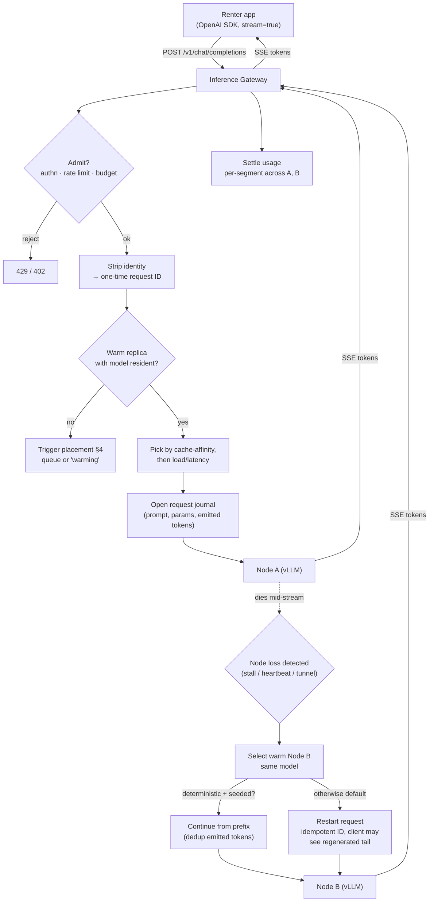

# Serving

Serving is Loom's serverless-inference product: a renter (or their app) sends an OpenAI-compatible request to an operator-run gateway, and Loom routes it to a warm consumer GPU running the requested model, streaming tokens back. This document owns the serving product shapes, the engine layer, the gateway and its failover behaviour, the weight cache and cold-start economics, Hugging Face integration, autoscaling, renter observability, and non-LLM serving.

It does not own transport (WireGuard/DERP — see [networking.md](../platform/networking.md)), identity-stripping rationale (see [security.md](../platform/security.md)), replica scheduling/placement mechanics (see [control-plane.md](../platform/control-plane.md)), or per-token pricing policy (see [marketplace.md](../product/marketplace.md)). It receives fine-tuned adapters from [training.md](../ml-lifecycle/training.md).

The defining constraint, repeated so it stays load-bearing: **supply is other people's daily-driver GPUs behind residential NAT that die a lot.** Every decision below flows from "any warm node can vanish at any moment, and residential upload is slow."

## 1. Product shapes

Loom sells three serving shapes over one gateway.

**(a) Shared endpoints** — multi-tenant pools of popular open-weight models (`loom serve` is unnecessary; these always exist). Many renters share a fleet of nodes all holding, say, `Qwen3-14B-AWQ`. Billing is **per-token**. This is the cheapest path to "just give me a good model," and it's where pre-placement and P2P weight distribution pay off most — one hot model, many warm replicas, high cache-hit rate.

**(b) Dedicated endpoints** — a renter's own base model, or (the killer path) a LoRA adapter on top of a shared base. Billing is **per-second** of replica wall-clock, with **scale-to-zero**. This is where fine-tuners land after [training.md](../ml-lifecycle/training.md).

**(c) Batch / offline inference** — no latency SLA, fills idle capacity, **cheapest tier**. Runs as a managed job (Flow A in [overview](../architecture/overview.md)) rather than through the live gateway: submit a dataset of prompts, get a results file. Scheduled onto whatever nodes are cheap and idle, preemptible, no keep-warm cost.

### What actually fits consumer VRAM

Consumer cards are 24–32GB, whole-card only (no MIG/SR-IOV). Being honest about what fits is the difference between a product and a demo. Numbers below are quantized-weight footprints; **you must leave headroom for KV cache and CUDA graphs**, so treat the card as ~20GB usable on a 24GB part.

| Model class | Example (July 2026) | Fits 24GB? | Notes |
|---|---|---|---|
| 7–9B dense | Llama-class 8B, Qwen3-8B | Yes, comfortably (AWQ ~5–6GB) | Long context fits; high concurrency headroom |
| 14B dense | Qwen3-14B | Yes (AWQ ~9–10GB) | The sweet spot for shared endpoints |
| 30–32B dense | Qwen3-32B, DeepSeek-R1-Distill-32B | Yes but tight (~18–20GB at INT4) — limited KV headroom | Lower concurrency; 32GB cards breathe easier ([acecloud](https://acecloud.ai/blog/best-open-source-llms/), [sitepoint](https://www.sitepoint.com/best-local-llm-models-2026/)) |
| Small MoE (~30B total / ~3B active) | Qwen3-Coder-30B-A3B | Yes (~19GB Q4) — best quality-per-GB | Runs like a 3B for speed, weighs like a 30B; ideal for single consumer cards ([techsy](https://techsy.io/en/blog/best-open-source-llms-2026)) |
| 70B+ dense | Llama-70B-class | **No** on a single 24–32GB card | Needs a multi-GPU LAN rig or is out of scope; whole-model-per-node forbids WAN sharding |
| Frontier MoE (235B+) | Qwen3-235B-A22B | **Out of scope** for single consumer cards | Requires a multi-GPU rig; a LAN-local multi-GPU host could serve it, but that's a supply edge case, not the base product |

The base product is **7–32B dense plus small MoEs, quantized.** 70B+ is only servable on a single LAN-connected multi-GPU host (a supply edge case), never by sharding across residential nodes. We do not invent throughput numbers here — measured throughput per replica is a runtime property fed into the router (§3) and surfaced to renters (§7).

## 2. Engine layer

vLLM is primary. The others earn their place only where vLLM genuinely doesn't fit.

| Engine | Hardware | Model classes | Why / when |
|---|---|---|---|
| **vLLM** (primary) | CUDA + ROCm | Dense + MoE LLMs, VLMs, embeddings | PagedAttention, continuous batching, mature OpenAI-compatible server exposing `/v1/chat/completions`, `/v1/completions`, `/v1/embeddings` ([vLLM docs](https://docs.vllm.ai/en/stable/serving/online_serving/)). ROCm is now first-class: dedicated AMD CI live since Dec 2025, ~93% of AMD test groups passing by Jan 2026, prebuilt ROCm wheels/images shipping ([ROCm blog](https://rocm.blogs.amd.com/software-tools-optimization/vllm-omni/README.html), [Phoronix](https://www.phoronix.com/news/AMD-ROCm-vLLM-Wheel)). One engine covers our Linux+NVIDIA-first / ROCm-fast-follow fleet. |
| **SGLang** | CUDA + ROCm | Same LLM classes; prefix-heavy workloads | Strong alternative. RadixAttention gives a throughput edge (~single-digit to ~29% depending on model size) and lower TTFT, with the biggest wins on RAG / multi-turn / shared-prefix traffic ([particula](https://particula.tech/blog/sglang-vs-vllm-inference-engine-comparison), [techsy](https://techsy.io/en/blog/vllm-vs-sglang)). **When we add it:** as an alternate engine image for shared endpoints whose traffic is measurably prefix-heavy. Not a rewrite — a second image behind the same gateway. |
| **TensorRT-LLM** | NVIDIA only | Dense LLMs, homogeneous fleet | **Assessed and rejected for the general fleet.** Its ahead-of-time build produces an engine binary specific to one GPU + dtype combo, and **engines are not portable across GPUs** ([localaimaster](https://localaimaster.com/blog/tensorrt-llm-setup-guide), [spheron](https://www.spheron.network/blog/vllm-vs-tensorrt-llm-vs-sglang-benchmarks/)). Our fleet is maximally heterogeneous consumer silicon — we'd have to build and cache a distinct engine per (model, GPU SKU, dtype), which fights whole-model-per-node fungibility. Revisit only if a large homogeneous NVIDIA sub-fleet emerges and per-node latency is the bottleneck. |
| **llama.cpp / GGUF** | CUDA/ROCm/CPU/Apple | Small models on long-tail nodes | Worth supporting **narrowly.** GGUF's CPU/GPU hybrid offload is the only mature path when a model doesn't fully fit VRAM, and llama.cpp is simpler and lighter at low concurrency (<15–20 users) ([gigagpu](https://gigagpu.com/vllm-vs-llama-cpp-gpu-servers/), [insiderllm](https://insiderllm.com/guides/llamacpp-vs-ollama-vs-vllm/)). But CPU offload "severely cripples" speed, so we use it only for tiny/undersized nodes serving low-concurrency dedicated endpoints — never for shared pools where throughput rules. Default off. |
| **ONNX Runtime + diffusers/whisper** | CUDA/ROCm/CPU | Non-LLM: embeddings, classifiers, Whisper ASR, diffusion image gen | Not every model is an autoregressive LLM. ONNX Runtime for portable classifier/embedding graphs; `diffusers` for image gen; `whisper`/`whisper.cpp` for ASR. Different engine images, same gateway (§8). |

**Bet: one gateway, multiple engine images, vLLM as the default.** The agent (see [host-agent](../platform/host-agent.md)) launches whichever engine image the replica spec names; the gateway only speaks the OpenAI-compatible wire protocol and doesn't care which engine answers.

## 3. Gateway architecture

The gateway is the front door and the only component renters and their apps talk to. It is operator-run, stateless-per-request, and horizontally scaled.

**OpenAI-compatible surface.** `/v1/chat/completions`, `/v1/completions`, `/v1/embeddings` at launch (vLLM serves all three natively). `/v1/images/generations` and `/v1/audio/transcriptions` follow with the non-LLM engines (§8). We track OpenAI's schema so existing SDKs work unmodified.

**Admission control + per-account limits.** On every request the gateway: authenticates the API key, checks the account's rate limit and concurrency ceiling (token-bucket per key, per-model), reserves budget, and — critically — **strips renter identity** before anything leaves for a node. The node sees an anonymized prompt and a one-time request ID, never an account. Rationale and threat model live in [security.md](../platform/security.md); this doc just guarantees the gateway is the only place identity exists.

**Live replica table.** The router maintains an in-memory table of every serving replica, fed by agent heartbeats routed through the control plane ([control-plane.md](../platform/control-plane.md) owns the heartbeat transport). Each entry carries: health/liveness, current load (in-flight + queue depth), **resident models** (from the weight cache manifest, §4), and **measured throughput** (tok/s observed, not advertised). Stale entries (missed heartbeats) are evicted fast — a consumer node that stops beating is assumed dead.

**Routing policy: cache-affinity first, then load/latency.** Pick among replicas that already hold the requested model+revision resident (cache hit = no cold start), then break ties by lowest load and best measured throughput/latency. Only if no warm replica exists does the gateway trigger a placement (§4) and either queue the request or, for scale-to-zero endpoints, return a "warming" state. Cache-affinity dominates because a cold start on residential bandwidth is minutes, not milliseconds (§4).

**Streaming plumbing.** SSE end-to-end. The node streams tokens to the gateway over the WireGuard/DERP tunnel; the gateway re-emits them as SSE to the caller. The gateway is a stateful proxy *per live stream* — it must be, to do failover.

### Failover spec

This is the heart of the product, because nodes die mid-stream constantly.

**Request journal.** For each in-flight stream the gateway keeps a small journal: the original (identity-stripped) request, the assigned replica, the sampling parameters, and **the exact sequence of tokens already emitted to the client.**

**On node loss** (broken tunnel / missed heartbeat / stream stall past a deadline): the gateway selects another warm replica holding the same model from the live table and re-dispatches.

**Restarting the stream — stated honestly:**
- Continuing *seamlessly* (client never sees a hiccup, no regenerated tail) requires the replacement node to reproduce the identical prefix and continue from it. That is only sound when **sampling is seeded and the engine is deterministic**, so emitted-token dedup on the gateway is possible. Deterministic-decode support is uneven across engines and quantizations, and a different node (different GPU, different kernels) may not reproduce logits bit-for-bit.
- Therefore the **recommended default is restart-from-scratch on the replacement node with an idempotent UX**: for non-streaming calls the client simply gets the full answer once (retry is invisible). For streaming calls, the honest behaviour is that the client may see a regenerated tail; we surface this as an idempotent request ID so a well-behaved client can dedupe or simply replace the partial with the final.
- **Seeded-deterministic continuation is an optimization we enable only where the engine guarantees it** (same engine build, seeded sampling, verified reproducibility on that model+quant), and only within a GPU-compatible replica sub-pool. Where those guarantees don't hold, we restart. We do not pretend the seam is invisible.

**Timeout budgets.** Per-request the gateway enforces: a TTFT budget (no first token within *N* seconds → treat replica as unhealthy, re-dispatch), an inter-token stall budget, and a total wall-clock ceiling. Budgets are per-model (a 32B replica gets a looser TTFT than an 8B). Exhausting the ceiling fails the request cleanly rather than hanging.

**Billing across failover** is settled per-segment (each node bills for what it actually served); double-charging and induced-failover gaming are called out as an open question in [overview](../architecture/overview.md) and owned by [marketplace.md](../product/marketplace.md).



## 4. Weight cache & cold starts

This is make-or-break. If cold starts are unbounded, scale-to-zero is a lie and the marketplace can't price serving.

**Content-addressed chunked storage.** Every node has a content-addressed weight cache. Weights are split into **content-defined chunks** (rolling-hash boundaries, ~64KB average, grouped into larger transfer blocks) following the proven Xet/CDC design ([HF Xet dedup](https://huggingface.co/docs/hub/xet/deduplication)). Each chunk is addressed by its hash; a **manifest per `model@revision`** lists the ordered chunk hashes plus engine/quant metadata. Content-addressing gives us free integrity verification and lets a node fetch any chunk from any peer that has it (transport in [networking.md](../platform/networking.md)).

**Dedup honesty.** CDC deduplicates *within* a model and across revisions that share unchanged tensors (a fine-tune that only moves some layers reuses the rest). But **dedup across different quantizations of the same base is low** — AWQ, GPTQ, and FP8 renderings of the same weights are different byte streams at the tensor level, so their chunks mostly don't match. We do **not** promise cross-quant dedup savings. Each `(model, quant, revision)` is largely its own footprint; the win is peer-to-peer distribution and cross-revision reuse, not magical compression across quant formats.

**Placement service.** When demand for a model rises (or is forecast), the placement service pre-warms **N replicas** by selecting nodes on **reputation-weighted** criteria (uptime history, benchmark class, bandwidth, geographic spread) — mechanics owned by [control-plane.md](../platform/control-plane.md). Selected nodes fetch chunks **P2P from each other and from an origin object store** as a fallback seed, so we don't melt the origin when a model goes hot.

**Cold-start budget — the honest breakdown.** A cold replica for a fresh model pays, roughly in sequence:
1. **Weight download.** Tens of GB over residential downlinks (~100–500 Mbps). A 14B AWQ model (~10GB) is ~3–13 minutes at those rates; a 32B is worse. P2P parallel fetch from multiple peers helps, but the floor is *minutes*, not seconds.
2. **Engine load + graph capture.** vLLM startup captures CUDA graphs across batch sizes (tens of seconds) and, with `torch.compile`, Inductor kernel compilation adds 30–120s on first run ([spheron cold-start](https://www.spheron.network/blog/gpu-cold-start-llm-inference-2026/), [arxiv 2606.07362](https://arxiv.org/pdf/2606.07362)).

**Mitigations we apply:**
- **Persist compiled graphs / torch.compile output to an on-node cache directory** so subsequent cold starts of the same (model, GPU) skip recapture — first start pays ~30s, later starts read from NVMe ([spheron](https://www.spheron.network/blog/gpu-cold-start-llm-inference-2026/)).
- **`--enforce-eager`** to skip graph capture entirely when we want fastest boot at some steady-state throughput cost — a knob, chosen per endpoint.
- Pre-placement so popular models are *already resident* before demand — turning most requests into cache hits and eliminating step 1.

**Conclusion — keep-warm is the product answer.** Because even the optimized floor is minutes-scale (download-dominated), **scale-to-zero is inherently a minutes-scale cold start.** We do not hide this. The product answer is **keep-warm**: shared endpoints stay warm by construction (steady traffic + pre-placement); dedicated endpoints offer a keep-warm option that the renter pays for (a per-second floor that keeps ≥1 replica resident), traded against scale-to-zero savings. This is a direct pricing hook into [marketplace.md](../product/marketplace.md): the renter chooses between "cheap but cold-starts in minutes" and "costs a floor but always hot."

## 5. Hugging Face integration

Deploy-by-model-id is the primary UX:

```
loom deploy hf:Qwen/Qwen3-14B --quant awq
loom deploy hf:Qwen/Qwen3-14B@a1b2c3 --quant awq   # pinned revision
```

- **Auto-detect architecture → engine compatibility.** The control plane reads the model's `config.json` architecture and picks a compatible engine image (vLLM for supported LLM/VLM/embedding architectures; falls back to llama.cpp/ONNX where relevant, §2/§8). Unsupported architectures are rejected at deploy time with a clear error, not at runtime on a node.
- **Gated-model tokens via sealed secrets.** For gated repos, the renter's HF token is stored as a **sealed secret** (encrypted to the control plane, never written plaintext to a host; see [security.md](../platform/security.md)) and used only to fetch weights into the content-addressed cache. Nodes never see the token.
- **Revision pinning.** Deployments pin `model@revision`; the manifest is keyed by revision so a silent upstream change can't swap weights under a running endpoint.
- **License surface.** We display the model's declared license at deploy time. **Compliance is the renter's responsibility** — we surface, we don't adjudicate.
- **Quant selection.** `--quant awq|gptq|fp8`. AWQ INT4 is the default recommendation for the fleet: best-balanced INT4 for vLLM, strong reasoning stability, fast to quantize ([vrlatech](https://vrlatech.com/llm-quantization-explained-int4-int8-fp8-awq-and-gptq-in-2026/), [sesamedisk](https://sesamedisk.com/quantization-techniques-ai-inference-2026/)). FP8 is offered for 32GB / newer cards where VRAM allows near-FP16 quality at high speed.

### Adapters — the killer cheap path

Fine-tuners coming out of [training.md](../ml-lifecycle/training.md) usually have a **LoRA adapter**, not a full model. Serving a LoRA on top of a **shared base** is the cheapest possible dedicated endpoint: the base is already warm across the fleet, the adapter is megabytes, and one base replica can serve many adapters. vLLM supports multi-LoRA for exactly this ([vLLM LoRA docs](https://docs.vllm.ai/en/latest/features/lora/)).

**Status flag (verify at build time):** vLLM can load adapters at startup via `--lora-modules`, and can *dynamically* load via `/v1/load_lora_adapter` — but runtime dynamic loading is gated behind `VLLM_ALLOW_RUNTIME_LORA_UPDATING` and is flagged as **not production-safe in an untrusted multi-replica setup**: it doesn't guarantee the adapter is present on every replica or survives a restart ([spheron LoRA](https://www.spheron.network/blog/lora-multi-adapter-serving-gpu-cloud/), vLLM docs). For Loom this means **we treat adapters as first-class cached artifacts**: an adapter is content-addressed and placed on the base-model replicas by the placement service (same P2P path as weights, §4), and registered with the replica ahead of serving — not hot-loaded ad hoc on one node. The gateway routes a LoRA request only to replicas the control plane confirms have that adapter resident. This turns "dynamic LoRA loading" (fragile) into "placement of a tiny artifact" (our existing, robust path).

## 6. Autoscaling

A **per-endpoint replica controller** runs on the control plane. Signals: **queue depth** and **TTFT target** (measured from the replica table, §3). If queue depth or observed TTFT exceeds the endpoint's target, add a replica (trigger placement §4); if replicas sit idle below a low-water mark, remove them.

- **Scale-to-zero semantics.** Dedicated endpoints can scale to zero replicas. The next request pays the cold start (§4) — minutes — so the endpoint is marked "cold," the caller gets a `warming` response or long-poll, and a replica is placed. Renters who can't tolerate this buy keep-warm (§4).
- **Burst borrowing (open question).** A dedicated endpoint under a spike could temporarily borrow capacity from the shared pool of the same base model. Attractive (base is already warm) but tangled: billing attribution, isolation, and fairness against shared-pool tenants are unresolved. **Flagged as an open question**, not committed.
- **Capacity forecasting (brief).** Placement is reactive by default but improved by a light forecast: time-of-day and weekly seasonality per popular model drive pre-warming so hot models have warm replicas *before* the queue builds. Forecasting only pre-warms shared/popular models; dedicated endpoints scale reactively unless keep-warm is bought.

## 7. Observability for renters

Renters get, per endpoint and per request:
- **TTFT, TPS (tok/s), queue depth, and latency percentiles** — all derived from the gateway's own measurements and the replica table, so they're real, not advertised.
- **Per-request traces, gateway-side only.** A trace covers admission, routing decision, replica assignment, failover events, and timing — everything the *gateway* observed. It deliberately excludes any node-side or renter-identity linkage, preserving the identity-stripping guarantee ([security.md](../platform/security.md)). Traces are keyed by the one-time request ID.
- **Usage dashboards** — tokens/requests/spend over time, per model and per key, feeding the billing surface in [marketplace.md](../product/marketplace.md).

We never expose which host served a request (renter privacy is symmetric with host privacy — the renter doesn't learn the host either).

## 8. Non-LLM serving

Same gateway, different engine images. The gateway's job is auth + billing + routing + failover; it's engine-agnostic once the wire protocol matches.

- **Embeddings** — `/v1/embeddings`, served by vLLM in pooling mode (it supports embedding/pooling models natively, incl. multimodal) ([vLLM online serving](https://docs.vllm.ai/en/stable/serving/online_serving/)) or by a lightweight ONNX Runtime image for small classifier/embedder graphs.
- **Whisper ASR** — `/v1/audio/transcriptions`, served by a `whisper`/`whisper.cpp` engine image. Small models, fit easily, good for filling idle capacity.
- **Diffusion image generation** — `/v1/images/generations`, served by a `diffusers` engine image. Heavier VRAM and different batching characteristics, so its own replica pool and its own throughput accounting.

These share the whole-model-per-node topology, the content-addressed cache, pre-placement, and failover. The only differences are the engine image and the OpenAI endpoint surface. Non-LLM engines are a fast-follow after the LLM path is solid; the gateway is designed so adding one is "register an engine image + endpoint," not a redesign.

## 9. Open questions

- **Deterministic failover continuation.** Which engine builds + model + quant combinations actually give bit-reproducible seeded decoding across *different* consumer GPUs? Until we can characterize this per-combo, restart-from-scratch is the default and seamless continuation is a narrow optimization. Needs empirical work.
- **Burst borrowing from shared pools** (§6) — billing attribution, tenant isolation, and fairness are unresolved.
- **Adapter explosion.** If one base has hundreds of LoRAs, how many can we co-place per replica before KV/routing overhead dominates, and how do we schedule adapter placement across the base-model sub-fleet?
- **Cold-start floor vs. scale-to-zero pricing.** Given the minutes-scale download floor, is there a viable "warm-ish" middle tier (weights resident but engine stopped) that cuts cold start to engine-load-only, and how do we price it against full keep-warm? (Pairs with [marketplace.md](../product/marketplace.md).)
- **Quant policy per card generation.** As FP8-capable consumer cards spread, when do we default a model to FP8 vs AWQ, and do we keep both cached (no cross-quant dedup, §4) or pick one per node class?
- **SGLang adoption trigger.** What measured share of prefix-heavy traffic on a shared endpoint justifies standing up an SGLang image alongside vLLM for that model?
- **VLM / long-context KV pressure.** Vision-language and long-context requests blow up KV cache on 24GB cards; what's the honest max context we advertise per model class before we must reject or degrade?
