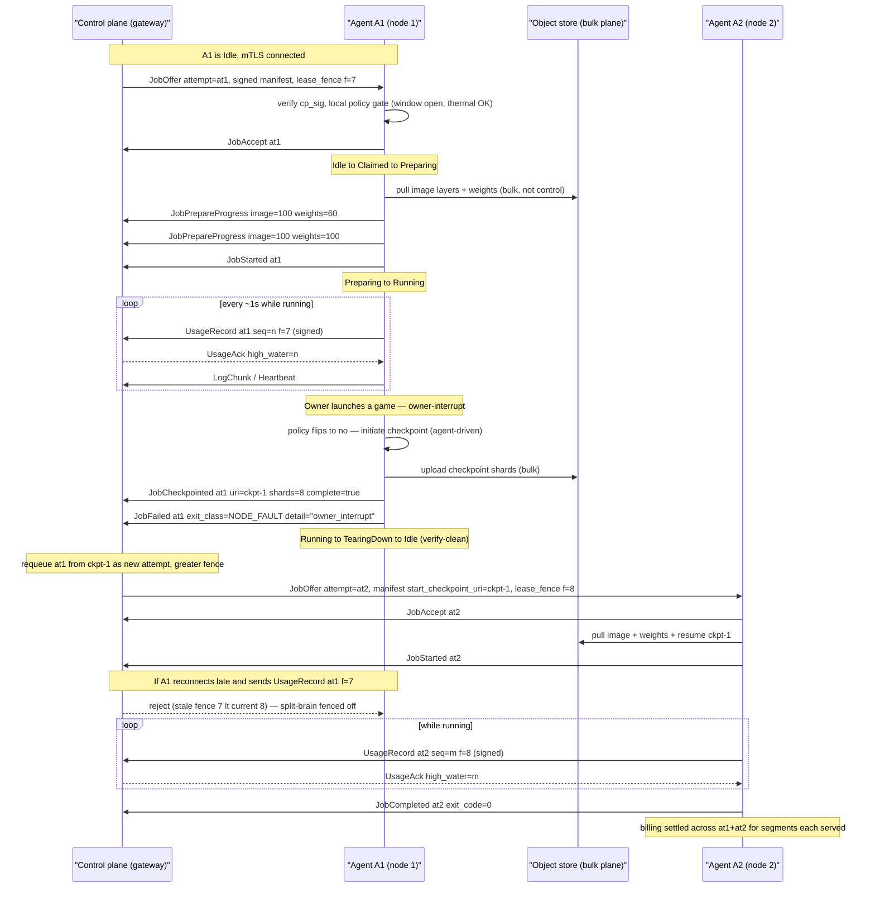

# Agent protocol

Status: design draft · July 2026 · owner: platform

This document specifies the **wire protocol** between a Loom host agent ([host-agent.md](./host-agent.md)) and the operator's agent-gateway ([control-plane.md](./control-plane.md) §1). It owns the *message contract*: transport establishment, framing, the message catalog, the binding of messages to agent states, the failure matrix, and the protocol-level security properties. It does **not** own transport mechanics (QUIC/WSS choice, migration, NAT traversal — [networking.md](./networking.md)), agent lifecycle internals ([host-agent.md](./host-agent.md)), scheduler decisions ([control-plane.md](./control-plane.md)), or the trust model ([security.md](./security.md)). Where those decisions land on the wire, we carry them and cross-link the authority.

Two invariants from the sibling docs shape everything here and are restated, not re-decided:

1. **Outbound-only.** The agent opens exactly one connection to the gateway and never listens ([networking.md](./networking.md) §2). All control messages, including gateway→agent commands, flow over streams *the agent opened* or streams the gateway opens *on that agent-initiated connection*.
2. **Local policy is authoritative.** The control plane can *offer* work and *push* config, but it can never loosen an owner's limits ([host-agent.md](./host-agent.md) §10, [control-plane.md](./control-plane.md) §4). This surfaces in the protocol as reason codes and a hard rule: no message widens a cap.

---

## 1. Transport & session

### 1.1 Connection establishment

The agent's control-channel client (host-agent §2) establishes exactly one long-lived connection to a connection-gateway. Transport selection follows [networking.md](./networking.md) §2:

1. **QUIC first.** Attempt QUIC over UDP/443 via **quinn** (RFC 9000). ALPN token `loom/1` is offered in the TLS `ClientHello`; the gateway rejects any mismatched ALPN early (networking §8). QUIC connection migration is enabled gateway-side so a residential IP change does not drop the session (networking §2.3).
2. **WSS fallback.** If QUIC cannot be established or sustained (UDP-hostile middlebox), fall back to **WSS over TCP/443** via `tokio-tungstenite`, negotiating the same protocol identifier through the WebSocket `Sec-WebSocket-Protocol` header (value `loom/1`) so the fallback is indistinguishable from ordinary HTTPS while still advertising the app protocol to our gateway.

`loom/1` denotes the *transport framing* version, not the protobuf schema version (§2.3). The two version axes are independent: the transport identifier changes only on a breaking framing/multiplexing change; message schemas evolve under semver within a given transport.

### 1.2 mTLS identity & CSR provisioning at enrollment

Steady-state connections are **mTLS** (rustls): the gateway pins the Loom CA and validates the agent's client certificate; the agent pins the gateway identity ([networking.md](./networking.md) §2, [security.md](./security.md) §7).

The agent has no certificate before enrollment, so the **very first** connection is a constrained bootstrap:

- The agent connects with **no client certificate** and presents only a single-use **enrollment token** `T` (minted when the owner links the machine, host-agent §4) inside the first application message. The gateway routes token-only connections to an enrollment-only path — they may send `EnrollRequest` and nothing else.
- The agent generates a keypair locally and sends a **PKCS#10 CSR** (subject holds a self-asserted nonce; the real `agent_id` is assigned by the control plane, so the CSR subject is advisory) alongside `T`, inventory, and fingerprint.
- The control plane verifies `T`, binds the node identity to the owner's account and the CSR public key, signs a **long-lived node certificate** (CN/SAN = `agent_id`), and returns it in `EnrollGrant`.
- The private key never leaves the host; it lives in memory plus an encrypted-at-rest keystore (host-agent §10). All subsequent connections present this certificate; the token is spent.

Cert rotation (`RotateCert`, §3a) reuses the CSR flow over an *already-authenticated* mTLS connection — no token needed, because possession of the current key is the proof of identity.

### 1.3 Session resumption & reconnect

- **QUIC 0-RTT is disabled** for the control channel. 0-RTT early data is replayable, and this channel carries state-mutating messages; we accept the extra round trip and use 1-RTT only. TLS session tickets for faster *handshake* (not early data) are permitted.
- **Reconnect** uses exponential backoff + full jitter (base 500 ms, cap ~30 s), re-probing QUIC-then-WSS each cycle (networking §2). Reconnect is **not** a fresh session in the protocol sense: the agent re-authenticates with its cert and immediately sends a `StateReport` (§4) so the gateway reconciles ground truth. Attempts survive brief disconnects; only sustained silence past **90 s** declares an attempt lost (§1.5, control-plane §3).
- **Spool replay.** Durable-but-unacked messages (usage records, unacked log chunks) are replayed from the local spool on reconnect, deduped by their keys (§3e, §3f). This is the load-bearing reason metering survives a home-internet blip without losing billing data.

### 1.4 Stream layout

Over the single connection we run one bidirectional control stream plus per-concern unidirectional streams, so a slow log upload never head-of-line-blocks a heartbeat (networking §2). **Who opens what:**

| Stream | Direction | Opener | Kind | Carries |
|---|---|---|---|---|
| **control** | agent ↔ gateway | agent opens on connect | bidi | Enrollment, `JobOffer`/accept/reject, checkpoint commands, `ReplicaPlace`, config push, `StateReport`, `AttestationQuote`. Request/response + gateway-initiated RPC. |
| **heartbeats** | agent → gateway | agent | uni | `Heartbeat` |
| **logs** | agent → gateway | agent | uni | `LogChunk` (backpressured, may lag) |
| **metering** | agent → gateway | agent | uni | `UsageRecord` (durable, spooled) |

The gateway never opens a new QUIC stream *to* the agent out of nowhere in a way that violates outbound-only: it multiplexes gateway→agent RPC as **messages on the agent-opened bidi control stream** (the connection is agent-initiated, so this is fully outbound-consistent — the agent opened the pipe, the gateway writes into its half). On the WSS fallback there is a single TCP stream; the four logical streams are multiplexed by a `channel` tag in the frame header (§2.1) and TCP head-of-line blocking is accepted as the fallback penalty (networking §2).

---

## 2. Framing & encoding

### 2.1 Length-prefixed protobuf

Every message is **length-prefixed protobuf**: a `uint32` big-endian byte length, then the serialized `Envelope`. On WSS each WebSocket binary frame carries exactly one length-prefixed message plus a one-byte `channel` tag (`0=control, 1=heartbeat, 2=log, 3=metering`); on QUIC the stream itself is the channel and the tag is omitted.

**Why protobuf, not JSON:**

- **Schema evolution.** Protobuf's field-number model gives forward/backward compatibility for free: old agents skip unknown fields, new fields are additive, and reserved numbers prevent accidental reuse. Reserving `trust_tier`/attestation fields from day one ([security.md](./security.md) §6.5) is *exactly* the additive-evolution case protobuf is built for — adding Tier C later is a new field, not a new schema version.
- **Size.** Usage records and heartbeats are high-frequency on a bandwidth-constrained residential uplink (networking §7). Binary encoding of the mostly-numeric telemetry is materially smaller than JSON, and every byte on the uplink competes with the owner's Netflix.
- **Determinism for signing.** `UsageRecord` is signed (§3f). Protobuf gives a stable, canonical-enough byte layout to sign over the serialized message bytes (we sign the *bytes on the wire*, §6), avoiding JSON's whitespace/key-order ambiguity.

**Human-debuggable JSON stays in tooling.** The `loom-hostd` CLI and gateway admin tools render any captured frame to pretty JSON via protobuf reflection. The wire is binary; the debugging surface is JSON. We do not pay JSON's size/ambiguity cost on the wire to buy readability we can synthesize on demand.

### 2.2 Envelope

Every message is wrapped:

```protobuf
message Envelope {
  uint32 protocol_version = 1;   // semver-major of the message schema (see §2.3)
  string msg_id           = 2;   // ULID; unique per sender per connection
  string correlation_id   = 3;   // echoes the msg_id this responds to; empty if unsolicited
  int64  timestamp_ms     = 4;   // sender wall clock, ms since epoch (advisory; see clock-skew §3b)
  oneof body {
    // enrollment & identity
    EnrollRequest       enroll_request        = 10;
    EnrollGrant         enroll_grant          = 11;
    ReEnroll            re_enroll             = 12;
    RotateCert          rotate_cert           = 13;
    // presence & health
    Heartbeat           heartbeat             = 20;
    StateReport         state_report          = 21;
    // job lifecycle
    JobOffer            job_offer             = 30;
    JobAccept           job_accept            = 31;
    JobReject           job_reject            = 32;
    JobPrepareProgress  job_prepare_progress  = 33;
    JobStarted          job_started           = 34;
    JobCheckpointRequest job_checkpoint_request = 35;
    JobCheckpointed     job_checkpointed      = 36;
    JobCompleted        job_completed         = 37;
    JobFailed           job_failed            = 38;
    JobAbort            job_abort             = 39;
    // serving lifecycle
    ReplicaPlace        replica_place         = 40;
    ReplicaReady        replica_ready         = 41;
    ReplicaDrain        replica_drain         = 42;
    ReplicaEvict        replica_evict         = 43;
    // logs & artifacts
    LogChunk            log_chunk             = 50;
    ArtifactUploadGrant artifact_upload_grant = 51;
    // metering
    UsageRecord         usage_record          = 60;
    UsageAck            usage_ack             = 61;
    // trust / attestation (reserved for Tier C)
    AttestationQuote    attestation_quote     = 70;
    // agent ops
    UpdateAvailable     update_available      = 80;
    UpdateApplied       update_applied        = 81;
    ConfigPush          config_push           = 82;
    Drain               drain                 = 83;
  }
}
```

### 2.3 Versioning & compatibility

- **Semver of the schema.** `protocol_version` carries the **major** number of the message schema. Minor/patch (additive fields, new optional messages) require no version bump — protobuf handles them by unknown-field tolerance. Major bumps are breaking (field-number reuse, semantics change) and are rare.
- **Agent advertises a supported range; control plane picks.** `EnrollRequest` and every reconnect's first `StateReport` carry `supported_versions {min, max}`. The control plane selects the highest mutually-supported major and echoes `chosen_version` in `EnrollGrant` / the reconnect ack. If the ranges do not overlap, the gateway closes the connection with a `version_unsupported` close code and the agent must self-update (§3g) before retrying.
- **Unknown-field tolerance is mandatory.** Both sides MUST ignore unknown fields and unknown `oneof` bodies rather than erroring — this is what lets a Tier C `AttestationQuote` field ship to old agents harmlessly and lets a new control plane talk to a not-yet-updated fleet.
- **Deprecation windows.** A field or message deprecated in major `N` remains wire-present and honored through the entire life of major `N` and is removed no earlier than major `N+2`. The fleet updates on a staged rollout (host-agent §9), so the control plane must speak the oldest still-deployed major for the length of one deprecation window — pragmatically, several release cycles.

---

## 3. Message catalog

Field sketches are illustrative protobuf, not the authoritative `.proto` (which lives in-repo). Every message rides inside `Envelope`.

### (a) Enrollment & identity

```protobuf
message EnrollRequest {
  string enroll_token        = 1;   // single-use T; only on the token-only bootstrap connection
  bytes  csr_der             = 2;   // PKCS#10 CSR, DER-encoded
  HardwareInventory hw       = 3;   // GPU model, VRAM, driver/CUDA, PCIe topo, ECC, power/thermal caps
  BenchmarkFingerprint bench = 4;   // achieved FLOPs @ shapes, mem bandwidth, timing distribution
  NatProbeResult nat         = 5;   // reflexive addr, cone/symmetric classification (networking §3)
  VersionRange supported_versions = 6;
}
message EnrollGrant {
  string agent_id            = 1;
  bytes  node_cert_der       = 2;   // CA-signed long-lived node cert (CN/SAN = agent_id)
  bytes  ca_chain_der        = 3;
  AgentConfig config         = 4;   // heartbeat cadence, spool caps, endpoints, chosen tiers
  uint32 chosen_version      = 5;
}
message ReEnroll  { string reason = 1; }               // gateway→agent: re-run enrollment (e.g. re-verify)
message RotateCert { bytes csr_der = 1; }              // agent→gateway over authenticated mTLS; replies EnrollGrant-shaped
```

- **Direction:** `EnrollRequest`/`RotateCert` agent→gateway; `EnrollGrant`/`ReEnroll` gateway→agent.
- **Backend capability ([ADR-0015](../adr/0015-pluggable-compute-backends.md)).** Per [compute-backends.md](./compute-backends.md), `HardwareInventory` (in `EnrollRequest`) and `Heartbeat` gain **additive** backend-capability fields — `backends[]` (the enum subset the node can run: `mlx`/`cuda`/`cpu`/`rocm`), `memory_model` (e.g. unified vs. discrete VRAM), and per-backend runtime versions — which the scheduler filters placement on (backend.md §3). These are new fields, not a schema break: consistent with the additive protobuf-evolution rule (§2 "Schema evolution", §2.3), old agents simply omit them.
- **Errors/retry:** an invalid/spent token → `JobReject`-style close with reason `enroll_token_invalid`; the agent surfaces it to the owner and does **not** retry automatically (a spent token is terminal). CSR signing failure is retriable with backoff. `RotateCert` before cert expiry is routine; a failed rotation keeps the old cert until it actually expires, then falls back to `ReEnroll`.

### (b) Presence & health

```protobuf
message Heartbeat {
  AgentState state           = 1;   // enum mirrors host-agent §3 state machine
  GpuTelemetry gpu           = 2;   // util %, vram_used_mb, power_w, temp_c (summary, not full sample stream)
  string cache_digest_version = 3;  // version tag of the node's weight/image cache manifest
  int64  monotonic_uptime_ms = 4;   // agent process monotonic clock (skew-immune, §3b)
  repeated string active_attempt_ids = 5;  // for reconciliation
}
message StateReport {                // full resync after reconnect / on demand
  AgentState state           = 1;
  repeated AttemptState attempts = 2;  // {attempt_id, phase, last_seq_sent, lease_fence}
  VersionRange supported_versions = 3;
  string cache_digest_version = 4;
}
```

- **Cadence:** `Heartbeat` ~ every 10–20 s while idle, more frequent under load (config-driven). **The 90 s rule, both sides:** the *agent* treats > 90 s of failed sends as "the gateway has probably declared me lost" and, on reconnect, expects its leases may have been fenced (§5); the *control plane* marks an attempt `lost` after 90 s of silence, expires the lease, and requeues (control-plane §3). The threshold lives in control-plane; the agent mirrors it defensively.
- **Clock-skew handling.** Consumer RTCs are unreliable (host-agent §7). `timestamp_ms` and `Heartbeat.gpu` wall times are **advisory, for alignment only**. Every gateway ack stamps **server time**; the agent computes an offset for reconciliation. **Durations that bill are always `monotonic_uptime_ms`-derived**, never wall-clock deltas (§3f) — a wrong host RTC can never over/under-bill.

### (c) Job lifecycle

```protobuf
message JobOffer {
  string attempt_id          = 1;
  SignedManifest manifest    = 2;   // see below; control-plane-signed
  string lease_fence         = 3;   // monotonic fencing token for this lease (§5)
  int64  lease_expires_ms    = 4;   // server time
}
message SignedManifest {
  bytes  manifest_pb         = 1;   // serialized JobManifest
  bytes  cp_sig              = 2;   // control-plane job-signing key (KMS/HSM), over manifest_pb (§6)
  string key_id              = 3;
}
message JobManifest {
  string image_digest        = 1;   // content-addressed; agent verifies before run (security §7)
  ResourceClaim resource     = 2;   // gpus, min_vram_mb, cpu, ram
  string isolation_tier      = 3;   // "B" | "A" | "C"
  string trust_tier          = 4;   // reserved; drives attestation requirement (§3g, security §6.5)
  int64  max_duration_ms     = 5;
  string sealed_secrets_ref  = 6;   // handle to sealed-channel env injection (security §7); NOT the secrets
  string start_checkpoint_uri = 7;  // resume-from, if any
}
message JobAccept { string attempt_id = 1; }
message JobReject { string attempt_id = 1; RejectReason reason = 2; string detail = 3; }
enum RejectReason {
  LOCAL_POLICY = 0;   // owner window closed / cap exceeded — control plane cannot override
  THERMAL      = 1;   // GPU over thermal cap
  OWNER_WINDOW = 2;   // scheduling window closed
  RESOURCE     = 3;   // can't satisfy the resource claim right now
  MANIFEST_SIG = 4;   // signature verify failed — refuse to run
  TIER_UNSUPPORTED = 5; // e.g. trust_tier=C on a non-attestable node
}
message JobPrepareProgress { string attempt_id = 1; uint32 image_pct = 2; uint32 weights_pct = 3; }
message JobStarted   { string attempt_id = 1; int64 started_monotonic_ms = 2; }
message JobCheckpointRequest {  // gateway→agent: checkpoint now
  string attempt_id = 1; uint32 grace_ms = 2; CheckpointCause cause = 3;
}
enum CheckpointCause { PERIODIC = 0; PREEMPT = 1; DRAIN = 2; OWNER_INTERRUPT = 3; }
message JobCheckpointed {       // also agent-initiated on owner-interrupt
  string attempt_id = 1; string checkpoint_uri = 2; bytes manifest_hash = 3;
  uint32 shards_uploaded = 4; bool complete = 5;
}
message JobCompleted { string attempt_id = 1; int32 exit_code = 2; }
message JobFailed    { string attempt_id = 1; ExitClass exit_class = 2; string detail = 3; }
enum ExitClass { OOM = 0; NONZERO_EXIT = 1; SANDBOX_VIOLATION = 2; NODE_FAULT = 3; }
message JobAbort { string attempt_id = 1; string reason = 2; }  // gateway→agent: kill now
```

- **`JobOffer` → accept/reject.** The agent verifies `cp_sig` **before anything touches the GPU** (security §7) and runs the local policy gate (host-agent §6). A manifest that violates local policy is rejected with `LOCAL_POLICY`/`THERMAL`/`OWNER_WINDOW`; the control plane requeues elsewhere (control-plane §4). A bad signature is `MANIFEST_SIG` and is never run.
- **Checkpoint.** `JobCheckpointRequest` is gateway→agent for periodic/preempt/drain snapshots. On **owner-interrupt** (owner starts a game) the agent *initiates* the checkpoint itself and emits `JobCheckpointed` unsolicited — the owner always wins and does not wait for the control plane (host-agent §3, §8). `grace_ms` bounds the window; on expiry teardown force-kills and the attempt requeues from the last checkpoint.
- **Terminal.** `JobCompleted`/`JobFailed` are the agent's honest execution truth; the control plane still owns billing terminality (control-plane §3, §6). Exit-class taxonomy feeds reliability scoring (control-plane §5).
- **Retry.** Terminal reports are idempotent by `attempt_id` — a duplicate on reconnect is a no-op (control-plane §3). `JobAbort` is fire-and-force; the agent acks by transitioning and reporting terminal `JobFailed`/aborted.

### (d) Serving lifecycle

```protobuf
message ReplicaPlace {
  string replica_id = 1; string deployment_id = 2;
  SignedManifest model_manifest = 3;  // same signing discipline as jobs
  EngineConfig engine = 4;            // vLLM args, model digest, dtype, max_batch
  string keep_warm_class = 5;         // scheduling hint for warm-pool retention
  string lease_fence = 6;
}
message ReplicaReady { string replica_id = 1; }   // agent→gateway: model resident, tunnel up (networking §4)
message ReplicaDrain { string replica_id = 1; uint32 grace_ms = 2; }  // graceful: finish in-flight, stop new
message ReplicaEvict { string replica_id = 1; }   // immediate: owner-eject / preempt
```

- Replicas are long-lived attempts under a deployment (control-plane §4). `ReplicaReady` is only sent **after** the gateway tunnel is established, so the node is never marked ready before it can serve (networking §4). `ReplicaDrain` respects in-flight requests; `ReplicaEvict` is the owner-eject/preempt path and drops immediately, gateway fails over to another replica (overview Flow B).

### (e) Logs & artifacts

```protobuf
message LogChunk {
  string attempt_id = 1; LogStream stream = 2;  // STDOUT | STDERR | EVENT
  uint64 seq = 3; bytes data = 4; bool dropped_marker = 5; uint64 dropped_count = 6;
}
message ArtifactUploadGrant {  // gateway→agent: where to push bulk artifacts
  string attempt_id = 1; string presigned_url = 2; int64 expires_ms = 3; string method = 4;
}
```

- **Backpressure rule: drop-oldest with marker.** When the log stream's bounded buffer fills (a chatty job outruns a slow uplink), the agent **drops the oldest buffered chunks and emits a `dropped_marker=true` chunk carrying `dropped_count`**, rather than blocking. Justification: logs are diagnostic, not billing — blocking the log task to preserve every byte would let a runaway job's stdout apply backpressure into the agent and risk starving heartbeats/metering, the two streams that *must not* lag (host-agent §2 "backpressured so a chatty job can never OOM the host"). We lose old log bytes visibly (the marker tells the reader exactly how many) rather than risk liveness. Metering, by contrast, **never** drops (§3f) — different stream, different rule.
- **Bulk NEVER over the control channel.** Artifacts, checkpoints, weights, datasets — tens to hundreds of GB — go node↔object-store via the bulk plane (networking §5), never inline on control. The control channel only carries the **`ArtifactUploadGrant`** (a presigned URL) and the agent uploads out-of-band. This keeps the control channel thin and constant (networking §1).

### (f) Metering

```protobuf
message UsageRecord {
  string attempt_id = 1; uint64 seq = 2;      // monotonic per attempt; dedup key (attempt_id, seq)
  uint64 gpu_ms = 3;                          // monotonic counter, skew-immune
  uint32 gpu_util_avg = 4;                    // 0..100 over the window
  uint64 vram_peak_mb = 5;
  uint64 net_in_bytes = 6; uint64 net_out_bytes = 7;
  uint64 energy_mj = 8;                       // estimate, millijoules
  int64  window_start_monotonic_ms = 9;
  int64  window_end_monotonic_ms = 10;
  bytes  agent_sig = 11;                       // ed25519 over the serialized record (agent identity key, §6)
}
message UsageAck { string attempt_id = 1; uint64 high_water_seq = 2; }  // gateway→agent: cumulative ack
```

- **Signing.** Each record is ed25519-signed by the agent's identity key so a compromised relay/MITM cannot inflate or deflate earnings undetected (host-agent §7, control-plane §6). Signature is over the canonical serialized `UsageRecord` with the `agent_sig` field cleared (§6).
- **Durable local spool + replay.** Records are written to a bounded on-disk spool before send; a transient disconnect never loses billing data (networking §2, host-agent §7). On reconnect the agent replays everything above the last `UsageAck.high_water_seq`.
- **Ack = high-water mark.** `UsageAck` is cumulative: acking `seq=N` acks all `seq ≤ N`, and the agent may prune its spool up to `N`. **Dedup by `(attempt_id, seq)`** at the aggregator's UNIQUE constraint (control-plane §6) makes at-least-once replay exactly-once for billing.
- **Retry.** Unbounded retry with backoff — metering is money and must not drop. If the spool hits its cap (extended outage), the agent stops *accepting new work* before it drops a billing record (fail-safe toward not losing money), surfacing a degraded state via `Heartbeat`.

### (g) Trust / attestation (reserved for Tier C)

```protobuf
message AttestationQuote {              // reserved now; wired for additive Tier C (security §6)
  string attempt_id = 1;
  bytes  report = 2;                    // CVM measurement + GPU attestation report (SEV-SNP/TDX + H100/Blackwell)
  repeated bytes cert_chain = 3;        // AMD/Intel + NVIDIA roots
  bytes  nonce = 4;                     // gateway-supplied freshness nonce (replay protection)
}
```

- **Placeholder semantics now.** The field is reserved and the message defined so Tier C ([security.md](./security.md) §6) is **additive, not breaking** (security §6.5). On Tiers A/B the agent never sends it and the control plane never requires it. When Tier C lands, a `JobOffer` with `trust_tier="C"` triggers a gateway→agent nonce challenge and an `AttestationQuote` response, which the key service verifies before releasing the DEK (security §6.2). Old agents that receive a Tier C offer simply reject with `TIER_UNSUPPORTED` — graceful, because the field was reserved from day one.

### (h) Agent ops

```protobuf
message UpdateAvailable { string version = 1; string release_url = 2; string cohort = 3; }
message UpdateApplied   { string version = 1; bool ok = 2; string detail = 3; }
message ConfigPush      { AgentConfig config = 1; string config_version = 2; }
message Drain           { uint32 grace_ms = 1; DrainReason reason = 2; }
```

- **Updates.** `UpdateAvailable` is the control plane's staged-rollout gate (host-agent §9) — it says "you are eligible for vX"; the agent fetches, verifies signature, swaps, and reports `UpdateApplied`. Crash-loop rollback is agent-local (host-agent §9); a rollback reports `ok=false`.
- **`ConfigPush` — the owner-authoritative invariant.** Config push can tighten but **can never loosen an owner limit**. The agent's policy engine treats every pushed value as an *upper bound intersected with local config*: if `ConfigPush` says "you may offer 90% VRAM" but `host.toml` says 50%, the effective cap is 50%. **The control plane can never widen a cap the owner set** (host-agent §8, §10, control-plane §4). This is a hard protocol invariant, enforced agent-side; a push that attempts to loosen is clamped, not honored.
- **`Drain`.** Graceful vacate for update/shutdown (host-agent §3): stop accepting offers, let in-flight work reach a checkpoint boundary, exit clean. Nodes are cattle; drained jobs requeue.

---

## 4. State-machine binding

Agent states are host-agent §3: `Enrolling, Idle, Claimed, Preparing, Running, TearingDown, Draining`, plus the `OwnerInterrupt` transition. A message received in an illegal state is **rejected and triggers resync**: the agent replies with a `StateReport` (its actual state + attempt phases + `lease_fence`s) and the gateway reconciles against Postgres (control-plane §3). No message silently no-ops on a state mismatch.

| Message | Legal agent states | On illegal state |
|---|---|---|
| `EnrollRequest` / `EnrollGrant` | Enrolling | reject → StateReport |
| `ReEnroll` | Idle (gateway→agent; agent re-enters Enrolling) | defer until Idle; StateReport |
| `RotateCert` | all authenticated (agent→gateway over mTLS; not on token-only bootstrap) | reject if unenrolled → StateReport |
| `StateReport` | all | always legal (it *is* the resync reply) |
| `Heartbeat` | all | always legal (carries state) |
| `JobOffer` | Idle | reject `LOCAL_POLICY`/StateReport (already busy) |
| `JobAccept` / `JobReject` | Claimed (accept moves Idle→Claimed) | StateReport |
| `JobPrepareProgress` | Preparing | StateReport |
| `JobStarted` | Preparing→Running | StateReport |
| `JobCheckpointRequest` | Running, Draining | reject if not running; StateReport |
| `JobCheckpointed` | Running, TearingDown, Draining, OwnerInterrupt | StateReport |
| `JobCompleted` / `JobFailed` | Running, Preparing, TearingDown | idempotent; StateReport if unknown attempt |
| `JobAbort` | Claimed, Preparing, Running | ack + TearingDown; no-op if already terminal |
| `ReplicaPlace` | Idle | reject (busy) → StateReport |
| `ReplicaReady` | Preparing→Running (serving) | StateReport |
| `ReplicaDrain` / `ReplicaEvict` | Running (serving), Draining | StateReport |
| `LogChunk` / `UsageRecord` | Preparing, Running, TearingDown | dropped if attempt unknown (stale) |
| `UsageAck` | all (gateway→agent; cumulative, prunes spool) | ignored if unknown attempt |
| `ArtifactUploadGrant` | Running, TearingDown (gateway→agent) | ignored if attempt unknown (stale) |
| `AttestationQuote` | Preparing (Tier C only) | reject `TIER_UNSUPPORTED` |
| `UpdateAvailable` | Idle, Draining | defer until Idle; ack-defer |
| `UpdateApplied` | Idle, Draining (agent→gateway) | always legal (status report) |
| `ConfigPush` | all | always legal (clamped, §3h) |
| `Drain` | all non-terminal | enter Draining |

---

## 5. Failure matrix

**Connection loss by phase.** The recovery rule is always "reconnect, `StateReport`, reconcile" (§1.3); the *cost* differs by phase:

| Phase at disconnect | Agent behavior | Recovery rule |
|---|---|---|
| **Idle** | reconnect, resume | No work lost; gateway re-marks available. |
| **Preparing** | keep pulling image/weights locally through the blip | On reconnect within 90 s, resume `JobPrepareProgress`. If gateway already declared lost (>90 s), attempt was requeued elsewhere; agent discovers via `StateReport` mismatch and **aborts** the local prepare (fence stale, §5 fencing). |
| **Running** | job keeps running; agent spools usage + logs locally | Reconnect < 90 s: replay spool, continue. > 90 s: control plane marked `lost` and requeued from last checkpoint (control-plane §3); on reconnect the agent's `lease_fence` is stale, so its late terminal report is **rejected** and it tears down the orphaned job. |
| **Checkpointing** | finish the checkpoint to object store if possible (bulk plane, independent of control channel) | On reconnect, send `JobCheckpointed`. If a requeued attempt already resumed from an *earlier* checkpoint, the newer checkpoint is redundant but harmless (content-addressed, dedup by hash). |

**Control-plane restart.** Agents hold outbound connections; a gateway restart drops them, agents reconnect with backoff (§1.3) and each sends a `StateReport`. The gateway rebuilds live-attempt state by reconciling reports against the store (the source of truth — SQLite in self-host, Postgres at marketplace scale, control-plane §1). No agent-side state is lost because the agent *is* the ground truth for execution; the control plane re-derives its view.

**Split-brain guard — lease fencing.** Two agents must never both believe they hold the same `attempt_id`. This is prevented by **monotonic fencing tokens**:

- Every lease carries a `lease_fence` (a monotonically increasing token, minted by the scheduler when it commits the lease, control-plane §4).
- The agent stamps its `lease_fence` on every `UsageRecord`, terminal report, and `StateReport` for that attempt.
- When an attempt is declared lost and **requeued**, the new attempt gets a **strictly greater** fence. The control plane records the current high fence per attempt lineage.
- Any message arriving with a **stale (lower) fence** is **rejected** — the old node's late writes cannot bill, cannot mark terminal, cannot resurrect a requeued attempt. The old node learns its fence is stale via the rejection and tears down.

This makes "two nodes claiming the same attempt" impossible to *effect*: both may transiently *believe* they run it (a partitioned old node), but only the holder of the current fence can produce accepted billing or state — the lease is the exclusive, expiring right (control-plane §4), and the fence is its version number.

---

## 6. Security properties recap

This is a recap; the trust model authority is [security.md](./security.md).

- **Manifest signature = control-plane authenticity, TLS-independent.** `SignedManifest.cp_sig` is made by the control-plane job-signing key in KMS/HSM (security §7). The agent verifies it **even though the connection is already mTLS** — because the guarantee must survive a compromised gateway or a DB breach: an attacker who pops Postgres but not the HSM cannot forge a runnable manifest (security §7, R6). The signature is *also* the enforcement point for `trust_tier` — a manifest cannot lie about the tier it is authorized for.
- **Usage signature = billing non-repudiation.** `UsageRecord.agent_sig` (ed25519, agent identity key) binds each record to the enrolled node so a compromised relay or MITM cannot inflate/deflate a host's earnings without detection (host-agent §7, control-plane §6). Signing is over the serialized record with `agent_sig` zeroed; likewise manifest signing is over `manifest_pb` bytes — we sign wire bytes, not a re-encoding, to dodge canonicalization ambiguity.
- **Replay protection.** Usage records carry monotonic `seq` per attempt (gaps/rollbacks are fraud signals, control-plane §6); the fencing token (§5) prevents replayed leases; the attestation `nonce` (§3g) gives freshness for Tier C quotes; 0-RTT is disabled (§1.3) so state-mutating messages can't be replayed from captured early data.
- **What is NOT protected.** Signing proves *who* sent a record and that it was not altered in transit — it does **not** prove the record is *true*. A malicious host can still lie about utilization *within plausibility bounds*: report gpu_util it didn't achieve, understate energy, or fabricate a believable loss curve. The protocol cannot catch this; the defenses are the result-integrity machinery — redundant spot-checks, canaries, loss-curve plausibility, benchmark cross-checks, reputation stakes — specified in [security.md](./security.md) §3.5 and enforced in the metering pipeline (control-plane §6). The protocol's honest bar: **tamper-evident transport and non-repudiable identity, not proof-of-honest-work.**

---

## 7. Worked example — fine-tune with owner-interrupt

One fine-tune attempt, offered, prepared, run, interrupted by the owner mid-run, checkpointed, and requeued. Fencing labels use `f=` (parenthetical GPU labels are quoted for GitHub-safe mermaid).



Narrative: the offer carries a control-plane-signed manifest and fence `f=7`; A1 verifies both the signature and local policy before touching the GPU. Metering flows every ~1 s, each record signed and cumulatively acked. When the owner starts a game, A1 *initiates* the checkpoint itself (the owner always wins — it does not wait for the control plane), pushes shards to object storage over the bulk plane, reports `JobCheckpointed` then a `NODE_FAULT`/owner-interrupt failure, and tears down. The control plane requeues `at1` from `ckpt-1` as `at2` with a strictly greater fence `f=8` on node 2. If the partitioned A1 later tries to post a late `f=7` record, the stale fence is rejected — the split-brain is fenced off. Billing settles across both attempts for the segments each actually served (overview Flow A, control-plane §6).

---

## 8. Open questions

1. **Heartbeat cadence vs 90 s budget.** What heartbeat interval best balances a fast lost-detection signal against uplink chatter on a metered residential link — and should cadence be adaptive (faster while Running, slower Idle)? Interacts with the lease-TTL question in control-plane §10.
2. **Spool cap sizing.** How large should the durable usage/log spool be before the agent stops accepting work (fail-safe, §3f)? Too small drops billing on a long outage; too large burns the owner's disk. Needs a real outage-duration distribution.
3. **Protobuf schema governance.** Where does the authoritative `.proto` live, who owns breaking-change review, and do we generate the Rust (`prost`/`tonic`) and control-plane bindings from one source? A deprecation-window violation is a fleet-wide outage risk.
4. **Manifest-signature key rotation.** How does the fleet learn a new control-plane job-signing `key_id` without a window where valid manifests are rejected? Likely a `key_id` set the agent trusts, rolled via `ConfigPush` ahead of the cutover — but that path itself must be authenticated.
5. **Attestation challenge shape (Tier C).** The `AttestationQuote` is reserved, but the exact challenge/response sub-protocol (nonce freshness window, who supplies the nonce, how the DEK-release handshake threads through the gateway vs. a renter-controlled key service) is deferred to the Tier C build (security §6.2, §10).
6. **WSS multiplexing fairness.** On the TCP fallback, the four logical channels share one stream and TCP head-of-line blocking applies. Do we need an explicit application-level fairness/priority scheme (heartbeat + metering over logs) on WSS, or is per-message chunking sufficient?
7. **`ReplicaPlace` vs `JobOffer` unification.** Serving replicas and batch attempts share most of the lifecycle. Should they be one message family with a `workload_class` discriminator rather than two parallel sets, to shrink the state-binding table?

---

*Cross-references: [./host-agent.md](./host-agent.md) (agent lifecycle, enrollment, metering, teardown) · [./control-plane.md](./control-plane.md) (gateway, scheduler, leases, billing pipeline) · [./networking.md](./networking.md) (QUIC/WSS transport, streams, migration, bulk plane) · [./security.md](./security.md) (trust tiers, signed manifests, attestation, result integrity).*
