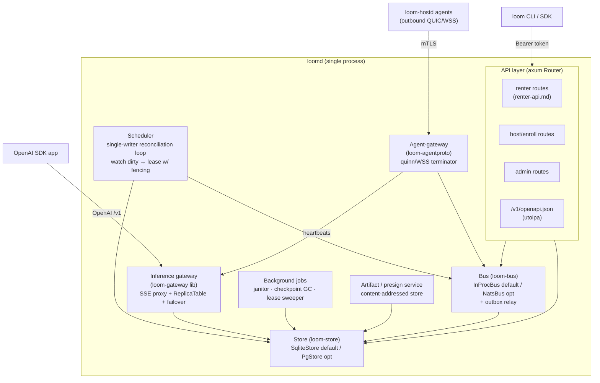

# Backend engineering design

Status: design draft · July 2026 · owner: platform

This is the detailed system-design document for the Loom backend as a **self-hostable stack**. Its sibling [control-plane.md](./control-plane.md) specifies the *logical* services (scheduler, agent-gateway, metering, billing) and their responsibilities; [profiles.md](../architecture/profiles.md) covers *deployment profiles* (standalone / private-fleet / marketplace). This doc owns the **engineering realization**: how those logical services are packaged into binaries and crates, which frameworks we bet on, how `loomd` is structured internally, how storage and the bus are abstracted so the same code runs on a laptop or a marketplace, and the concurrency, resource, configuration, and testing disciplines that keep it small and correct.

The positioning shift that shapes everything below: **Loom is a self-hostable GPU compute stack first, a hosted marketplace second.** The primary deliverable is a small set of static binaries a single engineer can `curl | sh` onto their own box, point at their own GPUs, and run the full ML lifecycle — train, eval, serve — without operating Postgres, NATS, Kubernetes, or a Python service mesh. The marketplace is the *same code* with heavier modules switched on. This is realized as one Cargo workspace producing three binaries, with every service embeddable as a library so the whole backend can be stood up inside a single integration test.

The hard targets, restated because they are load-bearing on every decision here (ADR-0013, [profiles.md](../architecture/profiles.md)):

- **`loomd` idle < 100 MB RSS**, near-zero idle CPU.
- **`loom-hostd` idle < 30 MB RSS** ([host-agent.md](./host-agent.md) §1).
- Binaries **tens of MB**, statically linked.
- **No JVM, no Python, no Kubernetes** in the core. Docker is *not* required for `loomd` itself — a container/microVM runtime is needed only on GPU hosts to actually run jobs ([isolation.md](./isolation.md)).

---

## 1. Cargo workspace layout

One workspace, three binary crates, the rest libraries. The library-vs-binary split is chosen for one property above all: **every service must be embeddable in-process** so an integration test can boot the whole backend without spawning processes, opening sockets to real infra, or requiring root.

```
loom/                          # cargo workspace root
├── Cargo.toml                 # [workspace] members + shared lints/deps
├── crates/
│   ├── loom-proto/            # LIB  protobuf/envelope codegen (prost) — shared by agent + server
│   ├── loom-core/             # LIB  domain types, state machines, pure decision logic (no I/O)
│   ├── loom-store/            # LIB  repository trait + sqlite/postgres impls (sqlx), migrations
│   ├── loom-bus/              # LIB  bus trait + in-proc (tokio) / NATS impls, outbox relay
│   ├── loom-gateway/          # LIB  OpenAI-compatible inference proxy (embedded in loomd)
│   ├── loom-sandbox/          # LIB  runtime drivers: runc/youki, gVisor, Cloud Hypervisor
│   ├── loom-agentproto/       # LIB  server-side agent-gateway session logic (QUIC/WSS terminator)
│   ├── loomd/                 # BIN  the server: API + scheduler + gateway + agent-gateway
│   ├── loom-hostd/            # BIN  the host agent (design owned by host-agent.md)
│   └── loom/                  # BIN  the CLI (clap) — renter + host + admin verbs
├── migrations/                # sqlx migration set (shared; dialect notes inline, §4)
└── xtask/                     # cargo-xtask helper (codegen, golden-vector regen, release)
```

**Crate responsibilities.**

- **`loom-proto`** — the single source of the wire schema. The authoritative `.proto` lives here; `prost-build` (invoked from `build.rs`) generates Rust types for the `Envelope` and every message in [agent-protocol.md](./agent-protocol.md) §2–3. Both `loom-hostd` and the server (`loom-agentproto`) depend on it, so the agent and server can never drift on the wire contract — the deprecation-window discipline (agent-protocol §2.3) is enforced by *one* schema compiled into both sides. This crate also owns the length-prefix framing codec and the golden test vectors (§9).

- **`loom-core`** — domain types (`Job`, `Attempt`, `Node`, `Lease`, `Deployment`, `Replica`, `UsageRecord`) and the **pure** state machines: the job lifecycle (control-plane §3), the lease/fencing rules (agent-protocol §5), the scheduler's filter→score→commit *logic* (control-plane §4) expressed as pure functions over inputs. No `async`, no `sqlx`, no `tokio` — this crate is the deterministic heart, unit-tested exhaustively without any I/O, mirroring the "pure decision logic" seam that made the Mirror project's safety gate testable. If it touches a socket or a DB it does not belong here.

- **`loom-store`** — the **repository trait** (`Store`) and its two implementations, `SqliteStore` and `PgStore`, both over `sqlx`. Owns the migration set and the outbox *table* (the relay lives in `loom-bus`). This is the single persistence seam: `loomd` holds a `Box<dyn Store>` (or generic `S: Store`) and never knows which backend it has. Tests inject an in-memory SQLite store; the CI store-conformance matrix runs the *same* trait tests against both backends (§9).

- **`loom-bus`** — the **bus trait** (`Bus`: `publish`, `subscribe`, `request`/`reply`) with two implementations: `InProcBus` (tokio `mpsc`/`broadcast` + the durable outbox table in `loom-store` for at-least-once) and `NatsBus` (JetStream, for marketplace scale). Also owns the **outbox relay** task that drains `outbox` rows to whichever bus is active. The trait is what lets the scheduler emit a "placement" event identically whether the consumer is a function call away (standalone) or across a NATS cluster (marketplace).

- **`loom-gateway`** — the OpenAI-compatible inference proxy ([serving.md](../ml-lifecycle/serving.md) §3) *as a library*. It exposes an axum `Router` and a `ReplicaTable` fed from heartbeats. In standalone it is mounted directly into `loomd`'s axum app under `inference.*` paths; at marketplace scale the same crate can be compiled into a standalone gateway binary and horizontally scaled. Embedding-as-a-library is why the failover logic (serving §3 "Failover spec") can be tested against a fake vLLM without any network (§9).

- **`loom-sandbox`** — runtime drivers behind a `SandboxDriver` trait: `RuncDriver`/`YoukiDriver` (Tier B), `CloudHypervisorDriver` (Tier A). This crate is a dependency of `loom-hostd`, **not** `loomd` — the server never drives a sandbox. It is listed in the workspace because the CLI's local `loom dev` mode (standalone-on-one-box) may co-launch `loom-hostd`, and because the driver trait's fakes are shared test infrastructure.

- **`loom-agentproto`** — the *server* side of the agent protocol: the quinn/WSS endpoint that terminates `loom-hostd` connections, validates mTLS identity (agent-protocol §1.2), demultiplexes the four logical streams, and bridges messages onto the `Bus`. Split from `loomd` so the agent-gateway can be exercised in a test with a fake agent driving a real terminator, and so at marketplace scale it can shard independently (control-plane §1).

- **`loomd`** (bin) — wires the libraries into one process: builds the `Store`, the `Bus`, the axum app (renter + host + admin routers + embedded `loom-gateway`), the scheduler loop, the agent-gateway (`loom-agentproto`), and background jobs. Owns process lifecycle, config loading, graceful shutdown, and `loomd doctor`/`loomd migrate`. **This is the whole backend in one binary.**

- **`loom-hostd`** (bin) — the host agent, design unchanged and owned by [host-agent.md](./host-agent.md). It depends on `loom-proto`, `loom-sandbox`, and its own crates. Listed here only for workspace completeness.

- **`loom`** (bin) — the CLI (`clap`), the primary renter surface and the host/admin control surface. Talks to `loomd` over the renter API ([renter-api.md](./renter-api.md)). Generated request types are shared from the OpenAPI the server emits, but the CLI does not link `loom-store` or `loom-bus` — it is a thin HTTP client.

**Why library-first.** The single most valuable engineering property here is *testability by composition*. Because `loomd` is assembled from `Store`, `Bus`, gateway, and agent-gateway libraries, the simulated-fleet integration test (§9) constructs a `loomd` with an in-memory SQLite `Store`, an `InProcBus`, a fake agent-gateway harness, and a fake vLLM — all in one process, no sockets, no root — and drives a job through its entire lifecycle. This is the concrete lesson carried over from the Mirror QA effort: a test seam is only trustworthy if the *real* implementation can be swapped for a fake behind the *same* trait, and the trait is exercised against the real backend in CI. Binaries are thin; behavior lives in libraries with injectable seams.

---

## 2. Frameworks & dependencies

Every crate below was checked against crates.io / upstream in **July 2026**; load-bearing claims are footnoted with their sources, and known caveats (e.g. `object_store` local-presign) are called out inline rather than buried.

| Concern | Crate | Justification / 2026 status |
|---|---|---|
| Async runtime | **tokio** | The default multi-threaded runtime, timers, `mpsc`/`broadcast`, `tokio::process`, `JoinSet` for task supervision (§5). One runtime story across the whole workspace — non-negotiable. |
| HTTP API + SSE | **axum** | Tower-based, tokio-native, first-class SSE (`axum::response::sse`) for the renter log/metric streams ([renter-api.md](./renter-api.md) §3.2) and the gateway's streaming proxy. Composable `Router` merge is exactly how we mount renter/host/admin/inference sub-apps into one process. |
| QUIC (optional) | **quinn** | Async QUIC on tokio + rustls; the *optional* lower-latency agent transport on an additional UDP listener (default 8444, agent-protocol §1.1). Production-quality, founded 2018, 30+ releases, pluggable crypto (rustls/aws-lc-rs incl. FIPS).[^quinn] |
| WSS (baseline agent transport) | **tokio-tungstenite** | The always-available WSS-over-TCP terminator on the single API port (8443) — agents can *always* connect here, so no second port is required; QUIC is the opt-in upgrade (agent-protocol §1.1). Best-maintained Rust WebSocket lib, rustls TLS via feature. |
| TLS | **rustls** | Pure-Rust, no OpenSSL on a static binary; mTLS for the agent channel and TLS for the API. Shared by quinn, axum (via a TLS-terminating layer or `axum-server`), and tokio-tungstenite — one TLS stack. |
| SQL / storage | **sqlx** | Async, pure-Rust, **compile-time-checked queries without a DSL**, native SQLite *and* Postgres drivers.[^sqlx] 0.9.x is current.[^sqlx090] The dual-backend caveat is real and designed-around in §4. |
| Protobuf codegen | **prost** + **prost-build** | Generates the `Envelope`/message types (agent-protocol §2) from the in-repo `.proto`. We use *prost directly, not tonic* — see rejections. |
| Serialization | **serde** (+ `serde_json`, `toml`) | Config (`loom.toml`), renter API bodies, JSON columns. Universal. |
| CLI | **clap** (derive) | The `loom` CLI and `loomd`/`loom-hostd` arg parsing. Derive API, subcommands, env fallthrough. |
| OpenAPI from code | **utoipa** + **utoipa-axum** | Code-first OpenAPI generated from axum handlers; `utoipa-axum` (0.2) provides an `OpenApiRouter` that drops in for axum's `Router` and collects `#[utoipa::path]` handlers (via the `routes!` macro) into the spec as they are registered, served at `/v1/openapi.json` (§8). More flexible than `aide`, and the `OpenApiRouter` route-collection API specifically tackles the verbosity of wiring routes and spec separately in larger apps.[^utoipa] |
| Observability | **tracing** + **tracing-subscriber** | Span-based structured logging/tracing across every subsystem (§10). The `tracing` span *is* the correlation unit for a job's submit→schedule→dispatch→bill path. |
| Metrics (optional) | **metrics** + **metrics-exporter-prometheus** | Behind a config flag; `/metrics` endpoint only spun up when enabled (§10). Off by default in standalone to protect the idle budget. |
| In-memory cache (opt) | **moka** | Only where a hot read genuinely needs it (e.g. presign-URL memoization, model-manifest lookups). Not a default dependency of the request path; added surgically, not speculatively. |
| Ed25519 / signing | **ed25519-dalek** | Verifies `UsageRecord.agent_sig` (agent-protocol §3f/§6) and the control-plane manifest-signing key. Pure Rust. |
| Object storage (opt) | **object_store** | The `object_store` crate (now `apache/arrow-rs-object-store`) abstracts local-filesystem vs S3-compatible backends behind one trait for get/put — exactly the standalone-local vs marketplace-S3 split (§3, artifact service). Standalone uses the `LocalFileSystem` backend so **no MinIO is required by default.** **Verified caveat:** `object_store`'s `Signer`/`signed_url` presign API is implemented only for the cloud backends (S3/GCS/Azure), **not** for `LocalFileSystem` — so on the local backend `loomd` mints its own short-TTL HMAC-signed URLs (§3) rather than calling `object_store`; presign is our code on local, `object_store`'s on S3. |

**Explicitly rejected.**

- **tonic / gRPC** — rejected for the agent channel. We have our own length-prefixed-protobuf envelope protocol over QUIC/WSS with hand-specified stream layout, fencing, and spool-replay semantics (agent-protocol §1–5). gRPC would impose HTTP/2 framing, its own flow-control, and a service-definition model that fights our four-logical-stream design and our WSS fallback. We keep **prost** for message codegen and skip **tonic** entirely — we want the *encoding*, not the *transport/service* framework.
- **actix-web** — rejected in favor of axum. actix brings its own actor runtime and a second async story; the workspace commits to one tokio/tower stack. axum's `Router` composition is also the mechanism for embedding the gateway in-process.
- **Diesel / SeaORM (heavy ORMs)** — rejected. Diesel's synchronous core and macro DSL fight our async-everywhere design; SeaORM adds an entity/active-record layer we do not want between us and hand-tuned SQL. sqlx gives us raw SQL with compile-time checking and a thin repository trait — the ORM's abstraction is cost without benefit for a schema this small and this performance-sensitive.
- **Kubernetes / any orchestrator** — rejected at the architecture level ([overview.md](../architecture/overview.md)). The whole point of a self-hostable single binary is that there is nothing to orchestrate.

---

## 3. `loomd` internal architecture

`loomd` is one process hosting a set of long-lived tokio tasks, each owning its subsystem and communicating over the `Bus` trait and typed channels. There is no shared global mutable state that is not rebuildable from `loom-store` (§5).



**API layer.** A single axum app composed by merging four routers: the renter surface ([renter-api.md](./renter-api.md), resource-oriented REST + SSE), the host/enroll surface, the admin surface, and the embedded inference gateway's OpenAI-compatible routes. The API is the only writer of *intent* — a submitted job, a new deployment, an admin action — and it writes a row + an outbox event in one transaction (§4), never talking to agents directly. SSE endpoints (`/v1/jobs/{id}/logs`, `/metrics`) are axum SSE streams fed from the bus; they are drained on shutdown (§5).

**Scheduler.** A **single-writer reconciliation loop** — the invariant that keeps the design honest (control-plane §4 "honest scaling story"). It is one tokio task that:

1. **Watches dirty sets.** It subscribes on the bus to job/node state changes and also polls `loom-store` for schedulable work (`jobs.state='queued'`) and free capacity (`nodes.status='available'`) on a bounded interval. The bus keeps it warm; the store is the source of truth it reconciles against.
2. **Runs filter → score → commit** per schedulable unit (control-plane §4). Filter is a `WHERE` against the nodes index; score is pure `loom-core` logic; commit writes a `lease` row guarded by `INSERT ... ON CONFLICT` against the node's current status.
3. **Mints a fencing token** per lease — a monotonically increasing `lease_fence` (agent-protocol §5). This is the split-brain guard: a requeued attempt gets a strictly greater fence, and any agent message with a stale fence is rejected. The scheduler is the *only* minter of fences, which is why it must be single-writer.
4. **Emits placements** via the bus in the same outbox transaction as the lease write, so the agent-gateway can push the offer to `loom-hostd`.

Because leases carry `expires_at` and lapse without renewal, a crashed scheduler **fails safe**: leases expire, nothing is double-run for long, and a restarted loop rebuilds its entire view from the store (§5). No scheduler state is authoritative that is not in `loom-store`.

**Agent-gateway** (`loom-agentproto`). A WSS terminator (tokio-tungstenite) on the API port for the baseline agent transport, with an *optional* quinn/QUIC endpoint for lower-latency links, terminating `loom-hostd` connections. It validates the mTLS-bound agent identity (agent-protocol §1.2), demultiplexes the control/heartbeat/log/metering streams, verifies `UsageRecord` signatures, applies the fencing check on inbound state, and bridges everything to the `Bus`. Gateway→agent RPC (job offers, checkpoint commands) rides the agent-opened bidi control stream (outbound-only invariant, agent-protocol §1.4). In standalone this is a task inside `loomd` bound to localhost; at marketplace scale the same crate shards behind its own binary.

**Embedded inference gateway** (`loom-gateway`). An SSE streaming proxy ([serving.md](../ml-lifecycle/serving.md) §3). It holds an **in-memory `ReplicaTable`** fed from agent heartbeats routed through the agent-gateway → bus, keyed by `(model@revision, replica)` with health, load, and measured throughput. On an OpenAI request it authenticates, strips identity, routes cache-affinity-first, opens a per-stream request journal, and proxies tokens. On node loss it re-dispatches to another warm replica per the failover spec (serving §3). The replica table is *rebuildable* — it is pure derived state from heartbeats, so a `loomd` restart repopulates it within a heartbeat interval and no truth is lost. **Lazy start:** the gateway task and its quinn/replica machinery are only started if serving is enabled in config (§6, §7) — a train-only standalone box never pays for it.

**Artifact / presign service.** Bulk artifacts — checkpoints, weights, datasets, eval reports — **never stream through `loomd`** (networking §5, agent-protocol §3e). The API mints a presigned-style URL and the client/agent moves bytes out-of-band. Two backends behind the `object_store` trait:

- **Standalone: content-addressed on-disk store.** A local directory of `sha256`-addressed blobs served by a small authenticated `loomd` route with short-TTL HMAC tokens (the same signed-token discipline as Mirror's photo links). This yields presigned-*style* local URLs **without running MinIO or any S3 server by default** — the single most important simplification for the "one box, no infra" promise. Content-addressing gives free integrity verification and cross-revision dedup (serving §4).
- **Marketplace/optional: S3-compatible external store.** Flip a config key to an S3 endpoint (AWS S3, R2, MinIO if the operator wants it) and the artifact service mints real presigned URLs via `object_store`'s `Signer`. The get/put path is identical across backends; only the *presign* step differs — S3 uses `object_store`'s native signer, local uses `loomd`'s own HMAC tokens (§2), since `object_store` does not presign for `LocalFileSystem`.

The rule: `loomd` is a **control-and-metadata plane**; bulk bytes take the direct path. This is what protects the < 100 MB RSS budget — we never buffer a 40 GB weight file through the process (§6).

**Background jobs.** A small supervised set of periodic tasks (§5 supervision):

- **Lease sweeper / reconciliation** — the timeout loop (control-plane §3): agent silent > 90 s → mark attempt `lost`, expire lease, requeue from last checkpoint; lease `expires_at` passed → same path. Part of, or adjacent to, the scheduler's single-writer domain.
- **Janitor** — expires stale idempotency-key records (renter-api §1.3, 24 h TTL), prunes acked usage-spool metadata, drops orphaned outbox rows after successful publish, evicts dead replica-table entries.
- **Checkpoint GC** — enforces the per-job `keep_last: N` policy ([training.md](../ml-lifecycle/training.md) §checkpoints): after a new checkpoint is durably committed, delete all but the last N content-addressed checkpoint objects for that job, respecting refcounts on shared chunks. Runs against the artifact store, idempotent (deleting an already-deleted blob is a no-op).

---

## 4. Storage design

**Schema ownership.** `loom-store` owns the schema through a single **sqlx migration set** in `migrations/`. There is one logical migration history; the tables are those in control-plane §2 (`hosts`, `gpus`, `nodes`, `jobs`, `job_attempts`, `leases`, `usage_records`, `serving_deployments`, `replicas`, `accounts`/`balances`/`transactions`) plus the `outbox` table and the `idempotency_keys` table (renter-api §1.3).

**The honest dual-database story.** sqlx supports SQLite and Postgres natively with compile-time-checked queries — but the check runs against **exactly one `DATABASE_URL` (one dialect) at compile time**.[^sqlxcheck] You cannot compile-check the *same* `query!` against both backends simultaneously. This is a real constraint and we design around it deliberately rather than pretend the two dialects are one:

- **One migration set, dialect-annotated.** The bulk of the schema is portable DDL. Where dialects diverge we keep parallel statements guarded per-backend and document the divergence inline in the migration. Known divergences we flag now:
  - **JSON columns.** Postgres uses `JSONB`; SQLite has no `JSONB` type, so those columns are `TEXT` holding JSON (the `resource_claim`, `avail_window`, engine-config, and event-payload columns). Application code (`loom-core`) treats them as `serde_json::Value` on both; only the column type differs.
  - **UUID / IDs.** Postgres `UUID DEFAULT gen_random_uuid()`; SQLite stores IDs as `TEXT` (ULIDs generated app-side). We generate IDs in `loom-core` rather than relying on a DB default, so both backends receive an explicit ID — this also makes IDs deterministic in tests.
  - **Timestamps.** Postgres `TIMESTAMPTZ`; SQLite `TEXT` (RFC 3339) or integer epoch-ms. `loom-core` carries `OffsetDateTime`/`i64 ms` and the store adapts.
  - **`NUMERIC(12,6)` money.** Postgres has exact `NUMERIC`; SQLite lacks it. We store money as **integer micro-USD** everywhere (renter-api §1.1 already mandates this on the wire), sidestepping decimal-type divergence entirely — the cleanest resolution.
- **Compile-time checking strategy.** The `query!` macros are checked against the **Postgres** dialect in CI (the marketplace-authoritative backend), and the committed `.sqlx` offline query cache lets the workspace build without a live DB. For the handful of queries whose SQL genuinely differs between backends, `loom-store` uses **runtime-checked** `query()` (not the compile-time `query!`) behind the `Store` trait's two impls, with the store-conformance test matrix (§9) as the safety net that catches a divergence that a compile check cannot. We are explicit: **the dual-backend guarantee is enforced by the CI store-conformance matrix, not by the compiler alone.**

**Bus events are delivery *hints*; the store is the authority (ADR-0013).** We do **not** claim JetStream-equivalent durability from the embedded bus. In standalone there is no durable, replayable event stream, and the `InProcBus` loses in-flight events across a `loomd` restart. The design that makes this safe is the same crash-recovery contract as §5: **authoritative state lives in SQLite, and every consumer effect must be reconstructable by reconciliation from the store** — a subscriber that misses a bus event recovers by scanning the store on the next reconciliation tick, never by relying on the event having been delivered. A bus event is an optimization that keeps a consumer *warm*, not a guaranteed-once message.

Within that model the `outbox` table provides **at-least-once dispatch only for effects whose desired-state is already recorded in the DB**: a state change and the `outbox` row announcing it are written in **one transaction**, and the `loom-bus` relay publishes unsent rows and marks them sent. So the outbox is a low-latency *nudge* toward reconciliation, not a durable log that consumers may treat as the source of truth. `usage_records` remain idempotent via the `(attempt_id, seq)` UNIQUE constraint, so any replay is harmless. The full JetStream-backed exactly-once *transport* discipline (control-plane §3) applies only in the Postgres+NATS marketplace configuration; the embedded profile deliberately offers weaker delivery guarantees (ADR-0013) and leans on store-reconstructable state instead — acceptable because the trusted self-host profiles don't run the money path.

**What specifically does not work on SQLite at scale.** Stated plainly so the cutover is not a surprise:

- **Concurrent writers.** SQLite serializes writers (one write transaction at a time, even in WAL mode). For standalone and a modest private fleet this is *fine* — the single-writer scheduler is already the main writer, and WAL mode lets reads proceed concurrently. But a marketplace with many API replicas all writing intent will serialize on the SQLite write lock and stall.
- **No `LISTEN/NOTIFY`.** Postgres `LISTEN/NOTIFY` gives cross-process wakeups for the outbox relay and dirty-set watches; SQLite has none. In-process this is irrelevant (the `InProcBus` is a channel), but the moment `loomd` is horizontally scaled, the bus *must* be NATS and the store *should* be Postgres so relays across processes can be notified rather than polled.
- **No streaming replica / PITR at the same maturity.** The crown-jewels backup story (WAL archiving, PITR, read replicas) is a Postgres strength; SQLite backup is the online-backup path (`VACUUM INTO` / `.backup`, exposed as `loom backup`/`loom restore` — self-host §6; never a raw copy of the live file), adequate for one box, not for a fleet.

**Documented cutover.** The path is a first-class command: **`loomd migrate --to postgres`**. It runs the Postgres migration set, streams every table from the SQLite store to the Postgres store through the `Store` trait (both impls loaded), verifies row counts and a checksum per table, and flips the config's `store.backend` to `postgres`. Because all persistence goes through the `Store` trait, no business logic changes — the cutover is an infrastructure operation, not a rewrite. The same profile switch typically pairs the store cutover with `bus.backend = nats` ([profiles.md](../architecture/profiles.md), ADR-0013).

---

## 5. Concurrency & failure model

`loomd` is **one process, task-per-subsystem**. The disciplines below are what let a single process be both tiny and crash-safe.

**Task supervision.** Subsystem tasks are spawned into a supervising `JoinSet` (or a thin supervisor built on it). A panic in one task is **isolated**: the supervisor observes the `JoinError`, logs it with the task's tracing span, and restarts the task with backoff. A panicking log-SSE stream cannot take down the scheduler; a scheduler panic restarts and rebuilds from the store. Tasks are written to be **restart-safe** — they hold no un-rebuildable state (see below), so restart is always a valid recovery.

**Single-writer scheduler invariant.** Exactly one task mints leases and fences (§3). This is enforced structurally: the scheduler is a single task, and even at marketplace scale the sharding story is *region-partitioned single writers* (control-plane §4), never concurrent writers on the same partition. The lease `ON CONFLICT` guard plus monotonic fencing means that even a buggy double-schedule cannot *effect* a double-run — the second writer loses the conflict or produces a stale fence that agents reject.

**No in-memory truth that isn't rebuildable.** This is the crash-recovery contract. Everything authoritative lives in `loom-store`. Derived in-memory state — the gateway's `ReplicaTable`, the scheduler's warm dirty-set, spool high-water marks — is *reconstructable*: replica tables rebuild from heartbeats, dirty sets rebuild from a store scan, and reconciliation is **idempotent** (re-running it on the same store state produces the same decisions). A `loomd` that is `kill -9`'d and restarted converges to correct state with no operator intervention; the only cost is a few seconds of re-warming.

**Bounded channels everywhere.** Every inter-task channel and every SSE buffer is bounded. Backpressure is explicit: a slow log consumer applies backpressure that is *shed* (drop-oldest-with-marker for logs, agent-protocol §3e) rather than allowed to grow unbounded and OOM the process. Metering never drops (agent-protocol §3f); logs may. This mirrors the host agent's own rule and protects the RSS budget under load.

**Graceful shutdown.** On `SIGTERM`, `loomd` runs an ordered drain:

1. Stop accepting new API writes / new job offers (mark draining).
2. **Drain in-flight SSE streams** — flush buffered log/token chunks and emit a terminal `done`/`error` event so clients (and the CLI) detach cleanly (renter-api §3.2, §4 streaming-error semantics) rather than hanging.
3. **Signal checkpoints** — send `Drain`/`JobCheckpointRequest(cause=DRAIN)` to affected agents (agent-protocol §3c/§3h) so in-flight work reaches a checkpoint boundary before the connection drops.
4. Flush the outbox relay (publish any unsent rows), fsync the store, close pools.
5. Exit. Anything not drained in the grace window is *safe to abandon* — leases lapse, attempts requeue, usage records replay from the agent spool on reconnect. Nodes are cattle applies to `loomd` too: a hard crash degrades to the same recovery path as a clean shutdown, just less gracefully.

---

## 6. Resource budget

Targets, and the engineering rules that hold them. Numbers are budgets we treat regressions against as bugs, not measured guarantees.

| Component | Idle RSS | Under-load RSS | Idle CPU | Disk |
|---|---|---|---|---|
| `loomd` (standalone, serving off) | **< 100 MB** | scales with in-flight streams, bounded | near-zero (park between ticks) | SQLite DB + on-disk artifact store (operator-sized) |
| `loomd` API + scheduler + agent-gateway | ~40–70 MB | + bounded per-stream buffers | reconciliation tick, not a spin loop | — |
| `loomd` inference gateway (serving on) | + replica table + per-stream journals | + N live SSE token streams (bounded) | proportional to live streams | manifest cache only; **no weights** |
| `loom-hostd` (agent) | **< 30 MB** ([host-agent.md](./host-agent.md) §1) | + sandbox supervision | near-zero (seconds-cadence sampling) | encrypted content-addressed cache (LRU-capped) |
| binaries on disk | tens of MB each, static | — | — | — |

**Rules that keep the budget:**

- **No per-request threads / no per-request tasks that outlive the request.** tokio's work-stealing scheduler over a fixed worker pool; a request is a future on the pool, not a thread. A flood of requests grows the (bounded) queue, not the thread count.
- **Bounded channels and buffers everywhere** (§5). Nothing that a client or a chatty job controls can grow `loomd`'s memory without bound.
- **Stream, never buffer bulk.** Model files, checkpoints, datasets take the presigned/direct path (§3, networking §5). `loomd` handles a *URL*, never the payload. This single rule is what makes a < 100 MB control plane serving multi-hundred-GB workloads possible.
- **Lazy subsystem start.** The inference gateway, the agent-gateway's quinn endpoint, and the metrics exporter each start **only if enabled** (§7). A standalone box configured train-only never allocates the replica table or opens a QUIC socket. The idle process is genuinely idle.
- **Park, don't spin.** Every background loop is timer-driven with a sane cadence (the reconciliation tick, the janitor) or event-driven off the bus. Between ticks the runtime parks — idle CPU is noise on `top`, matching the agent's discipline (host-agent §1).

---

## 7. Configuration

**One `loom.toml`.** A single config file with three layers of precedence, low to high: **profile defaults → `loom.toml` → environment variables**. The chosen profile (standalone / private-fleet / marketplace, [profiles.md](../architecture/profiles.md)) selects sane defaults so a fresh standalone box needs almost no config. **Secrets live in a separate file** (or env), never in `loom.toml`, so the main config is safe to commit/share.

```toml
# loom.toml — standalone profile (the zero-infra default)
profile      = "standalone"            # standalone | private_fleet | marketplace
secrets_file = "./loom.secrets.toml"   # separate file; holds local token, signing keys, S3 creds

[server]
bind        = "127.0.0.1:8443"         # renter/host/admin API + inference (self-host §2: the one open port)
external_url = "http://localhost:8443" # for presign URL minting

[store]
backend = "sqlite"                      # sqlite | postgres
url     = "file:./loom.db?mode=rwc"     # or postgres://… after `loomd migrate --to postgres`

[bus]
backend = "inproc"                      # inproc | nats
# url   = "nats://localhost:4222"       # only when backend = nats

[artifacts]
backend = "local"                       # local | s3
path    = "./loom-artifacts"            # content-addressed on-disk store (no MinIO needed)
# endpoint = "https://…"                # only when backend = s3

[serving]
enabled = false                         # lazy: no gateway/replica-table unless true

[agent_gateway]
enabled  = true
# Canonical transport story: loom-hostd always connects over WSS on the single
# renter/admin API TCP port (8443) — agents never require a second exposed port.
# QUIC is an OPTIONAL additional UDP listener for lower-latency fleet links.
quic_enabled = false                    # opt-in; when false, agents use WSS-over-8443 only
quic_bind    = "0.0.0.0:8444"           # default UDP 8444 when quic_enabled = true (self-host §3)

[auth]
mode = "single_token"                   # single_token (standalone) | api_keys (fleet/marketplace)
# token created at `loomd init`, stored in the secrets file

[observability]
metrics_enabled = false                 # /metrics off by default in standalone (budget)
log_format      = "text"                # text | json
```

Environment overrides use a `LOOM__` prefix with `__` nesting (e.g. `LOOM__STORE__BACKEND=postgres`), the standard config-crate convention, so containerized/marketplace deploys override without editing files.

**`loomd doctor`.** A self-check command that validates a config before `loomd` runs for real: reachability of the store URL (and that migrations are applied), bus connectivity (NATS ping when `backend=nats`), artifact backend writability (local dir permissions or S3 `HEAD`), presence and validity of the signing keys and local token, TLS cert/key loadability for the API and agent-gateway, and — if `serving.enabled` — that the quinn UDP bind succeeds and isn't firewalled. It prints a green/red checklist and exits non-zero on any failure, so a self-hoster gets a precise diagnosis instead of a stack trace at startup. `loomd init` scaffolds `loom.toml` + secrets + the first local token; `loomd migrate` runs/checks migrations and owns the Postgres cutover (§4).

---

## 8. API surface recap

The renter contract is normative in [renter-api.md](./renter-api.md) and the host/admin sketch in [control-plane.md](./control-plane.md) §7 — this doc does not restate the shapes. Engineering notes:

- **OpenAPI is generated from code**, not hand-maintained. `utoipa` derives schemas from the axum handler types and `utoipa-axum`'s `OpenApiRouter` collects the `#[utoipa::path]` handlers as routes are registered; the assembled spec is served at **`/v1/openapi.json`**.[^utoipa] The `loom` CLI and the Python/TypeScript SDKs (renter-api §6.2) are generated from that spec, so code and contract cannot drift. **A CI gate regenerates the spec from the handlers and diffs it against the committed `openapi.json`; any drift fails CI**, so the checked-in spec (which the SDKs and docs build from) can never silently fall behind the code. The OpenAI-compatible inference surface (renter-api §4) is *not* part of our versioned spec — it mirrors OpenAI and is documented separately.
- **Auth by profile.** In **standalone**, auth is a **single local token** created at `loomd init` and stored in the secrets file — one operator, one box, no key-management ceremony. In **private-fleet/marketplace**, the full scoped **API-key system** (renter-api §1.2, `loom_sk_…`, scopes, rotation, spend caps) is switched on via `[auth] mode = "api_keys"`. The API-key tables live in `loom-store` in all profiles; standalone simply issues one implicit full-scope token and skips the key-management routes. This means the *code* is identical across profiles — the profile flips a policy, not a code path.

---

## 9. Testing strategy

The doc set lacked a testing story; here it is, made concrete. The through-line — carried directly from the Mirror QA hardening effort — is: **a mock is only trustworthy if the real implementation is exercised against the same seam in CI.** Green-against-mocks that never touches the real backend is exactly the failure mode we refuse to repeat.

- **Unit — pure logic.** `loom-core`'s state machines, scoring, fencing, and lifecycle transitions are exhaustively unit-tested with no I/O. These are the deterministic heart; they are fast and cover the combinatorial edge cases (under-desired replica sets, requeue fences, preemption priority).
- **Store conformance — SQLite *and* Postgres in a CI matrix.** The `Store` trait has one conformance test suite run against **both** `SqliteStore` and `PgStore` in a CI matrix (a Postgres service container for the PG leg). This is the safety net for the dual-dialect divergences of §4 — a JSONB-vs-TEXT or NUMERIC-vs-integer mismatch fails the matrix, not production. This directly implements the CLAUDE-level lesson that store behavior must be *provably* correct against the real backend, not just a native-type mock.
- **Protocol conformance.** `loom-proto` ships **golden vectors**: canonical serialized `Envelope`/message bytes checked into the repo, re-verified on every build so a schema change that breaks wire compatibility is caught immediately (`xtask` regenerates them deliberately). Plus a **fake-agent harness** that drives a real `loom-agentproto` terminator through the full job lifecycle (enroll → offer → accept → prepare → run → usage → checkpoint → terminal), asserting the state-binding table (agent-protocol §4) and fencing rejections (§5).
- **Simulated-fleet integration.** The headline test: an in-process `loomd` (in-memory SQLite `Store`, `InProcBus`, embedded agent-gateway) driven by **N fake agents** with **chaos** — random disconnects, owner-ejects, silence past 90 s, stale-fence late writes. Assertions: every lost attempt requeues with a strictly greater fence; no attempt is billed twice; no two agents ever hold an accepted lease on the same attempt (the split-brain invariant, agent-protocol §5). Because every service is a library (§1), this whole scenario runs in one process with no sockets and no root.
- **Gateway failover with a fake vLLM.** A fake engine that streams SSE tokens and can be **killed mid-generation**. The test asserts the gateway detects the loss within the stall budget, re-dispatches to a second warm fake replica, settles usage per-segment, and that the client sees either a clean continuation (seeded-deterministic path) or an idempotent restart with the documented `retry-after-restart` event (serving §3). Covers the exact "node dies mid-stream" path that is the serving product's reason to exist.
- **Real-GPU smoke suite, hardware-gated.** A thin suite that stands up a real `loom-hostd` on an actual GPU box, enrolls it against a real `loomd`, runs one tiny real job and one tiny real serve, and verifies teardown/verify-clean (host-agent §6). Gated behind hardware availability so it skips cleanly in CI without a GPU — the same skip-without-creds discipline the Mirror project used for live-integration tests. This is the ground-truth check that the mocks match reality.

---

## 10. Observability

- **Tracing spans as the standard.** Every subsystem is instrumented with `tracing`; a job's path (submit → schedule → dispatch → run → bill) is correlated by `job_id`/`attempt_id` fields on spans, so one grep (or one trace) follows a job across API, scheduler, agent-gateway, and billing. Async task instrumentation is `tracing`'s core competency and the natural fit for a task-per-subsystem process.
- **Structured logs.** `tracing-subscriber` with a `text` formatter by default (human-readable on a self-hoster's terminal) and a `json` formatter for fleet/marketplace log aggregation, selected by `[observability] log_format`.
- **`/metrics` Prometheus, optional.** A `metrics` + `metrics-exporter-prometheus` `/metrics` endpoint exposing queue depth, schedule latency, lease-expiry rate, usage-record reject rate, replica-table size, and SSE stream counts — but **off by default in standalone** (`metrics_enabled = false`) to protect the idle budget (§6). A private fleet or marketplace flips it on and points Prometheus/Grafana at it. Metrics are a marketplace-scale operational need, not a single-box one.
- **`loom top` / dashboard from the same telemetry.** The CLI's `loom top` and the web dashboard read the *same* telemetry — the renter SSE metric streams (renter-api §3.2, `/v1/jobs/{id}/metrics`) and admin fleet views — rather than a parallel metrics pipeline. One source of truth for numbers a human looks at, budget-conscious by construction: no metrics daemon is required to see live GPU util or earnings on a standalone box.

---

## 11. Open questions

- **Outbox relay wakeup in standalone.** The `InProcBus` outbox relay can be event-driven (a channel poke on write) or polled on an interval; the poked path is lower-latency but couples writers to the relay. Which is the right default for standalone, and does it change under a busy private fleet before the Postgres/`LISTEN` cutover?
- **sqlx dual-dialect maintenance cost.** Committing `.sqlx` offline vectors for the Postgres leg plus runtime-checked queries for divergent SQL is workable, but the maintenance tax of keeping two dialects honest is unquantified. Is the right long-term answer a thin query-abstraction layer, or accepting Postgres-primary with SQLite as a compatibility target checked only by the conformance matrix?
- **Scheduler HA before region sharding.** A single-writer scheduler with lease-based fail-safe is fine for standalone/fleet, but do we want a warm-standby with explicit leader election (or a store-backed advisory lock) even at small fleet scale, or is crash-and-restart acceptable given leases lapse safely (control-plane §10)?
- **Embedded vs. split gateway threshold.** At what fleet size / request rate does the embedded inference gateway need to be pulled out of `loomd` into its own horizontally-scaled binary, and can that be a config flip (compile the same `loom-gateway` crate into a separate bin) rather than a re-architecture?
- **Artifact GC and refcounting across profiles.** Checkpoint-GC keep-last-N and content-addressed dedup imply refcounting shared chunks; on the local on-disk store this is a small embedded index, but the cutover to S3 changes the GC semantics (lifecycle policies vs. explicit delete). Where does the refcount authority live, and how does `loomd migrate` carry it?
- **`loom.toml` schema versioning.** As profiles and modules grow, the config schema evolves. Do we version `loom.toml` and offer `loomd config migrate`, mirroring the store migration story, to avoid silent misconfiguration across releases?

---

*Related: [control-plane.md](./control-plane.md) (logical services, scheduler, billing) · [host-agent.md](./host-agent.md) (`loom-hostd` design) · [agent-protocol.md](./agent-protocol.md) (wire contract, fencing, streams) · [renter-api.md](./renter-api.md) (normative renter contract) · [serving.md](../ml-lifecycle/serving.md) (inference gateway, failover) · [networking.md](./networking.md) (bulk plane, presigned paths) · [../architecture/overview.md](../architecture/overview.md) · [../architecture/profiles.md](../architecture/profiles.md) (deployment profiles, ADR-0013).*

[^quinn]: quinn is a production-quality async QUIC implementation in Rust on tokio, founded 2018 with 30+ releases, using TLS 1.3 via pluggable crypto providers (rustls with ring / aws-lc-rs, including FIPS variants). See [quinn-rs/quinn](https://github.com/quinn-rs/quinn).

[^sqlx]: sqlx is an async, pure-Rust SQL toolkit with compile-time-checked queries without a DSL, supporting PostgreSQL, MySQL/MariaDB, and SQLite. See [launchbadge/sqlx](https://github.com/launchbadge/sqlx) (development now under [transact-rs/sqlx](https://github.com/transact-rs/sqlx)).

[^sqlx090]: sqlx 0.9.0 is the current release line (released 2026). See the [0.9.0 release discussion](https://github.com/transact-rs/sqlx/discussions/4271) and [sqlx on docs.rs](https://docs.rs/crate/sqlx/latest).

[^sqlxcheck]: The `query!` family checks against the single database named by `DATABASE_URL` at compile time; a query compiled against one database type is bound to that type, and without a `DATABASE_URL` (or committed `.sqlx` offline cache) no compile-time checking occurs. This is why our dual-backend guarantee is enforced by the store-conformance test matrix, not the compiler. See [sqlx query! macro docs](https://docs.rs/sqlx/latest/sqlx/macro.query.html) and [sqlx FAQ](https://github.com/launchbadge/sqlx/blob/main/FAQ.md).

[^utoipa]: utoipa provides code-first, compile-time-generated OpenAPI for Rust and is framework-agnostic; `utoipa-axum` (current release 0.2) supplies an `OpenApiRouter` that replaces axum's `Router` and collects `#[utoipa::path]`-annotated handlers (via its `routes!` macro) into the OpenAPI spec as routes are registered, addressing the verbosity of assembling the spec separately from the routes in larger apps. utoipa is more flexible than the `aide` alternative. See [juhaku/utoipa](https://github.com/juhaku/utoipa), [utoipa-axum README](https://github.com/juhaku/utoipa/blob/master/utoipa-axum/README.md), and the [docs.rs page](https://docs.rs/utoipa-axum).
