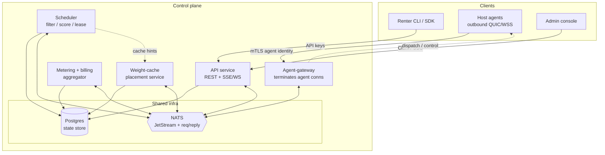
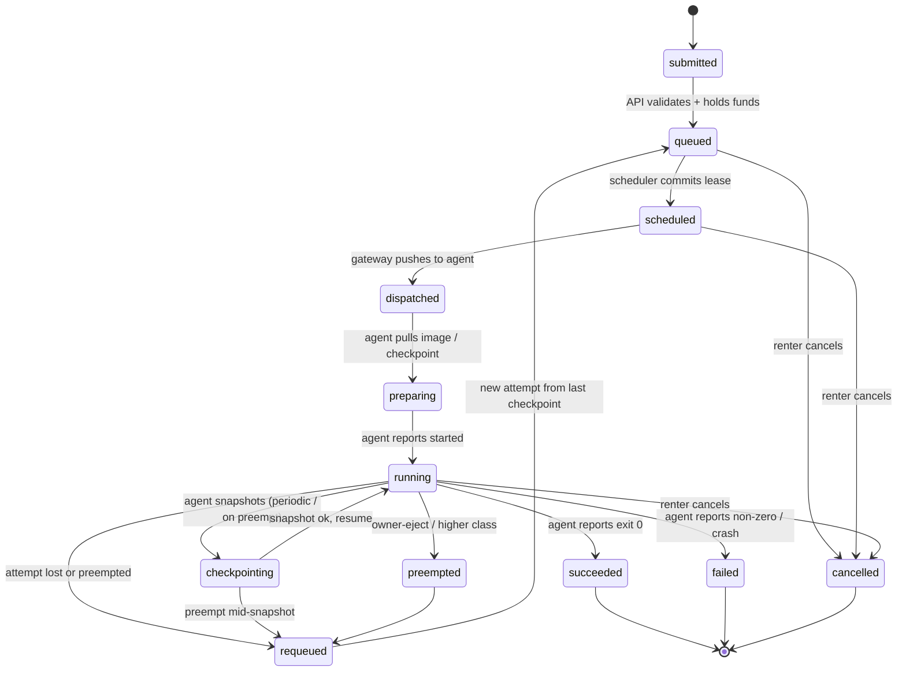
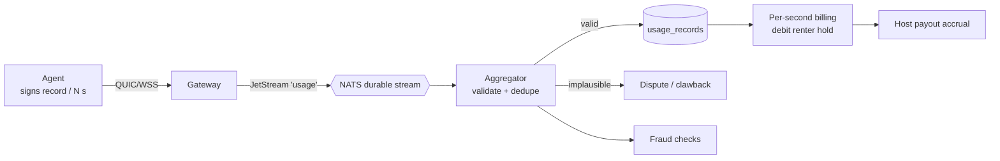

# Control plane

The control plane is the brain of Loom: it accepts work from renters, tracks the fleet of host machines, decides where each job runs, keeps serving deployments healthy, and turns signed usage records into money. It is deliberately *boring*. There is no Kubernetes here, no service mesh, no bespoke consensus protocol. The interesting engineering in Loom lives in the host agent ([`host-agent.md`](./host-agent.md)), the isolation tiers ([`isolation.md`](./isolation.md)), the networking/relay layer ([`networking.md`](./networking.md)), and the serving path ([`../ml-lifecycle/serving.md`](../ml-lifecycle/serving.md)). The control plane's job is to be a reliable, legible coordinator that a two-person on-call rotation can reason about at 3 a.m.

The design pressure that shapes everything below: **hosts are single NAT'd consumer machines, not an administered cluster.** A host is a gaming rig whose owner may launch a game, close a laptop lid, or lose Wi-Fi at any instant. Nodes are cattle. Checkpoint, requeue, and failover are core paths, not exception handlers.

## 1. Service inventory

Loom's control plane is a small set of stateless (or near-stateless) services around one Postgres database and one NATS cluster.

> **Packaging note.** The services described in this document are *logical* roles, not separate deployments. They are realized as a single Rust binary — **`loomd`** — with API, scheduler, embedded inference gateway, and agent-gateway as in-process subsystems, backed by an **embedded SQLite store and an in-process queue (with a durable outbox table) by default**. The Postgres + NATS pairing described throughout this doc is the **marketplace-scale** configuration (ADR-0013): the same code behind a repository trait and a bus trait, with heavier backends switched on. The engineering realization — crate layout, frameworks, `loomd` internals, and the SQLite→Postgres cutover — is specified in [backend.md](./backend.md); the deployment profiles that select these backends are in [../architecture/profiles.md](../architecture/profiles.md).



**API service.** One HTTP service exposing three logical surfaces — renter, host, admin — over REST plus SSE/WebSocket for live streams (logs, job status). It is the only writer of "intent" (a submitted job, a new deployment, an admin action) and it never talks to host agents directly; it writes rows and publishes events. It is horizontally scalable and stateless; all state is in Postgres.

**Scheduler.** A single process (see §4 for the honest scaling story) that reads schedulable work and free capacity from Postgres, runs filter → score → commit, and writes leases. It consumes fleet-state and job-state events from NATS to stay warm, but Postgres is the source of truth it reconciles against.

**Agent-gateway connection service.** Terminates the outbound-only QUIC/WSS control channels from host agents, authenticates them via mTLS-bound agent identity, and bridges each connection to NATS subjects. Agents never reach the API or scheduler directly; the gateway is the membrane. It publishes agent events (heartbeats, attempt state, usage records) onto NATS and delivers control messages (dispatch, checkpoint, cancel, preempt) back down the socket. It is the only service that holds long-lived stateful connections, so it is scaled and sharded independently of the rest.

**State store — Postgres.** One primary, streaming replica(s), PITR. Holds every durable fact: hosts, nodes, jobs, attempts, leases, deployments, replicas, usage records, accounts, balances, transactions. Postgres is also the transactional-outbox substrate for exactly-once effects (§3).

**Message bus — NATS.** Carries three traffic patterns: (a) low-latency request/reply for gateway↔service calls, (b) fan-out control/event pub-sub, and (c) durable JetStream streams for usage records and job-lifecycle events that must survive a consumer restart. See §1.1 for why NATS and not Kafka/Redis.

**Metering + billing pipeline.** Consumes the durable `usage` JetStream stream, validates each signed record, aggregates per-second, debits renter balance holds, accrues host payouts, and flags fraud (§6).

**Weight-cache placement service.** Tracks which nodes already hold which model weights and container images so the scheduler can prefer cache-warm placements. Kept deliberately brief here — the serving doc ([`../ml-lifecycle/serving.md`](../ml-lifecycle/serving.md)) owns content-addressed weight distribution, eviction, and pinning. The control plane only consumes its "where is X cached" answers as a scheduling signal.

### 1.1 Why NATS (vs Kafka / Redis)

Loom needs three things from a bus: sub-millisecond **request/reply** (gateway asking "does this attempt still hold a lease?"), cheap **fan-out** pub/sub (control messages), and **durable streams** for usage and lifecycle events. NATS with JetStream covers all three from a single ~20 MB Go binary with clustering built in and self-healing mesh routes — one thing to run, one config file, binary-swap upgrades.[^nats-compare]

Kafka is the log-is-the-system-of-record tool: excellent long-retention replay and a deep Connect/stream-processing ecosystem, but it brings KRaft/broker/partition/replication topology decisions and effectively a dedicated ops runbook for the messaging layer — overkill for hundreds of nodes and a small team.[^nats-compare] Kafka also has no first-class request/reply, which we'd otherwise have to bolt on.

Redis Streams is lighter than Kafka but is primarily a cache/data-structure server; using it as the durable event backbone means conflating our cache and our bus and reasoning about Redis persistence semantics for money-critical usage records. NATS keeps the bus a bus.

Durability nuance we design around: **core NATS is fire-and-forget** — with no subscriber, a plain message is dropped.[^outbox] Anything that must not be lost (usage records, lifecycle transitions) goes on a **JetStream** stream with durable, explicitly-acked consumers, never plain pub/sub.

## 2. Data model sketch

The relational model mirrors the domain: a **host** is a machine; it advertises one or more **gpus**; a **node** is a concrete, schedulable offer (a host + a specific GPU + an isolation tier + a price). A **job** is renter intent; each real placement of that job on a node is a **job_attempt** (there can be many across a job's life, because of checkpoint/requeue). A **lease** is the scheduler's exclusive, expiring claim on node capacity for an attempt or replica. **serving_deployments** own a set of **replicas** (long-lived attempts). **usage_records** are the signed per-N-seconds meter readings that drive billing against **accounts** / **balances** / **transactions**.

DDL sketch for the four core tables (readable, not exhaustive — enums, some FKs and indexes elided):

```sql
-- A concrete, schedulable capacity offer: a host + one GPU + isolation tier + price.
CREATE TABLE nodes (
  id                UUID PRIMARY KEY DEFAULT gen_random_uuid(),
  host_id           UUID NOT NULL REFERENCES hosts(id),
  gpu_id            UUID NOT NULL REFERENCES gpus(id),
  gpu_model         TEXT NOT NULL,          -- e.g. 'RTX 4090'
  vram_mb           INT  NOT NULL,
  driver_version    TEXT NOT NULL,          -- filterable
  cuda_version      TEXT NOT NULL,
  isolation_tier    TEXT NOT NULL,          -- 'B' | 'A' | 'C' (future)
  region            TEXT NOT NULL,          -- coarse placement domain
  failure_domain    TEXT NOT NULL,          -- e.g. host-level; for replica spread
  reliability_score NUMERIC(4,3) NOT NULL DEFAULT 0.500,  -- 0..1, see §5 (not money)
  price_per_sec_micro_usd BIGINT NOT NULL, -- host ask, integer micro-USD; marketplace doc owns mechanics
  status            TEXT NOT NULL DEFAULT 'offline',
                    -- 'offline'|'available'|'leased'|'draining'|'owner_ejected'
  avail_window      JSONB,                  -- optional thermal/idle windows
  last_heartbeat_at TIMESTAMPTZ,
  created_at        TIMESTAMPTZ NOT NULL DEFAULT now()
);
CREATE INDEX ON nodes (status, region, isolation_tier, gpu_model);

CREATE TABLE jobs (
  id             UUID PRIMARY KEY DEFAULT gen_random_uuid(),
  account_id     UUID NOT NULL REFERENCES accounts(id),
  image_ref      TEXT NOT NULL,             -- content-addressed image
  resource_claim JSONB NOT NULL,            -- {gpu_model?, min_vram_mb, gpus, ...}
  isolation_tier TEXT NOT NULL,             -- minimum acceptable tier
  region_pref    TEXT,
  max_price_per_sec_micro_usd BIGINT NOT NULL, -- ceiling, integer micro-USD
  workload_class TEXT NOT NULL DEFAULT 'batch', -- 'batch' | 'serving'
  checkpoint_uri TEXT,                       -- last durable checkpoint, if any
  state          TEXT NOT NULL DEFAULT 'submitted',
  priority       INT  NOT NULL DEFAULT 0,
  submitted_at   TIMESTAMPTZ NOT NULL DEFAULT now(),
  terminal_at    TIMESTAMPTZ
);
CREATE INDEX ON jobs (state, workload_class, priority DESC, submitted_at);

-- One placement of a job on a node. A job may have many attempts over its life.
CREATE TABLE job_attempts (
  id             UUID PRIMARY KEY DEFAULT gen_random_uuid(),
  job_id         UUID NOT NULL REFERENCES jobs(id),
  attempt_no     INT  NOT NULL,             -- 1,2,3... monotonic per job
  node_id        UUID REFERENCES nodes(id),
  lease_id       UUID REFERENCES leases(id),
  state          TEXT NOT NULL DEFAULT 'scheduled',
                 -- scheduled|dispatched|preparing|running|
                 -- checkpointing|succeeded|failed|lost|preempted|cancelled
  start_checkpoint_uri TEXT,                 -- checkpoint this attempt resumed from
  end_checkpoint_uri   TEXT,                 -- checkpoint this attempt produced
  last_event_at  TIMESTAMPTZ,               -- drives the 90s silence timeout
  exit_reason    TEXT,
  created_at     TIMESTAMPTZ NOT NULL DEFAULT now(),
  UNIQUE (job_id, attempt_no)
);
CREATE INDEX ON job_attempts (state, last_event_at);

-- Signed per-N-seconds meter readings from the agent. Immutable once written.
CREATE TABLE usage_records (
  id             UUID PRIMARY KEY DEFAULT gen_random_uuid(),
  attempt_id     UUID NOT NULL REFERENCES job_attempts(id),
  node_id        UUID NOT NULL REFERENCES nodes(id),
  host_id        UUID NOT NULL REFERENCES hosts(id),
  seq            BIGINT NOT NULL,           -- monotonic per attempt; gap/rollback = fraud signal
  window_start   TIMESTAMPTZ NOT NULL,
  window_end     TIMESTAMPTZ NOT NULL,
  billable_secs  INT NOT NULL,
  gpu_util_pct   SMALLINT,                  -- cross-checked vs benchmark fingerprint
  agent_sig      BYTEA NOT NULL,            -- signature over the record (agent identity key)
  validation     TEXT NOT NULL DEFAULT 'pending',  -- 'valid'|'implausible'|'disputed'
  ingested_at    TIMESTAMPTZ NOT NULL DEFAULT now(),
  UNIQUE (attempt_id, seq)                  -- idempotent ingest
);
```

**Money is integer micro-USD, everywhere.** All monetary columns — `price_per_sec_micro_usd`, `max_price_per_sec_micro_usd`, and the balance/transaction amounts in `accounts`/`balances`/`transactions` — are stored as `BIGINT` integer **micro-USD** (1 USD = 1,000,000), never `NUMERIC`/decimal. This matches the wire contract in [renter-api.md §1.1](./renter-api.md) (`price_micro_usd`) and the storage decision in [backend.md §4](./backend.md), and it sidesteps decimal-type divergence between Postgres and SQLite entirely. Human-facing dollar formatting is a **conversion at the edge** (CLI/UI), not a database concern.

Other tables in the same shape but omitted for brevity: `hosts` (enrollment, agent identity, payout account), `gpus` (per-GPU inventory + benchmark fingerprint), `leases` (attempt/replica ↔ node claim + `expires_at`), `serving_deployments` and `replicas` (§4), and `accounts` / `balances` / `transactions` (§6, integer micro-USD amounts). The `outbox` table (§3) sits alongside these.

## 3. Job lifecycle state machine

A job moves through a lifecycle owned jointly by the **API** (renter intent), the **scheduler** (placement decisions), and **agent events** relayed through the gateway (ground truth about what actually happened on the machine).



**Who transitions what.**

- **API** owns `submitted → queued` (after validating the job spec and placing a balance hold), and renter-initiated `→ cancelled` from any non-terminal state. It writes intent, never machine truth.
- **Scheduler** owns `queued → scheduled` (it commits a lease) and the preemption decision `running → preempted`. It also owns reconciliation-driven `→ requeued` when an attempt is declared lost.
- **Agent events** (via gateway → NATS) drive `dispatched → preparing → running`, the `checkpointing` sub-cycle, and the honest terminal reports `succeeded` / `failed`. The agent cannot mark a job terminal by fiat for billing purposes — see §6 — but it is the source of truth for execution state.

**Attempts vs jobs.** The *job* has the lifecycle above; each placement is a *job_attempt* with its own narrower state (see the DDL). `requeued` is a job-level state that spawns a new attempt (`attempt_no + 1`) resuming from `jobs.checkpoint_uri` (the last durable `end_checkpoint_uri`). A job with three lost nodes has one job row and four attempt rows.

**Timeout / reconciliation.** Each attempt carries `last_event_at`, refreshed by heartbeats and state events. A **reconciliation loop** (part of the scheduler process) sweeps attempts in live states:

- Agent silent > **90 s** → mark the attempt `lost`, expire its lease, and transition the job `running → requeued`. Requeue resumes from the last checkpoint, so a vanished laptop costs at most the work since the last snapshot.
- Lease `expires_at` passed without renewal → treat as lost, same path. Leases are short and renewed by liveness; this makes a dead scheduler *fail safe* (leases lapse, nothing is double-run for long).
- `preparing` stuck > N minutes (slow/failed image or checkpoint pull) → fail the attempt and requeue elsewhere.

**Idempotency & exactly-once effects.** Machines and networks retry, so every effect that touches money or state is made idempotent:

- **Attempt IDs** are the unit of idempotency for execution. A duplicate "started"/"finished" event for an already-advanced attempt is a no-op.
- **Usage records** carry `(attempt_id, seq)` with a UNIQUE constraint — re-ingesting a record is a no-op, so at-least-once delivery from JetStream yields exactly-once accounting.
- **Cross-service effects use a Postgres transactional outbox.** A state change and the event announcing it are written in *one* transaction — the row change plus an `outbox` row. A relay process publishes `outbox` rows to NATS and marks them sent. This makes the write path atomic and the publish path at-least-once; downstream consumers dedupe on the event ID.[^outbox] JetStream's own `Nats-Msg-Id` server-side dedup window is a second belt-and-braces layer on top.[^jetstream]

## 4. Scheduler design

The scheduler runs a classic three-phase loop per schedulable unit: **filter → score → commit**.

**Filter (hard constraints).** From the pool of `nodes.status = 'available'`, keep only nodes that satisfy the job's resource claim: GPU model / VRAM, driver + CUDA version, isolation tier (node tier must be ≥ the job's minimum), region preference, reliability score floor, and `price_per_sec_micro_usd ≤ job.max_price_per_sec_micro_usd`. Everything here is expressible as a Postgres `WHERE` against the `nodes` index.

**Score (soft preferences).** Rank survivors by a weighted sum:

- **Price** — cheaper is better, bounded by the ceiling.
- **Reliability** — the node's score (§5); flaky nodes are penalized.
- **Cache locality** — nodes that already hold the required weights/images (per the weight-cache placement service, §1) score materially higher. *Placing a job where the model is already cached beats a slightly cheaper cold node* — cold-pull of tens of GB dominates short-job cost and latency.
- **Data affinity** — proximity to the job's input data / checkpoint store.
- **Host thermal / availability windows** — prefer nodes inside a healthy `avail_window`; avoid nodes about to hit a known busy period.

**Commit.** The winning node is claimed with a **lease** row (`INSERT ... ON CONFLICT`-guarded against the node's current status) carrying an `expires_at`. The lease is the exclusive right to run one attempt/replica on that node; it must be renewed via liveness or it lapses (fail-safe, §3). Commit and the dispatch event are written in one outbox transaction.

**Two workload classes.**

- **Batch jobs** — queued and bin-packed. The scheduler drains the `queued` queue in priority/FIFO order, packing attempts onto the best-scoring free nodes.
- **Serving replicas** — a `serving_deployment` declares a desired replica count. A **maintenance loop** continuously reconciles actual vs desired replicas, placing new replicas to fill deficits and **spreading them across failure domains** (`nodes.failure_domain`) so one host or region dying doesn't take a whole replica set with it. Replicas are just long-lived attempts under a deployment; the serving doc ([`../ml-lifecycle/serving.md`](../ml-lifecycle/serving.md)) owns routing and mid-stream failover.

**Preemption rules (strict priority).**

1. **Owner-eject beats everything.** When a host owner reclaims the machine (starts a game, closes the lid), the node reports `owner_ejected`; any attempt/replica on it is immediately `preempted` and requeued. This is non-negotiable — the marketplace only works if owners always win.
2. **Higher workload class / priority preempts lower** on contended capacity (e.g. a paying serving replica may preempt a low-priority best-effort batch attempt), triggering a checkpoint-then-preempt where the isolation tier supports it.
3. **Serving self-healing.** When a replica is lost or preempted, the maintenance loop treats the set as under-desired and re-places a replacement on the best-scoring node in a *different* failure domain, restoring redundancy without operator involvement.

**Honest scaling story.** At MVP scale — hundreds of nodes — **a single-process scheduler reading Postgres is entirely sufficient.** No distributed scheduler, no sharded leader election, no fancy queueing system. One process, one loop, Postgres as the coordination point (leases guard against double-scheduling; a warm-standby process can take over on crash because leases lapse safely). When the fleet outgrows one process, the scaling path is **shard by region** — one scheduler instance per region, each owning its region's `nodes` and `queued` jobs, with cross-region placement handled at the API/routing layer. We call this out now but do **not** build it yet; a single scheduler will comfortably carry the first several thousand nodes.

## 5. Reliability scoring of nodes

Every node carries a `reliability_score` in `[0,1]` that summarizes how much we trust it to *finish work it accepted*. It is computed from rolling history:

- **Uptime history** — fraction of advertised-available time the node was actually reachable (heartbeat-derived).
- **Job completion rate** — attempts that reached `succeeded` vs those that ended `lost`/`preempted`-by-owner while assigned to this node.
- **Checkpoint-loss incidents** — times the node vanished *between* checkpoints, forcing lost work; weighted heavily because that's the expensive failure.
- **Benchmark drift** — divergence between the node's current benchmark fingerprint and its enrolled baseline (thermal throttling, a swapped/downclocked GPU, a lying agent).

The score is an exponentially-decayed rolling aggregate, so a machine that improves recovers, and one that degrades is demoted quickly. It feeds two places:

- **Scheduling** — a hard floor in the filter (below-floor nodes are excluded from money-critical work) and a soft weight in the score. Serving replicas demand a higher floor than best-effort batch.
- **Pricing** — reliability is an input to what a node can earn. The *mechanics* of that (how score maps to effective price, host incentives, tiers) live in the marketplace doc ([`../product/marketplace.md`](../product/marketplace.md)); the control plane only publishes the score.

## 6. Metering → billing pipeline

This is the money path, so it is the most defensively engineered part of the control plane.



1. **Emit.** The agent emits a **signed** usage record every N seconds (`billable_secs`, monotonic `seq`, `gpu_util_pct`, `agent_sig` over the payload). Signing binds the record to the mTLS agent identity so a record can't be forged by a third party.
2. **Transport.** Records flow gateway → NATS **JetStream durable stream** `usage` (never plain pub/sub — these must survive an aggregator restart).
3. **Validate.** The **aggregator** checks each record: **monotonic `seq`** (gaps/rollbacks are suspicious), plausibility vs the GPU's spec (billable seconds can't exceed wall-clock; util can't exceed 100%; throughput can't exceed the card's ceiling), and signature validity. Duplicates collapse on the `(attempt_id, seq)` UNIQUE constraint, so JetStream's at-least-once redelivery is safe.
4. **Persist & bill.** Valid records land in `usage_records`; **per-second billing** debits the renter's **balance hold** (placed at `submitted → queued`) and accrues **host payout**. Because ingest is idempotent, replaying the stream never double-bills.
5. **Disputes & clawback.** Records flagged `implausible` are quarantined (`validation = 'implausible'`), not billed, and can trigger **clawback** of a prior accrual if fraud is confirmed after the fact.
6. **Fraud checks live here.** Beyond per-record plausibility, the aggregator **cross-checks reported utilization against the node's benchmark fingerprint** — a node claiming 100% util at throughput its GPU can't reach, or util that doesn't track the job's known compute profile, is a fraud signal that both dings reliability (§5) and holds payout for review.

Pricing/payout *mechanics* (fees, currencies, payout schedules) are the marketplace doc's ([`../product/marketplace.md`](../product/marketplace.md)) concern; the control plane owns the *metering and accounting integrity* — turning trustworthy seconds into balanced ledger entries.

This whole JetStream-native pipeline (durable `usage` stream, aggregator, billing hold, payout accrual) is **marketplace-profile machinery** — the money path only exists among untrusting strangers. In the self-host profiles ([`../architecture/profiles.md`](../architecture/profiles.md)) there is no billing: metering still runs, but only as **local usage accounting** (per-job seconds/util for the operator's own visibility), with no balance holds, payouts, or fraud clawback, and the in-process bus stands in for JetStream.

## 7. API surface sketch

**OpenAPI is generated from code (code-first).** The spec is **not** hand-maintained: it is generated from the axum handler types via `utoipa` ([backend.md §8](./backend.md)), and a **CI gate diffs the generated spec against the committed one so any drift fails CI**. The generated spec then produces clients, docs, and request validation. REST for command/query; **SSE or WebSocket** for streams (log tails, live job status, deployment health).

**Renter surface** (auth: **API keys**):

| Method | Path | Purpose |
|---|---|---|
| `POST` | `/v1/jobs` | Submit a job (spec = image + resource claim + isolation tier + max price) |
| `GET` | `/v1/jobs/{id}` | Job + attempts status |
| `GET` | `/v1/jobs/{id}/logs` | **SSE/WS** live log stream |
| `POST` | `/v1/jobs/{id}/cancel` | Cancel |
| `GET` | `/v1/nodes` | List available nodes + prices (marketplace view) |
| `POST` | `/v1/deployments` | Create/scale a serving deployment |
| `GET`/`PATCH`/`DELETE` | `/v1/deployments/{id}` | Manage deployment (replica count, teardown) |

**Host surface** (auth: **mTLS-bound agent identity** — not API keys):

| Method | Path | Purpose |
|---|---|---|
| `POST` | `/v1/hosts/enroll` | Enroll a machine, bind agent identity |
| — | agent QUIC/WSS via gateway | status, heartbeats, usage, control (not REST) |
| `GET` | `/v1/hosts/me/earnings` | Payout accrual + history |

**Admin surface** (auth: SSO): fleet inspection, dispute resolution, manual preempt/drain, reliability overrides, clawback approval.

Authentication summary: **renters → API keys**, **hosts → mTLS-bound agent identity** (the same identity that signs usage records), **admins → SSO**. Host control traffic is *not* REST — it rides the persistent gateway connection.

## 8. Multi-region & latency

The control plane starts in **one region.** This is fine because the control plane is not on the data hot path:

- **Agents tolerate 200 ms+ RTT.** The control channel carries dispatch, heartbeats, and usage records — none latency-sensitive at human scale. A host in another continent talking to a single-region control plane is completely acceptable.
- **The inference data plane does NOT hairpin through the control plane.** Renter↔replica traffic goes over the relay/data-plane path described in the networking doc ([`networking.md`](./networking.md)); the control plane only *places* replicas and never sits in their request path. This is what lets one control-plane region serve a globally-distributed fleet.

When scale demands it, the region-sharded scheduler (§4) plus per-region gateways give a natural expansion path without changing the model.

## 9. Operational posture

Deliberately small and legible:

- **Deployment.** MVP is a **single Docker Compose** (or a small Nomad job set / systemd units) bringing up API, scheduler, gateway, aggregator, weight-cache service, Postgres, and NATS. One host box can run the whole control plane for the first fleet.
- **Migrations.** Schema changes via a standard migration tool (forward-only, reviewed), run on deploy.
- **Backup / PITR.** Postgres is the crown jewels: continuous WAL archiving for **point-in-time recovery**, plus a streaming replica for read scaling and fast failover. NATS JetStream state is recoverable; Postgres is the authority, so a JetStream loss degrades to replay-from-Postgres, not data loss.
- **Observability.** **OpenTelemetry** traces across services (a job's path from submit → schedule → dispatch → bill is one trace), **Prometheus** metrics (queue depth, schedule latency, lease-expiry rate, usage-record reject rate), **Grafana** dashboards, and **structured logs** correlated by job/attempt ID.

## 10. Open questions

- **Lease TTL vs churn.** How short can leases be before renewal chatter dominates, yet short enough that a vanished node frees capacity fast? Likely adaptive per reliability score.
- **Preemption fairness.** When a serving replica preempts batch work, how do we avoid starving low-priority batch on a hot fleet? Needs an aging/credit mechanism, TBD.
- **Reliability cold-start.** New nodes have no history — what default score, and how aggressively do we probe them with low-stakes work before trusting them with paid jobs?
- **Fraud vs false positives.** Benchmark-fingerprint cross-checks must tolerate legitimate thermal throttling and mixed workloads without punishing honest hosts. Thresholds need real data.
- **Outbox relay ownership.** Does the outbox relay live in the API process, a dedicated sidecar, or a Postgres logical-decoding CDC feed? CDC is lower-latency but adds a moving part; polling is simpler for MVP.[^outbox]
- **Scheduler HA before region sharding.** A single scheduler with lease-based fail-safe is fine, but do we want a warm-standby with explicit leader election even at small scale, or is crash-and-restart acceptable given leases lapse safely?
- **Cross-region job placement.** Once sharded by region, who owns a job with no region preference — a global admission layer, or hashed assignment? Deferred until multi-region is real.

---

[^nats-compare]: NATS ships as a single ~20 MB Go binary with built-in self-healing clustering and first-class request/reply plus pub/sub; Kafka centers on the durable replicated log and brings broker/partition/replication topology and a dedicated ops runbook, while Redis Streams is primarily a cache/data-structure server. See [Synadia: NATS and Kafka Compared](https://www.synadia.com/blog/nats-and-kafka-compared), [NATS docs: Compare NATS](https://docs.nats.io/nats-concepts/overview/compare-nats), and [Kafka vs Redis Streams vs NATS in 2026](https://dev.to/young_gao/real-time-event-streaming-kafka-vs-redis-streams-vs-nats-in-2026-34o1).

[^jetstream]: JetStream provides at-least-once delivery with exactly-once *effects* via publisher-side `Nats-Msg-Id` server-side dedup windows plus durable, explicitly-acked consumers. See [NATS docs: JetStream](https://docs.nats.io/nats-concepts/jetstream) and [NATS blog: message deduplication in JetStream](https://nats.io/blog/new-per-subject-discard-policy/).

[^outbox]: The transactional-outbox pattern writes the state change and its event in one Postgres transaction, then a relay (poll or logical-decoding CDC) publishes to the bus; it guarantees at-least-once delivery, so consumers must dedupe. Core NATS is fire-and-forget (a message with no subscriber is dropped), which is why durable events use JetStream. See [event-driven.io: Push-based Outbox with Postgres logical replication](https://event-driven.io/en/push_based_outbox_pattern_with_postgres_logical_replication/) and [Decodable: Revisiting the Outbox Pattern](https://www.decodable.co/blog/revisiting-the-outbox-pattern).
