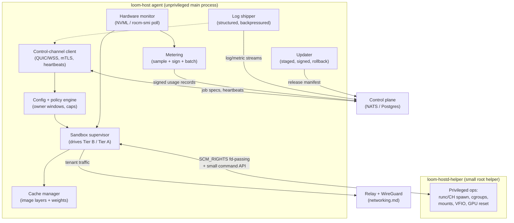
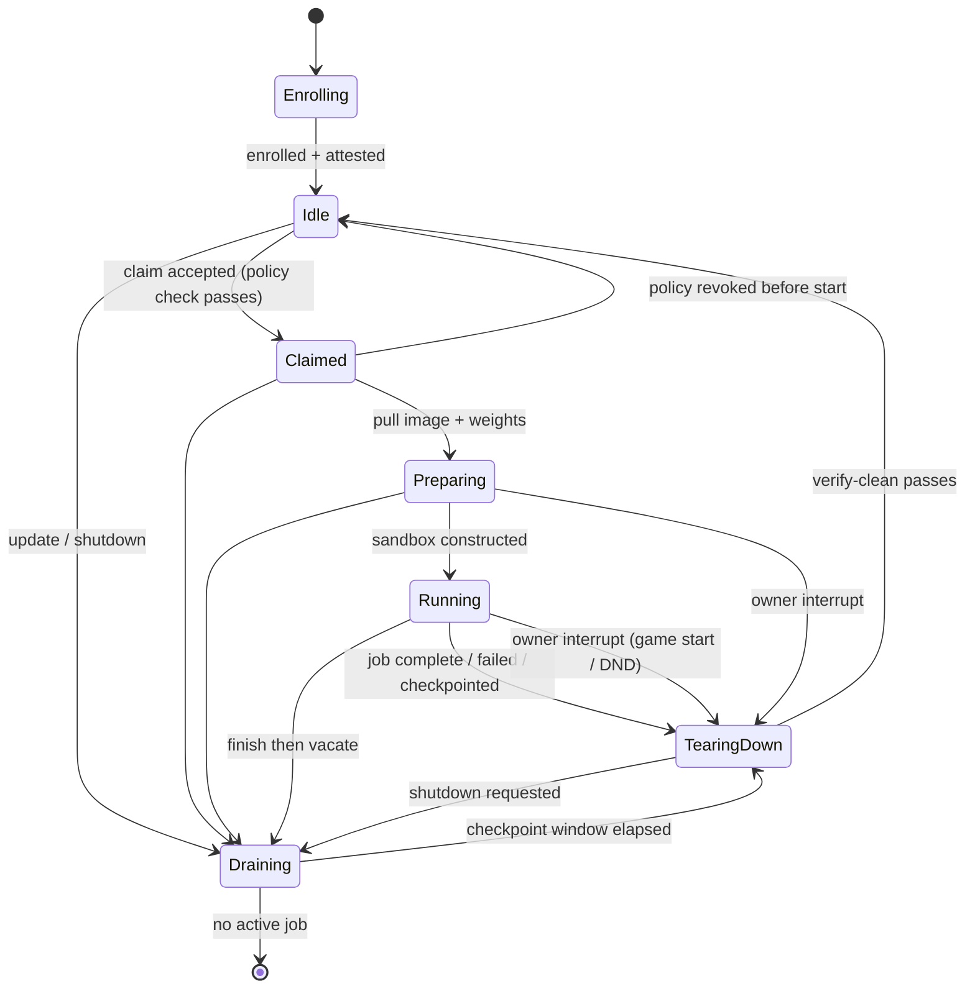
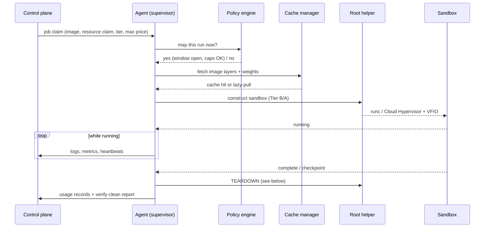

# Host agent

The host agent is the single piece of Loom software that runs on a stranger's machine. Everything else in the system — the [control plane](./control-plane.md), the [relay fabric](./networking.md), the gateway — is infrastructure we operate. The agent is a guest in someone's gaming rig, workstation, or ex-mining box, and it has to behave like one: invisible when the owner wants their GPU, ruthless about privacy when a renter's job is running, and honest about the fact that it needs real privileges to drive containers and microVMs.

This document specifies the agent: its design goals, process architecture, lifecycle, hardware attestation, crate choices, job-execution and teardown paths, metering, owner controls, self-update, and its own security posture. It covers *how the agent drives* the isolation tiers; the internals of those tiers live in [isolation.md](./isolation.md). The agent side of networking is covered here; the relay and WireGuard upgrade path live in [networking.md](./networking.md).

---

## 1. Design goals

**Invisible when idle.** The overwhelming majority of an agent's life is spent doing nothing but holding a connection open and sampling hardware every few seconds. In that state it must be unnoticeable:

- **< 30 MB RSS idle.** A tokio-based Rust binary with a handful of background tasks and no loaded ML runtime has no business exceeding this. We budget the steady-state resident set at under 30 MB and treat regressions as bugs. (For comparison, the idle agent holds one QUIC/WSS connection, a timer wheel, and small ring buffers for metrics/logs — there is no reason for it to be large.)
- **Near-zero idle CPU.** Sampling cadence is measured in seconds, not milliseconds (see §7). Between samples the runtime parks. Target: statistically indistinguishable from noise on `top`.
- **No fans spinning.** The idle agent issues only NVML *read* queries. It never launches GPU work of its own except the enrollment/re-verification benchmark (§4), which is explicitly gated and rate-limited. If the owner's GPU is spinning up its fans, a renter job is running and the owner opted in.

**Safe by default.** The agent claims the GPU only when the owner has opted in *and* the machine satisfies the owner's idle policy (§6, §8). Out of the box, a freshly installed agent enrolls and sits idle; it does nothing to the GPU until the owner configures a scheduling window or flips "available now."

**One-command install.** `curl … | sh` fetches a signed static binary, drops a `loom-host` CLI, installs a systemd unit, and walks the owner through enrollment. Target: under 10 minutes, matching the product promise in [deployment.md](../product/deployment.md).

**Unattended self-update.** Hosts will not babysit this. The agent updates itself from signed releases on a staged schedule and rolls back automatically on a crash-loop (§9).

---

## 2. Process architecture

The agent is one tokio multi-threaded runtime hosting a set of long-lived tasks that communicate over `tokio::sync` channels. There is no shared global mutable state beyond a small `ArcSwap`-style config snapshot; each subsystem owns its data and exposes a message API.

**Module breakdown:**

- **Control-channel client** — owns the single outbound connection to the control plane (§10, [networking.md](./networking.md)). Handles enrollment, receives job claims, sends heartbeats, multiplexes log/metric/usage streams. Never accepts inbound connections.
- **Hardware monitor** — polls NVML (`nvml-wrapper`) or `rocm-smi` for inventory at enrollment and utilization/power/thermal during operation. Feeds both metering and policy.
- **Sandbox supervisor** — the heart of the agent. Translates a validated job claim into a running sandbox in the requested tier and owns its full lifecycle including teardown (§6). Delegates every privileged syscall to the root helper.
- **Metering** — samples usage, signs records, batches them to the control plane (§7).
- **Log shipper** — streams structured logs and metrics with bounded buffers and backpressure so a chatty job can never OOM the host.
- **Cache manager** — content-addressed store of image layers and model weights on the host's disk as **encrypted blobs only** (see [isolation.md](./isolation.md) and §6). Serves cache hits; fetches misses; evicts by LRU under a configured size cap.
- **Updater** — checks the signed release manifest, stages, swaps, and rolls back (§9).
- **Config + policy engine** — loads `/etc/loom/host.toml`, watches for changes, and is the single authority that answers "may this job run right now?" (§8).

---

## 3. Agent state machine

Two transitions deserve emphasis:

- **Owner interrupt** — the owner starts a game, or the policy engine detects the machine is no longer idle (foreground GPU process appears, do-not-disturb toggled, scheduling window closed). This is not an error; it is the *expected* path on a consumer machine. The agent immediately signals the running job for checkpoint, grants it a bounded window (§8), then force-vacates. From `Preparing`, where no useful work exists yet, it aborts immediately. The owner always wins.
- **Draining** — a graceful mode entered for self-update or host shutdown. The agent stops accepting new claims, lets in-flight work reach a checkpoint boundary, and exits cleanly. Nodes are cattle ([control-plane.md](./control-plane.md)): a drained or crashed node's jobs are requeued elsewhere.

---

## 4. Enrollment & hardware attestation

**Inventory.** At enrollment the hardware monitor queries NVML via [`nvml-wrapper`](https://github.com/rust-nvml/nvml-wrapper) — GPU model, VRAM size, driver/CUDA version, PCIe topology, ECC capability, power/thermal limits — or `rocm-smi` on AMD (parsed from its JSON output until a mature Rust ROCm-SMI binding lands; see Open Questions). This produces a claimed hardware profile the marketplace advertises.

**Benchmark fingerprint.** Inventory is self-reported and trivially spoofable by a modified agent. To raise the cost of lying, enrollment runs a **short, deterministic GPU workload** — a fixed-shape GEMM / memory-bandwidth sweep — and records a *performance profile*: achieved FLOPs at several shapes, memory bandwidth, and the timing distribution across runs. A real RTX 4090 has a bandwidth and compute signature that is hard to reproduce without a 4090-class GPU actually executing the kernel.

Be honest about what this does and does not buy:

- **It buys** detection of the cheap lies: claiming a 4090 while actually holding a 3060, or claiming a GPU with no GPU at all. The fingerprint won't match, and the profile is expensive to fake because faking it convincingly requires *hardware that performs like the claimed card* — at which point the host essentially has the card.
- **It does not buy** protection against a determined adversary with *better* hardware impersonating *worse* hardware, or one who records genuine benchmark traces and replays them. A host with a real 4090 can always pass a 4090 benchmark and then quietly downclock, share the GPU with their own gaming session, or throttle the tenant. The fingerprint is a *floor on capability at enrollment*, not a continuous guarantee.
- **Mitigations layer on top:** periodic surprise re-verification (below), renter-side work verification and reputation ([marketplace.md](../product/marketplace.md)), and — for renters who need cryptographic assurance — the attestable TEE tier ([security.md](./security.md)). The benchmark fingerprint is the cheap first line, not the whole defense.

**Enrollment token flow.** The owner runs `loom-host enroll --token <T>`, where `T` is a short-lived single-use token minted by the control plane when the owner links the machine to their account. The agent generates a keypair locally, sends the public key + inventory + benchmark fingerprint + `T` over the mTLS control channel. The control plane verifies `T`, binds the node identity to the account and the presented public key, and returns a long-lived node certificate. The private key never leaves the host and lives only in memory plus an encrypted-at-rest keystore file (§10).

**Periodic re-verification.** The control plane periodically schedules an unannounced re-run of the benchmark during idle windows and compares the profile against enrollment (and against peers with the same claimed card). Drift beyond tolerance flags the node for review and can suspend payouts. Re-verification is cheap, rate-limited, and never runs while a tenant job holds the GPU.

---

## 5. Crate choices

All crates below were checked against crates.io / their repos in **July 2026**. Nothing here is stale; flags are noted explicitly.

| Concern | Crate | Justification / status |
|---|---|---|
| Async runtime | **tokio** | The default. Multi-threaded scheduler, timers, channels, `tokio::process`. Non-negotiable for this workload. |
| TLS | **rustls** | Pure-Rust, no OpenSSL dependency on a static binary; used for mTLS control channel. Actively maintained, integrates with both quinn and tokio-tungstenite. |
| Control channel (primary) | **quinn** | Async QUIC on tokio + rustls. The primary transport ([networking.md](./networking.md) §2): QUIC over UDP/443 gives head-of-line-blocking-free stream multiplexing and connection migration across residential IP changes. Actively maintained. ([quinn-rs/quinn](https://github.com/quinn-rs/quinn)) |
| Control channel (fallback) | **tokio-tungstenite** | Most-downloaded, best-maintained Rust WebSocket lib; works directly with tokio; rustls TLS via feature flag; versions > 0.26 are notably more performant. WSS over TCP/443 is the portable fallback that traverses UDP-hostile middleboxes by looking like ordinary HTTPS ([networking.md](./networking.md) §2). ([lib.rs](https://lib.rs/crates/tokio-tungstenite)) |
| NVIDIA inventory/metrics | **nvml-wrapper** | Safe wrapper over NVML; loads the library at runtime via `libloading`, so the same binary runs on GPU-less machines and degrades gracefully. Supports NVML 12. Maintained under the `rust-nvml` org. ([rust-nvml/nvml-wrapper](https://github.com/rust-nvml/nvml-wrapper)) |
| Host inventory | **sysinfo** | CPU, memory, disk, process enumeration for policy (detect foreground GPU/game processes) and host inventory. Mature, cross-platform. |
| Container control (Tier B) | **bollard** | Typed async Docker API client on hyper/tokio; also speaks Podman. We drive `nvidia-container-toolkit` + gVisor `runsc` **through the Docker/containerd daemon** rather than shelling out, for typed errors and stream handling. ([fussybeaver/bollard](https://github.com/fussybeaver/bollard)) |
| OCI runtime (alt path) | **youki** | Rust OCI runtime; a memory-safe `runc` alternative with cgroups v2, seccomp, rootless support. Kept as a *fallback/direct-invocation* option where we want to avoid a Docker daemon dependency. Younger than runc — less adversarial review — so it is a considered alternative, not the day-one default. ([youki-dev/youki](https://github.com/youki-dev/youki)) |
| microVM control (Tier A) | **cloud-hypervisor-client** | *Unofficial* auto-generated client for the Cloud Hypervisor REST API socket. We drive CH over its `--api-socket` UNIX socket (VM create, VFIO device attach, pause/resume, shutdown). **Flag:** unofficial and thin — we pin a version and are prepared to talk the REST API directly via a small in-house module if it lags CH releases. ([lpotthast/cloud-hypervisor-client](https://github.com/lpotthast/cloud-hypervisor-client)) |
| Serialization | **serde** (+ `serde_json`, `toml`) | Job specs, config, usage records, release manifests. Universal. |
| Observability | **tracing** (+ `tracing-subscriber`) | Structured, span-based logging feeding the log shipper; the natural fit for async task instrumentation. |
| Self-update | **self_update** | Handles GitHub/S3/HTTP backends, checksum (SHA-256/512) + zipsign signature verification of artifacts. Actively maintained (1.0.0-rc.1 landed 2026-06). **Flag:** it has *no built-in staged-rollout or crash-loop-rollback logic* — those we implement ourselves around it (§9). ([jaemk/self_update](https://github.com/jaemk/self_update)) |

Notably absent: no `openssl` (rustls only), no async-std (tokio only), no heavyweight web framework (the agent serves nothing).

---

## 6. Job execution flow

**1. Receive & validate.** The claim carries image ref, resource claim (GPU count/VRAM, CPU, RAM), isolation tier, and max price. Before *anything* touches the GPU, the policy engine (§8) checks it against local reality: is the owner's scheduling window open? Are we within thermal/power caps? Is the machine actually idle? A claim that violates local policy is rejected back to the control plane, which requeues it elsewhere. **Local policy always overrides the control plane** — this is a load-bearing security property (§10).

**2. Prepare.** The cache manager resolves image layers and model weights. Both are content-addressed. Where the runtime supports **lazy/on-demand image pulling** (e.g. eStargz-style layers, per [serving.md](../ml-lifecycle/serving.md)), we start the container before all layers are present and fault them in — this collapses cold-start latency, which matters enormously for serverless inference. Weights come from the encrypted content-addressed cache; a miss fetches over the relay. Nothing renter-supplied lands on host disk in plaintext (§ teardown).

**3. Construct sandbox.** The supervisor asks the root helper to build the sandbox in the requested tier — Tier B (container + `nvidia-container-toolkit` + gVisor `runsc`/`nvproxy`) or Tier A (Cloud Hypervisor microVM + VFIO passthrough). Mechanics are in [isolation.md](./isolation.md); the agent's job is to hand the helper a precise spec and supervise the result.

**4. Run.** Logs and metrics stream out with backpressure. Heartbeats flow on the control channel. Tenant network traffic goes over the relay ([networking.md](./networking.md)) — never an inbound port.

**5. Complete / checkpoint.** On normal completion, or on owner-interrupt/drain, the job is checkpointed if the workload supports it (the control plane requeues from the checkpoint), then teardown begins.

### Teardown spec (the part that has to be right)

Teardown is where renter privacy is actually enforced. It runs as an ordered, fail-closed sequence; if any step cannot be verified, the node marks itself **dirty**, refuses new claims, and escalates (a dirty node that can't self-clean is drained and flagged for owner attention rather than silently re-rented).

1. **Kill the sandbox.** Terminate the container (`runc`/youki) or shut down the microVM (CH `shutdown` / power-off). SIGTERM → grace → SIGKILL. For Tier A, VM shutdown drops the VFIO device.

2. **Scrub VRAM.** This is the honest hard part. **NVIDIA does not clear VRAM for you.** `cudaMalloc` explicitly returns uninitialized memory, memory is not zeroed on `cudaFree` or context destruction, and a decade of research shows real recovery of model weights, KV caches, and user data from residual GPU memory left behind by a prior process. ([barrack.ai](https://blog.barrack.ai/nvidia-cuda-never-clears-gpu-memory/)) (A related but distinct class of bug is LeftoverLocals / CVE-2023-4969, which leaks GPU *local/shared* memory across kernels — it affected AMD, Apple, Qualcomm and Imagination GPUs, and NVIDIA stated its devices were **not** affected; we cite it only as evidence that GPU memory is routinely not cleared between tenants, not as an NVIDIA-VRAM claim. [Trail of Bits](https://blog.trailofbits.com/2024/01/16/leftoverlocals-listening-to-llm-responses-through-leaked-gpu-local-memory/)) The only firmware-guaranteed scrub is the Secure Processor scrub during a Function-Level Reset in H100 Confidential-Computing mode — **which consumer/prosumer cards do not have.** So on our target hardware we scrub in software, defense-in-depth:
   - **Allocate-and-zero sweep.** Immediately after the tenant process is gone, allocate VRAM in a loop until allocation fails and `cudaMemset` every block to zero, then free. This overwrites memory the driver would otherwise hand to the next allocator uninitialized. (This is the same allocate-and-overwrite approach NVIDIA's own `gpu-admin-tools` memory-clearing utility uses; we should validate the exact tool/flag we shell out to at build time.)
   - **GPU reset where possible.** When no other GPU consumer is present (true between tenants on a dedicated-to-Loom window), issue a GPU reset (`nvidia-smi -r` / NVML device reset) to clear HW+SW state. This requires no application holding the device and root — hence it goes through the helper. On a machine where the owner also games on the same card, a full reset may not be available mid-session; the allocate-and-zero sweep is the fallback.
   - **ECC scrub note.** On cards with ECC enabled, driver init runs a memory scrub; we don't rely on this (consumer cards often lack ECC) but record it when present.

   **Documented limit, stated plainly:** software VRAM scrubbing on consumer GPUs is *best-effort, not firmware-attested*. We cannot offer an H100-CC-grade cryptographic guarantee of zero residue on a 4090. Renters who require that guarantee use the TEE tier ([security.md](./security.md)); the marketplace labels tiers honestly ([marketplace.md](../product/marketplace.md)). The allocate-and-zero + reset path closes the well-known practical leakage vectors, and we verify it (step 6).

3. **Unmount tmpfs scratch.** All renter scratch was tmpfs (RAM-backed) per [isolation.md](./isolation.md); unmounting reclaims it and guarantees nothing was flushed to disk. Any encrypted cache blobs that persist do so only in the content-addressed cache with keys held in memory.

4. **Cgroup / namespace cleanup.** Remove the job's cgroup, veth/netns, loop devices, and any leftover mounts. Reclaim VFIO binding for Tier A.

5. **Wipe in-memory secrets.** Zeroize the tenant's ephemeral keys and any decrypted material (keys were never on disk).

6. **Verify-clean checklist.** The agent runs and reports a structured checklist to the control plane before returning to `Idle`:
   - sandbox PID(s) gone (no orphan tenant processes),
   - GPU shows zero tenant processes and expected free-VRAM level restored (via NVML),
   - VRAM scrub method used + result (sweep / reset / both),
   - all tenant mounts unmounted, tmpfs gone,
   - job cgroup removed, netns removed,
   - VFIO device released (Tier A),
   - encrypted-cache-only invariant holds (no plaintext renter files on disk).

   A passing report returns the node to `Idle` and available. A failing report marks it dirty.

---

## 7. Metering

Metering must be accurate enough to bill per-second and cheap enough to be invisible.

- **Sampled signals:** GPU utilization %, VRAM used, board power draw (all via NVML), plus network bytes in/out (from the relay data path) and wall-clock allocation time. Tier A adds VM-level CPU/RAM from CH.
- **Cadence:** ~1 Hz during a running job (sufficient for per-second billing granularity while trivial for the runtime); much slower (~0.2 Hz) when idle, only enough to answer availability and re-verification questions.
- **Signed usage records:** samples are aggregated into short usage records (e.g. per-minute rollups plus the authoritative start/stop timestamps) and **signed with the node key**. Signing makes records tamper-evident end-to-end into the billing pipeline ([control-plane.md](./control-plane.md), [marketplace.md](../product/marketplace.md)); a compromised relay or MITM cannot inflate or deflate a host's earnings without detection.
- **Batching:** records batch to the control plane over the control channel and are buffered locally (bounded) so a transient disconnect doesn't lose billing data; on reconnect the buffer flushes. Duplicate-safe via record IDs.
- **Clock-skew handling:** consumer machines have unreliable clocks. The agent syncs an offset against the control plane's clock on connect and stamps records with both local monotonic elapsed time (authoritative for *duration*) and the skew-corrected wall clock (for *alignment*). Billing uses monotonic elapsed durations so a wrong host RTC can't over- or under-bill; wall-clock is only for reconciliation.

---

## 8. Owner controls & UX

The owner is the customer here as much as the renter is. Controls are layered:

- **Config file** — `/etc/loom/host.toml`: scheduling windows (e.g. "available 01:00–08:00 and whenever idle > 15 min"), power cap (watts), thermal cap (°C — vacate if the GPU crosses it), max VRAM/GPU fraction offered, allowed isolation tiers, cache size cap, do-not-disturb default.
- **`loom-host` CLI** — `enroll`, `status`, `pause`, `resume`, `eject`, `logs`, `config edit`, `update`. Primary interface; scriptable.
- **Optional tray / TUI status** — a small status surface (system-tray icon on desktop installs, `loom-host top` TUI otherwise) showing current state, live earnings, GPU temp/power, and current tenant tier. Optional and off by default on headless boxes.
- **Scheduling windows & idle policy** — the policy engine (§2) continuously answers "may a job run now?" from windows + live signals (foreground GPU process detection via sysinfo/NVML, do-not-disturb, thermals). If the answer flips to *no* mid-job, that is the owner-interrupt transition (§3).
- **Instant eject** — `loom-host eject` (and the tray button, *"Give me my GPU back"*). The running job gets a bounded checkpoint window (configurable, default on the order of a minute; the control plane advertises this SLA to renters so pricing reflects it), after which it is force-killed and teardown runs. The owner never waits indefinitely. **SLA implication:** jobs that can't checkpoint fast lose in-flight progress on eject — this is priced in, and renters who need eject-proof runs choose dedicated/data-center capacity, not consumer nodes. Nodes are cattle; the control plane requeues.

---

## 9. Self-update

- **Signed releases.** Release artifacts are signed; the updater verifies a SHA-256/512 checksum *and* a signature (zipsign) before install (`self_update` provides both). An unsigned or mismatched artifact is refused. Signing keys are the release keys described in [security.md](./security.md).
- **Staged rollout.** The control plane gates rollout: a new version reaches a small canary cohort first, and only widens as crash-free telemetry accumulates. `self_update` has no rollout logic of its own, so this orchestration lives in our updater module (control plane says "you are eligible for vX"; agent then fetches/verifies/swaps).
- **Rollback on crash-loop.** The updater keeps the previous binary. If the new version crash-loops within a short probation window (e.g. N restarts in M minutes, tracked via a small on-disk breadcrumb + systemd restart counter), the agent reverts to the previous binary and reports the failure. This makes an unattended bad release self-healing rather than fleet-wide downtime.
- **systemd unit, least privilege.** The agent runs as a systemd service with `Restart=on-failure`, restart backoff, and a hardened unit. Here we must be honest: **driving containers and microVMs requires substantial privilege** — cgroup management, mount/unmount, network-namespace setup, VFIO binding, GPU reset. You cannot do those fully unprivileged.

  So we split privilege:
  - **`loom-host` main process** runs unprivileged (its own service user). It holds the control channel, does all policy, metering, logging, caching, and orchestration. This is the large, network-facing, complex surface — and it has no ambient root.
  - **`loom-hostd-helper`** is a *small, auditable* root (or narrowly-capability'd: `CAP_SYS_ADMIN`, `CAP_NET_ADMIN`, `CAP_SYS_RESOURCE`, device access) helper that does *only* the privileged primitives — spawn runc/CH, set up cgroups/mounts/netns, bind VFIO, issue GPU reset — behind a tight command API over a UNIX socket, with fds passed via `SCM_RIGHTS`. It contains no network code and no LLM-adjacent logic. Its whole job is to be small enough to review.

  This keeps the blast radius of a bug in the big process off root, while acknowledging plainly that the *system as a whole* holds real privilege — pretending otherwise would be dishonest.

---

## 10. Security of the agent itself

- **Binary signing.** Every released binary is signed (§9); installs and self-updates verify signatures. The install script pins the release public key.
- **Control-plane mTLS.** The control channel is mutual-TLS (rustls). The node authenticates with its enrollment-issued certificate; the agent pins the control-plane identity. All connections are **outbound-only** — the agent never listens ([networking.md](./networking.md)), so there is no inbound attack surface to scan or exploit.
- **Blast radius if the control plane is compromised.** Assume the worst and bound it. A compromised control plane can: schedule jobs to hosts, and see metadata it already sees. It **cannot**:
  - **override local policy** — the agent independently enforces scheduling windows, thermal/power caps, and owner-idle detection (§6, §8). A malicious control plane telling a host to run at 3 PM during a game is simply refused.
  - **open a shell on a host** — there is deliberately **no remote-exec / remote-shell path** in the agent. The control plane sends *job specs*, not commands. Jobs run inside the sandbox tiers ([isolation.md](./isolation.md)); they cannot escalate to the host without breaking the sandbox, which is a separately-defended boundary.
  - **exfiltrate host keys** — the node private key never leaves the host and is never transmitted.
  - So the realistic blast radius is "schedule sandboxed jobs within the owner's allowed policy and pay them incorrectly" — bad, detectable via signed usage records, and bounded by the sandbox and the local-policy veto. The deeper cross-tenant threat model is in [security.md](./security.md).
- **No remote shell into hosts, restated because it matters.** There is no debugging backdoor. Diagnostics are pull-style structured telemetry the owner can see, not push-style command execution. If we ever need on-host debugging, it goes through an owner-consented, audited, time-boxed mechanism — never an ambient capability.
- **Secrets at rest.** The node key and any long-lived material live in an encrypted keystore file; per-job renter keys live only in memory and are zeroized at teardown (§6).

---

## 11. Open questions

1. **ROCm inventory binding.** There is no mature, safe Rust equivalent of `nvml-wrapper` for AMD. Do we parse `rocm-smi --json` (fragile across versions), bind `librocm_smi` via FFI ourselves, or invest in a shared crate? Gates the ROCm fast-follow.
2. **Benchmark-fingerprint anti-replay.** A determined host can record a genuine benchmark trace and replay it, or pass enrollment then downclock. How much does surprise re-verification + reputation actually cost such an adversary, and where exactly is the line past which only the TEE tier suffices? Needs quantifying with [marketplace.md](../product/marketplace.md).
3. **VRAM scrub verification depth.** Our verify-clean checks free-VRAM levels and process absence, but doesn't *read back* VRAM to prove zeroing (reading arbitrary VRAM is itself a leak vector and not generally possible post-scrub). Is allocate-and-zero + reset + telemetry a sufficiently strong claim for the non-TEE tiers, or do we need a per-card empirical study of residue after our scrub?
4. **GPU reset availability on shared cards.** When the owner games on the same GPU Loom rents in other windows, a full FLR/`nvidia-smi -r` may be unavailable without disrupting the owner. Does the allocate-and-zero sweep alone meet our stated bar, or must shared-card configs be restricted to a lower advertised assurance?
5. **cloud-hypervisor-client longevity.** The client crate is unofficial and thin. Do we adopt it and pin, or write our own minimal REST-over-UNIX-socket module against the CH OpenAPI spec from day one to avoid a maintenance dependency?
6. **Checkpoint-window SLA tuning.** What default eject checkpoint window best balances owner responsiveness against renter progress loss, and should it be per-tier / per-workload rather than a single global default?

---

*Related: [isolation.md](./isolation.md) · [networking.md](./networking.md) · [security.md](./security.md) · [control-plane.md](./control-plane.md) · [deployment.md](../product/deployment.md) · [marketplace.md](../product/marketplace.md)*
