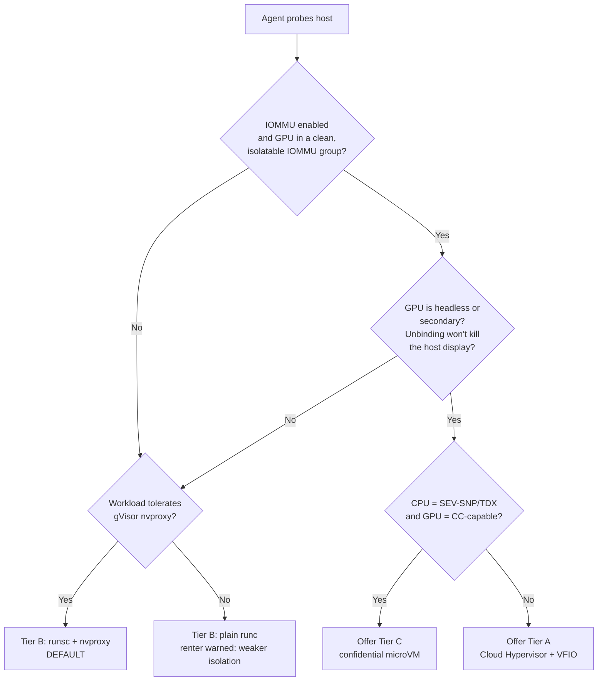

# Host Isolation & Sandboxing

**Status:** Design (July 2026)
**Scope:** Protecting *hosts* — the people who install our agent and rent out idle GPUs — from untrusted renter workloads.
**Out of scope (see other docs):** Protecting *renters* from a malicious host lives in [security.md](./security.md). The Rust agent that drives sandbox lifecycle and teardown lives in [host-agent.md](./host-agent.md). Egress plumbing and the relay live in [networking.md](./networking.md).

Loom lets individuals rent out consumer and prosumer GPUs. That means we are inviting arbitrary renter code onto machines we do not own, sitting on residential networks we do not control. The isolation boundary is the whole product's insurance policy: if a renter can escape onto a host's home LAN, brick their display, or turn their cable modem into a spam cannon, hosts leave and the marketplace dies. This document defines how we contain that code across the two shipping sandbox tiers (B and C are noted where relevant) and states plainly what we accept at each.

---

## 1. Threat model

The renter is the adversary. Their code is untrusted and may be actively malicious. Concretely we defend against:

- **Container / sandbox escape.** Breaking out of the runtime to execute as another user or in the host's root namespace.
- **Kernel exploitation via the GPU driver.** The NVIDIA/AMD kernel driver exposes a large, complex `ioctl(2)` surface reachable from inside any GPU-enabled sandbox. On a shared-kernel container this is the single fattest attack surface we have — a driver bug reached through a permitted ioctl is a direct host-kernel compromise, and gVisor's own docs stress that the sandbox *cannot* protect against vulnerabilities inside the NVIDIA driver itself ([gVisor GPU guide](https://gvisor.dev/docs/user_guide/gpu/)).
- **Cryptomining masquerading.** A job that claims to be training or serving but is really mining. Hard to distinguish from legitimate GPU-saturating work; see §7.
- **Abuse of the host's residential IP.** Using the host's home connection to send spam, run DDoS/reflection, port-scan, brute-force, or host phishing — attributable to the *host*, not us. This is an existential reputational risk for the host and is addressed primarily by network policy (§5).
- **Resource exhaustion.** Pinning all CPU/RAM/VRAM/IO/PIDs to starve the host's own use of their machine, or fork-bombing the box.
- **Persistence.** Writing to host-visible storage, installing a service, or surviving job teardown to reattach later.

We assume the renter can run arbitrary userspace code with full GPU access inside the sandbox. We do **not** assume they have a kernel 0-day, but we design so that a single driver-ioctl bug is *not* automatically game-over on our stronger tier.

---

## 2. Tier comparison

| | **Tier B — daily-driver** | **Tier A — dedicated rig** | **Tier C — confidential (future)** |
|---|---|---|---|
| Mechanism | Container: `runc` + nvidia-container-toolkit, default-hardened with **gVisor `runsc` + nvproxy** | **Cloud Hypervisor** microVM + **VFIO** GPU passthrough | Cloud Hypervisor/QEMU microVM under **SEV-SNP / TDX** + GPU CC mode |
| Kernel shared with host? | **Yes** (host kernel; gVisor interposes a userspace kernel in front of it) | **No** — unique minimal guest kernel per tenant | No — guest kernel + hardware-encrypted memory |
| GPU access path | Host driver; ioctls proxied by nvproxy (vetted subset) or passed raw (plain `runc` fallback) | Whole card passed through; **vendor driver runs inside the guest** | Whole card in CC mode; attested; guest driver |
| Isolation strength | Medium–strong (userspace-kernel syscall interposition) | Strong (hardware VM boundary + IOMMU DMA containment) | Strongest (VM boundary + memory encryption vs. a malicious host) |
| Host requirements | nvidia-container-toolkit; cgroup v2; a runsc-supported driver | **IOMMU on**; GPU in a clean IOMMU group; GPU unbindable from host driver (headless / secondary card) | Above **plus** SEV-SNP/TDX-capable CPU + CC-capable GPU (H100/Blackwell) |
| Workload compatibility | High for CUDA compute (PyTorch, vLLM, inference); some driver tools/ioctls unsupported | Highest — near-bare-metal; guest sees a real GPU | Highest, minus CC-mode perf caveats |
| Relative overhead | Low for GPU-bound work; measurable syscall overhead for IO-heavy CPU work | Low (near-native); one-time VM boot | Low compute; encryption/bounce-buffer overhead on H2D/D2H |

Tier C is documented here only for its sandbox mechanics; **attestation is [security.md](./security.md)'s job.** We note that Cloud Hypervisor and QEMU both support SEV-SNP and TDX guests, so Tier C reuses the Tier A VMM path rather than introducing a new one.

### Tier decision tree

The agent only ever *offers* a tier it has proven the host can support. A machine that fails the IOMMU/headless checks is simply never advertised as Tier A. See host-prerequisite detection in §4.

---

## 3. Tier B — hardened containers (daily-driver machines)

Tier B targets the common case: someone's gaming or workstation PC that they also use. We cannot take their only GPU away (that would blank their screen), and we cannot demand a spare rig. So Tier B runs GPU containers and hardens them as far as a shared kernel allows.

### 3.1 The `runc` + nvidia-container-toolkit baseline — and its ceiling

The nvidia-container-toolkit injects the host's GPU device nodes (`/dev/nvidia*`) and driver user-space into the container, and `runc` runs the workload as an ordinary namespaced process. This is the industry-standard GPU container path. **What it gives us** is process/namespace isolation, cgroup accounting, and capability control. **What it does not give us** is protection against the two things we care about most:

1. **Shared kernel.** Every container shares the host kernel. A kernel LPE reached from inside the container is a host compromise.
2. **Raw GPU driver ioctl surface.** With plain `runc`, the workload talks *directly* to the host NVIDIA kernel driver's full ioctl surface. That is a large, fast-moving C attack surface with a history of CVEs.

Because of (2), **plain `runc` is not our default.** We treat it as a compatibility fallback only, and when a renter's workload forces it, we flag the reduced isolation to the renter and price/reputation-gate accordingly.

### 3.2 Hardening layers applied to every Tier B container

Applied unconditionally, whether we're on runsc or the runc fallback:

- **`no-new-privileges`** set — kills setuid escalation inside the sandbox.
- **User namespaces** — container root maps to an unprivileged host UID; "root" inside is nobody outside.
- **Seccomp** — a tight allowlist profile; we start from the default deny-list and further remove syscalls the curated images don't need. (Curated images only — see §3.4 — makes a tight profile tractable.)
- **Dropped capabilities** — drop `ALL`, add back nothing beyond what the GPU runtime strictly needs.
- **Read-only rootfs** — writable space confined to an explicit ephemeral scratch mount; no persistence to host-visible paths.
- **cgroup v2 limits** — hard caps on CPU shares/quota, memory (with no swap-out to host disk), IO (`io.max`), and **`pids.max`** to defang fork bombs. VRAM is capped separately via the GPU runtime.

These blunt persistence and resource-exhaustion, but they do **not** close the shared-kernel or driver-ioctl holes. That's what gVisor is for.

### 3.3 gVisor `runsc` + nvproxy (the Tier B default)

gVisor's `runsc` runs the workload against a **userspace kernel (the "sentry")** that implements the Linux syscall ABI in a memory-safe Go process. The guest's syscalls hit the sentry, not the host kernel directly, so the host kernel's syscall attack surface is drastically narrowed.

**How nvproxy works.** GPU passthrough would normally defeat gVisor, because the point of gVisor is *not* to let the guest touch host drivers. nvproxy is the deliberate, narrow exception: it is a proxy driver inside the sandbox that forwards `ioctl(2)` calls destined for the NVIDIA devices to the host driver — but only a **vetted, hand-maintained subset** of ioctls, generated by running a large corpus of real GPU workloads and recording which ioctls they legitimately need ([gVisor GPU guide](https://gvisor.dev/docs/user_guide/gpu/), [nvproxy design doc](https://github.com/google/gvisor/blob/master/g3doc/proposals/nvidia_driver_proxy.md)). Everything outside that set is rejected before it reaches the host driver. This turns "the entire driver ioctl surface" into "the ioctls real ML workloads actually use," which is a large risk reduction even though it is not zero (a bug reachable *through a permitted ioctl* still reaches the host driver — hence the standing rule to keep drivers patched).

**What's supported in 2026.** nvproxy officially supports GPUs across Turing (T4), Ampere (A100, A10G), Ada Lovelace (L4), and Hopper (H100), and the same-architecture *consumer* cards (RTX 30/40-series) "likely work but aren't officially supported" ([gVisor GPU guide](https://gvisor.dev/docs/user_guide/gpu/)). Supported capabilities are **compute, utility, graphics, and video** (compute/utility on by default), which covers CUDA, Vulkan, and NVENC/NVDEC. Real CUDA workloads run unmodified — PyTorch, LLM inference/serving stacks including vLLM, and Stable Diffusion are the canonical known-working cases ([gVisor GPU guide](https://gvisor.dev/docs/user_guide/gpu/); [gVisor Stable Diffusion blog](https://gvisor.dev/blog/2023/06/20/gpu-pytorch-stable-diffusion/)). Driver-version support is a **rolling window with strict matching** — runsc cannot assume ABI compatibility across NVIDIA driver versions, so the host's installed driver must be one runsc knows; the agent checks this with `runsc nvproxy list-supported-drivers` at probe time and refuses runsc if the host driver is outside the window.

**Limitations we accept.**

- **Unsupported ioctls break some tools.** Anything relying on an ioctl outside the vetted set fails. Device files `/dev/nvidia-drm`, `/dev/nvidia-modeset`, and `/dev/nvidia-caps/*` are not exposed — so display/graphics-manager tooling and MIG control won't work (irrelevant for our compute workloads).
- **`cudaMallocManaged()` is flaky on the KVM platform** due to virtual-memory-layout limits; all other nvproxy functionality is fine on KVM ([gVisor GPU guide](https://gvisor.dev/docs/user_guide/gpu/)). Curated images steer around managed-memory patterns.
- **Overhead** is small for GPU-bound work (the GPU does the heavy lifting; nvproxy just forwards ioctls) but syscall-heavy CPU/IO phases pay the sentry's interposition cost.

**Policy.** nvproxy-on-runsc is the Tier B **default**. Plain `runc` is a **fallback only**, used when a renter workload genuinely needs an unsupported ioctl or an out-of-window driver, and it is **surfaced to the renter as explicitly weaker isolation** — not silently downgraded.

### 3.4 Curated images

At launch we run **only curated runtime images** (no arbitrary Dockerfiles). This is a defense-in-depth multiplier for Tier B: it lets us pin known-good CUDA/driver combinations inside the runsc support window, keep seccomp profiles tight, and avoid managed-memory footguns — while sharply reducing the supply-chain surface.

---

## 4. Tier A — Cloud Hypervisor + VFIO passthrough (dedicated rigs)

Tier A is for hosts with a **dedicated or secondary/headless GPU** — a mining-rig refugee, a second card, a server with onboard video for the console. Here we can give the renter a *whole real GPU* inside a *real VM with its own kernel*, which is a categorically stronger boundary than any container.

### 4.1 Mechanism

- **IOMMU groups.** The GPU (and any function sharing its IOMMU group, e.g. the HDMI-audio function) must sit in a group we can hand over cleanly. Devices in the same group must be passed together to avoid functional and security issues ([Cloud Hypervisor VFIO docs](https://github.com/cloud-hypervisor/cloud-hypervisor/blob/main/docs/vfio.md)).
- **Rebind to `vfio-pci`.** The agent unbinds the GPU from the host's NVIDIA/AMD driver and binds it to `vfio-pci` ([Cloud Hypervisor VFIO docs](https://github.com/cloud-hypervisor/cloud-hypervisor/blob/main/docs/vfio.md)). This is exactly why Tier A **requires a headless or secondary GPU**: unbinding the host's *only* display GPU blanks the screen. Consumer cards get **whole-card allocation only** — there is no SR-IOV/vGPU partitioning on consumer silicon (that's a licensed enterprise feature).
- **Guest owns the GPU.** Inside the microVM, the **vendor driver runs in the guest** and drives the passed-through card directly. The host kernel never sees renter GPU ioctls at all — the DMA/ioctl attack surface is inside the guest, contained by the CPU IOMMU.
- **Unique minimal guest kernel per tenant.** Each job boots its own guest kernel image — a minimal build (current LTS with a tuned, trimmed config, only the drivers the guest needs). No kernel state is shared between tenants or with the host.
- **Scratch storage.** Ephemeral scratch is provided as a **virtio-fs mount or a dedicated block device**, discarded at teardown. Nothing persists.
- **Boot time.** Cloud Hypervisor boots a minimal Linux guest in well under a second on the CPU side; the dominant cost is GPU/VFIO device setup (cold-plug at VM launch — the Kata reference stack likewise only supports cold-plugging VFIO GPUs, [NVIDIA GPU Operator + Kata docs](https://docs.nvidia.com/datacenter/cloud-native/gpu-operator/latest/deploy-kata-containers.html)). Budget low **single-digit seconds** to a job-ready GPU VM; this is one-time per job and amortized over job duration.

### 4.2 Why Cloud Hypervisor

- **Over QEMU:** Cloud Hypervisor is a `rust-vmm`-based VMM with a **much smaller attack surface**, a modern **REST API** for lifecycle control (a clean fit for the Rust agent), and it supports VFIO passthrough on the NVIDIA architectures we target (Turing/Ampere/Hopper/Lovelace), including GPUDirect P2P over PCIe ([Cloud Hypervisor VFIO docs](https://github.com/cloud-hypervisor/cloud-hypervisor/blob/main/docs/vfio.md); [Northflank Cloud Hypervisor 2026 guide](https://northflank.com/blog/guide-to-cloud-hypervisor)). QEMU's VFIO is more battle-tested, which is a real trade-off — see residual risk in §8.
- **Over Firecracker:** Firecracker **does not support GPU/PCI passthrough, by design.** It exposes only a handful of emulated virtio devices and deliberately omits PCI emulation to keep its attack surface and memory-oversubscription model small ([Firecracker GPU discussion #4845](https://github.com/firecracker-microvm/firecracker/discussions/4845); [issue #849](https://github.com/firecracker-microvm/firecracker/issues/849)). It is therefore disqualified for a GPU marketplace regardless of its other merits. This is settled.

**Kata Containers** deserves a name-check: it is the mature OCI-shim-over-microVM path and supports cold-plug VFIO GPU passthrough over QEMU and (less maturely) Cloud Hypervisor ([Kata NVIDIA GPU passthrough docs](https://github.com/kata-containers/kata-containers/blob/main/docs/use-cases/NVIDIA-GPU-passthrough-and-Kata-QEMU.md)). We are **not** adopting Kata initially — our Rust agent drives Cloud Hypervisor's REST API directly, which is simpler than carrying Kata's Kubernetes-oriented runtime — but Kata is the obvious fallback if we need broader VMM/GPU compatibility (or a ready-made confidential-containers path for Tier C), and there are known open issues with Cloud Hypervisor GPU IOMMU-group creation to watch ([kata-containers#11687](https://github.com/kata-containers/kata-containers/issues/11687)).

### 4.3 Host-prerequisite detection

The agent will not offer Tier A unless the machine is provably clean. At enrollment and on config change it probes:

1. **IOMMU enabled** (`intel_iommu=on` / `amd_iommu=on`, DMAR/IVRS present).
2. **GPU IOMMU-group cleanliness** — the target GPU's group contains only the GPU and its own functions, nothing else the host needs.
3. **Unbindable without blanking the host** — the GPU is not the host's active console/display GPU (headless or genuinely secondary).
4. **vfio-pci available** and the card bindable to it.
5. **(Tier C only)** SEV-SNP/TDX CPU flags + CC-capable GPU.

Only when all pass does Tier A get advertised for that card. Anything short falls back to Tier B.

---

## 5. Network egress controls (both tiers)

This is the control that kills most residential-IP-abuse scenarios, and it applies **identically to Tier A and Tier B**.

- **Default-deny egress with an allowlist.** A workload can reach only: our **package-registry proxy/mirror** (PyPI/conda/apt via our cache), the **Hugging Face hub via our cache**, and the **job's object store**. Everything else is dropped.
- **No inbound.** Nothing on the host's connection accepts connections on the workload's behalf.
- **No LAN access — the critical rule.** The workload must **never** reach RFC1918 space — `192.168.x.x`, `10.x`, `172.16/12`, link-local, or the host's own management interfaces. The renter's home printer, NAS, router admin page, and other devices are unreachable from the sandbox. This is enforced by dropping RFC1918 destinations at the sandbox network namespace / microVM tap, not merely by "not routing" them.
- **Rate and byte caps** on egress, so even allowlisted destinations can't be turned into a high-volume exfil or amplification channel.
- **Renter reaches their job via the relay, never direct LAN.** Renter-to-workload traffic is brokered through Loom's relay ([networking.md](./networking.md)); there is no path from the renter to the host's local network and no path from the workload out to the internet except the allowlist.

Net effect: a compromised or malicious workload cannot spam, scan, DDoS, or phish from the host's IP, and cannot pivot into the host's home network. Egress-firewall logs also feed abuse detection (§7). Full topology is in [networking.md](./networking.md).

---

## 6. GPU-specific risks

- **VRAM residue between tenants.** GPU memory is not automatically zeroed between allocations; a subsequent tenant could in principle read a previous tenant's residual VRAM. We mitigate by **ephemeral teardown**: on job completion the agent tears the sandbox down and performs an explicit GPU scrub/reset before the card is re-offered. The teardown/scrub sequence and its guarantees live in [host-agent.md](./host-agent.md) — this doc's contract is simply *no card is re-let without a clean reset*.
- **GPU reset between jobs (reset quirks).** Reliable reset is what makes card reuse safe. On NVIDIA consumer cards FLR/reset is generally workable in our tested configs. On **AMD**, the historical **reset bug** is real: many pre-RDNA2 cards (Polaris/Vega/Navi) cannot FLR and need the `vendor-reset` kernel module's vendor-specific quirks to be reusable without a full host power-cycle; RDNA2 (RX 6000) and RDNA3 (RX 7000) largely resolved this, though a few board vendors still ship cards with reset quirks ([nicksherlock: AMD reset bug / vendor-reset](https://www.nicksherlock.com/2020/11/working-around-the-amd-gpu-reset-bug-on-proxmox/); [Level1Techs Big Navi FLR thread](https://forum.level1techs.com/t/big-navi-function-level-reset-flr-aka-amd-reset-bug/162780)). **Policy:** the agent's ROCm fast-follow will **probe reset behavior at enrollment and refuse to enroll any card it cannot cleanly reset** — an un-resettable card is a VRAM-residue and availability hazard, so we don't accept it. (NVIDIA-first shipping order sidesteps most of this initially.)
- **Driver crashes taking down the host display (Tier B).** On Tier B the GPU driver is the *host's* driver. A renter workload that crashes or hangs it can freeze/blank the host's own display. gVisor's nvproxy narrows the reachable ioctls but cannot make the host driver crash-proof. This is a real Tier-B residual (§8); one more reason daily-driver hosts get isolation-tolerant curated images and per-job resource caps, and a reason reset/recovery is exercised. On Tier A a driver crash is contained inside the guest and cannot touch the host console.
- **MIG is inapplicable.** Multi-Instance GPU is a datacenter-GPU (A100/H100-class) feature; consumer/prosumer cards don't support it, and consumer allocation is whole-card anyway. No MIG-based partitioning is part of Tier A/B.

---

## 7. Abuse detection on top of isolation

Isolation contains blast radius; detection catches abuse that stays *within* the sandbox but violates our terms. Kept deliberately light — **reputation and enforcement policy live in the marketplace doc**, not here.

- **Cryptomining masquerading.** Honestly, this is hard: a job that says "training" and pins the GPU at 100% looks a lot like mining. Signals we can act on cheaply: sustained, characteristic utilization/power patterns inconsistent with the declared workload class; egress attempts toward known mining-pool endpoints (which our default-deny allowlist already blocks and *logs*); and mismatch between requested runtime images and observed behavior. We treat these as *reputation signals*, not hard blocks, precisely because false positives are easy.
- **Outbound scanning / attack attempts.** The egress firewall (§5) denies-by-default, so any attempt to reach non-allowlisted or RFC1918 destinations is both blocked and logged as a strong abuse signal.
- **Reputation consequences.** Confirmed abuse feeds renter reputation and enforcement — owned by the marketplace doc. This doc's job is only to *produce reliable signals* from the isolation and network layers.

---

## 8. Residual risk — what we consciously accept

A principal engineer signs the following, per tier:

**Tier B (containers + gVisor/nvproxy):**
- The **host kernel is shared.** gVisor removes most of the direct syscall surface, but a bug reachable through a *permitted* NVIDIA ioctl still reaches the host driver, and a sentry escape (rarer, but not impossible) reaches the host kernel. We accept this for daily-driver machines because the alternative is not offering them at all. We compensate with strict driver-version currency, curated images, and tight seccomp/caps/cgroups.
- A renter workload **can crash the host's GPU driver / display.** Accepted for Tier B; not present on Tier A.
- The plain-`runc` fallback is materially weaker (raw driver ioctl surface) and is only used when unavoidable, always disclosed to the renter.

**Tier A (Cloud Hypervisor + VFIO):**
- We rely on **Cloud Hypervisor's VFIO passthrough, which is less battle-tested than QEMU's**, and on correct **IOMMU-group isolation** on consumer boards of varying quality. We accept this in exchange for a smaller, Rust VMM attack surface and clean agent integration; Kata/QEMU is our documented fallback if a card or platform doesn't behave.
- Safe card reuse depends on **reliable GPU reset**; we accept this only for cards that pass enrollment reset-probing, and refuse the rest.
- The **guest still talks to a real vendor GPU driver** — a GPU-firmware/hardware-level attack is out of scope of the VM boundary (Tier C's confidential mode is the answer, later).

**Both tiers:**
- Egress allowlisting assumes our proxy/cache endpoints are themselves not abusable pivots; we accept and separately harden those.
- We do not claim protection against a determined attacker with a fresh GPU-driver or hardware 0-day; we claim strong containment of everything short of that, plus rapid teardown.

---

## 9. Open questions

1. **Consumer-card nvproxy coverage.** RTX 30/40-series are "likely work, not officially supported" by gVisor. We need our own per-card qualification matrix and a policy for when to fall back to plain `runc` vs. refuse the card.
2. **Blackwell / RTX 50-series** driver-version support windows in runsc, and Cloud Hypervisor VFIO behavior on the newest consumer silicon — verify before enrolling those cards. *(Unverified for 2026 silicon — see flag below.)*
3. **VRAM scrub verification.** How do we *prove* a GPU reset actually zeroed VRAM (not just reset the engine)? Needs a concrete, testable teardown assertion in [host-agent.md](./host-agent.md).
4. **Cloud Hypervisor GPU IOMMU-group edge cases** — there are open upstream issues around IOMMU-group creation for passthrough; we need a qualification suite before committing hosts. ([kata-containers#11687](https://github.com/kata-containers/kata-containers/issues/11687))
5. **Boot-time vs. utilization** — is per-job microVM boot cheap enough at our job granularity, or do we need a warm-pool of pre-booted Tier A VMs (and what does that do to the "unique kernel per tenant" guarantee)?
6. **ROCm reset-probe reliability** — can we build a reset probe trustworthy enough to safely auto-enroll AMD consumer cards, given the messy vendor-reset history?
7. **Kata adoption trigger** — define the concrete compatibility threshold at which we switch the Tier A path from bespoke-agent-drives-CH to Kata.

---

*Cross-references: [host-agent.md](./host-agent.md) (sandbox lifecycle, teardown, VRAM scrub) · [security.md](./security.md) (renter-from-host protection, Tier C attestation) · [networking.md](./networking.md) (relay, egress topology).*
