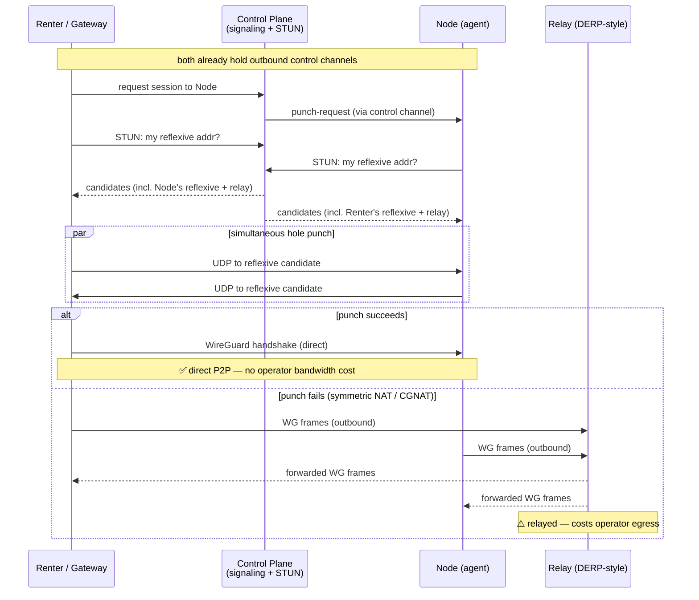

# Networking

Status: design draft · July 2026 · owner: platform

This document specifies how bytes move across Loom. It owns **transport**: the control channel, NAT traversal, tunnel establishment, the inference data path, bulk transfer, and how workload traffic is plumbed on the host. It does *not* own policy: what egress is *permitted* is decided in [../platform/isolation.md](../platform/isolation.md); *why* renter identity is stripped before traffic reaches a node is decided in [../platform/security.md](../platform/security.md); the weight-cache *content model* (chunking, content-addressing, placement) is decided in [../ml-lifecycle/serving.md](../ml-lifecycle/serving.md). We own how those decisions are physically carried on the wire.

The hard constraint shaping everything below: **agents never open inbound ports.** Home machines sit behind NAT, often CGNAT, and their owners will not — and should not — port-forward. Every connection an agent makes is outbound. This is the same box Tailscale, ngrok, and every reverse-tunnel product live in, and we borrow their playbook.

## 1. Three traffic planes

Loom carries three kinds of traffic with almost nothing in common. Conflating them is the classic mistake; we keep them physically and administratively separate.

| Plane | Volume | Latency sensitivity | Availability | Path |
|---|---|---|---|---|
| **Control** | Tiny (KB/s bursts) | Tolerant (seconds OK) | Always-on, per-agent | Agent → connection-gateway, single multiplexed connection |
| **Interactive / data** | Small–moderate | High (SSH keystrokes, token streams, notebook UIs) | On-demand, per-session | Renter ↔ node, via tunnel (direct WG or relay) |
| **Bulk** | Huge (tens–hundreds of GB) | None (throughput-bound) | On-demand, burst | Node ↔ origin (object store/registry) + node ↔ node (P2P) |

The control plane is a nervous system: thin, constant, reliable. The data plane is a phone call: it must feel live. The bulk plane is a freight train: nobody cares when it *starts* moving as long as it moves fast and doesn't derail the household's Netflix. These get different transports, different QoS classes, and different failure semantics.

## 2. The control channel

Each agent holds exactly **one** long-lived connection to a **connection-gateway** (operator infra, horizontally scaled, fronted by NATS internally per [../platform/host-agent.md](../platform/host-agent.md)). This is the agent's only unconditional dependency.

**Transport: QUIC, WSS fallback.** The primary transport is QUIC (over UDP/443), which gives us stream multiplexing, head-of-line-blocking avoidance, and — critically — connection migration (§2.3). Some hostile middleboxes (corporate proxies, a minority of CGNAT deployments, captive-portal networks) block or throttle UDP/443. When the agent cannot establish or sustain QUIC, it falls back to **WSS over TCP/443**, which is indistinguishable from HTTPS to a middlebox and gets through essentially everywhere. The agent probes QUIC first on every cold start and periodically re-probes; WSS is strictly the fallback because it reintroduces TCP head-of-line blocking across our multiplexed streams.

We implement the QUIC side with **quinn**, the mature pure-Rust async QUIC implementation (RFC 9000, client+server) ([quinn-rs/quinn](https://github.com/quinn-rs/quinn)). Rust keeps this in-process with the rest of the agent with no FFI.

**Authentication: mTLS with enrollment identity keys.** At enrollment (see [../platform/host-agent.md](../platform/host-agent.md)) each agent generates a keypair and receives a client certificate bound to its `agent_id`. The control connection is mTLS: the gateway pins our CA and validates the agent cert; the agent pins the gateway cert. There is no password, no bearer token on the wire that can be replayed — possession of the enrollment private key *is* the identity. Compromised or revoked agents are handled by CRL/short-lived-cert rotation at the gateway.

**Multiplexed streams.** Over the single connection we run independent QUIC streams so a slow log upload never blocks a heartbeat:

- **commands** — gateway → agent RPC (start job, stop job, punch-request, config push). Bidirectional, request/response.
- **heartbeats** — agent → gateway liveness + health (GPU temp, VRAM free, load). Cheap, frequent, drives scheduling and node health.
- **logs** — agent → gateway job stdout/stderr and structured events. Backpressured; may lag.
- **metering** — agent → gateway signed usage records (GPU-seconds, bytes relayed). Must be durable; buffered to disk on the host and re-sent after reconnect so we never lose a billing record across a blip.

**Reconnect / backoff.** On disconnect the agent reconnects with exponential backoff + full jitter (base 500 ms, cap ~30 s), re-probing QUIC-then-WSS each cycle. Metering and unacked logs are persisted locally and replayed on reconnect (idempotent by record ID). The gateway treats a missed heartbeat window as "node draining," stops routing new work to it, but does not immediately fail in-flight jobs — a 30 s home-internet hiccup should not evict a running training job.

### 2.3 Surviving IP changes (QUIC connection migration)

Residential IPs change: DHCP lease renewals, CGNAT rebinding, laptop moving Wi-Fi→wired. QUIC identifies a connection by **connection ID**, not by 4-tuple, so a client whose source address changes can keep the same connection without a full TLS re-handshake. In quinn this is governed by `ServerConfig::migration`, which is **enabled by default**, allowing clients to change address at will (e.g., switching to a cellular link) ([quinn docs](https://docs.rs/quinn/)). We keep it enabled on the gateway.

> ⚠️ **Verify at build time.** Migration is real in quinn, but the exact hardening — path validation on migration, anti-amplification limits, behavior under NAT rebinding vs. genuine address change — evolves per release. We pin a quinn version, read that version's migration code path, and write an integration test that forces a client source-port change mid-connection and asserts the streams survive. *We do not assume migration is transparent until that test is green.* On the WSS fallback there is no migration; a TCP reset forces a full reconnect (§2 backoff handles it).

## 3. NAT traversal for the data plane

The control channel is always agent→gateway, so it never needs traversal. The **data plane is different**: we want renter↔node (or gateway↔node) traffic to go **direct** whenever possible, because relaying it costs *us* operator bandwidth.

The sequence, coordinated over the already-established control channels of both endpoints:

1. **Reflexive discovery (STUN-style).** Each endpoint asks a STUN-like service (co-located with the gateway) for its public `ip:port` as seen from the outside. This reveals the NAT's external mapping.
2. **Candidate exchange.** Endpoints exchange candidate addresses (local, reflexive, and relay) *through the control plane* — the gateway is the signaling channel, so no inbound port is ever needed to negotiate.
3. **UDP hole punching.** Both sides fire UDP packets at each other's reflexive candidates simultaneously. If the NATs are cone-type, the outbound packets open the mappings and a bidirectional path forms.
4. **WireGuard tunnel.** On a successful punch, we bring up a **WireGuard** tunnel over that path — renter↔node for interactive sessions, or gateway↔node for inference (§4). WG gives us modern crypto, tiny overhead, and a kernel or userspace datapath. On Linux hosts we prefer the kernel module; where we need userspace (portability, unprivileged agents, non-Linux dev), we use a userspace implementation — **boringtun** (Cloudflare's Rust userspace WireGuard, [github.com/cloudflare/boringtun](https://github.com/cloudflare/boringtun)) is the baseline. Note the ecosystem is moving: Mullvad forked boringtun into **GotaTun** (announced Dec 2025) for performance and multi-threading ([Mullvad](https://mullvad.net/en/blog/announcing-gotatun-the-future-of-wireguard-at-mullvad-vpn)); we track it but do not depend on it yet.
5. **Relay fallback (DERP-style TURN).** When the punch fails — symmetric NAT, hard CGNAT, restrictive corporate egress — we fall back to a **relay** on operator infra: both endpoints hold outbound connections to the same relay, which forwards encrypted WG packets between them. This is architecturally identical to Tailscale's DERP. The relay never sees plaintext (it forwards WG-encrypted frames); it only sees ciphertext and endpoints.

### Expected hit rates and the pricing implication

Tailscale — the reference implementation of exactly this design — reports that a basic STUN + firewall-traversal approach gets a direct connection **"over 90% of the time,"** with further tricks (birthday-paradox port probing, port-mapping protocols) closing more of the gap ([Tailscale: How NAT traversal works](https://tailscale.com/blog/how-nat-traversal-works)). Their marketing elsewhere states the large majority of connections end up direct P2P.

> ⚠️ **Flag: the "over 90%" figure is Tailscale's estimate for a *basic* implementation, not a controlled measurement of Loom's population.** Our population skews *worse* than Tailscale's: consumer/prosumer home GPUs sit disproportionately behind CGNAT (mobile-carrier home internet, apartment-building shared NAT), which is exactly the hard case. We should plan for a **materially higher relay rate than 10%** until we measure it, and instrument the real direct-vs-relay ratio from day one.

**Every relayed session costs us operator egress bandwidth**, symmetric to the traffic it carries. For token streams (§4) that's negligible; for a fat interactive port-forward it is not. This is a direct input to unit economics: **relay bandwidth is a cost line that must be priced in.** → *Flagged to [../product/marketplace.md] (pricing): relayed sessions carry an operator egress cost; consider a modest pricing signal or a "direct-connectable" node preference so we're not subsidizing hard-NAT nodes indefinitely.*

## 4. The inference path

Inference is a special, high-value case of the data plane with its own shape.

- **Renter → gateway** is ordinary web traffic: HTTPS to our **OpenAI-compatible gateway**. The renter sees a standard `POST /v1/chat/completions`. The gateway does auth, billing, routing, and mid-stream failover; it strips renter identity before anything reaches a node (rationale in [../platform/security.md](../platform/security.md)). Nothing exotic here — TLS termination, HTTP/2 or HTTP/3, standard.
- **Gateway → node** uses the tunnel from §3 (direct WG when punchable, relay otherwise). Because the gateway is operator infra with a stable public presence, gateway↔node traversal is *easier* than renter↔node — the gateway is effectively a well-known peer, so more of these land direct.
- **Token streams are tiny.** An SSE/streamed completion is a few KB/s. **Latency dominates, bandwidth is irrelevant.** This flips the usual optimization: for inference we care about RTT and jitter, and relaying token streams is cheap even when we can't punch. We therefore *don't* aggressively insist on direct connections for inference — a low-latency relay near the node is fine.
- **Warm connection pools.** The gateway maintains per-node warm tunnels and connection pools, so a request doesn't pay handshake/traversal cost on the hot path. Nodes joining the serving fleet establish their gateway tunnel *before* being marked ready.

### Failover honesty

If a node dies mid-generation, the gateway fails over by **resubmitting the prompt to a replica.** Generation is restartable, so this is safe — but it is **not free UX**: the user may see the stream stall and restart from the beginning.

Two mitigations, stated honestly:

1. **Replay-from-last-token *iff* the engine supports it.** If the serving engine exposes deterministic generation (fixed seed, reproducible sampling) *and* the gateway has buffered the tokens already emitted, the gateway can resubmit with the same seed and **suppress re-emitting the already-sent prefix**, so the client sees a seamless continuation. This requires deterministic decoding end-to-end.
2. **Otherwise, restart the stream.** Most real deployments run non-deterministic sampling (temperature, top-p, batching non-determinism), so replay is often *not* achievable. In that case failover means the client's stream restarts. We surface this plainly and keep restarts rare by failing over *fast* (short node health timeouts) rather than pretending they're invisible.

The engine-capability boundary here is owned by [../ml-lifecycle/serving.md](../ml-lifecycle/serving.md); networking provides the buffering and resubmit mechanism, serving decides whether replay is possible.

## 5. Bulk transfers

Container image layers, model weights, datasets, checkpoints — tens to hundreds of GB. Two directions, different problems.

### Download (origin → node, and node ↔ node)

**Baseline: HTTP range requests with resume.** Nodes fetch from origin (object store / OCI registry) over HTTP using range requests, so an interrupted 80 GB weight pull resumes from the last byte instead of restarting. This is the floor and it always works.

**Acceleration: P2P chunk sharing between nodes.** When many nodes need the same content (a popular base image, a hot model), pulling every byte from origin N times is wasteful and slow. Content is content-addressed and chunked (model owned by [../ml-lifecycle/serving.md](../ml-lifecycle/serving.md)); we distribute chunks **peer-to-peer between nodes over the WG mesh**, so the second-through-Nth node pull mostly from peers, not origin.

**Recommendation: adopt Dragonfly (d7y), don't build our own.** Dragonfly is a CNCF **graduated** (Oct 2025) P2P file/image distribution system with an optional content-addressable filesystem for OCI launch acceleration ([d7y.io](https://d7y.io/), [github.com/dragonflyoss/dragonfly](https://github.com/dragonflyoss/dragonfly)). Its numbers are exactly our use case: for a 130 GB model across 200 nodes, origin traffic drops from ~26 TB to ~130 GB — a **99.5% reduction** — because seed peers share pieces as soon as any single piece lands, not after a full download ([CNCF](https://www.cncf.io/blog/2026/04/06/peer-to-peer-acceleration-for-ai-model-distribution-with-dragonfly/)). Early-2026 additions of native `hf://` and `modelscope://` protocols make model distribution first-class. Building a bespoke BitTorrent-like layer to match a graduated CNCF project would be a poor use of engineering; we adopt Dragonfly and run its peers on our nodes, layered over the WG mesh for transport security.

> ⚠️ **Open evaluation, not a settled decision.** Two things to validate before committing: (a) Dragonfly assumes peers can reach each other — we must confirm its peer-to-peer transport composes cleanly with our NAT-traversed WG mesh (peers behind CGNAT that can't punch will fall back to relay/origin, eroding the savings); (b) its scheduler/seed-peer topology needs to map onto our dynamic, churny consumer-node fleet, which is unlike the datacenter fleets Dragonfly is tuned for. If (a) proves ugly, the fallback is a **minimal custom chunk-swap over the WG mesh** keyed on the existing content-addressed chunk IDs — but that's plan B.

### Upload (node → object store): checkpoints

Training checkpoints flow **node → object store** via **multipart upload** (parallel parts, per-part retry, resumable). The critical constraint is residential **uplink asymmetry**: a home connection might be 500 Mbps down / 20 Mbps up. Saturating that uplink makes the owner's home internet unusable and will get us uninstalled.

Therefore checkpoint upload is **throttled with an owner-configurable cap** (default conservative, e.g. a fraction of measured uplink), enforced by the same QoS machinery as §7. Uploads are background-priority and yield to interactive traffic. Owners who *want* to dedicate more uplink can raise the cap; we never assume we own the pipe.

## 6. Workload traffic plumbing on the host

Renter workloads run in a sandbox. **The sandbox never touches the host's real interfaces.** All renter-facing connectivity terminates at the **agent process**, which forwards into the sandbox. Physical plumbing depends on isolation tier (tiers defined in [../platform/isolation.md](../platform/isolation.md)):

- **Tier B (container/namespace):** the sandbox gets a **veth pair** into a **network namespace**, the host-side veth attached to an **agent-managed bridge**. The agent owns the bridge and the routing.
- **Tier A (microVM):** the sandbox gets a **virtio-net** device bridged the same way. From the network's perspective it looks the same: a private link into an agent-controlled bridge.

On that bridge the agent runs an **nftables egress firewall** implementing the policy from [../platform/isolation.md](../platform/isolation.md): **default-deny**, an **allowlist** of permitted destinations, and a hard **no-RFC1918** rule so a workload can never reach the home LAN (router admin page, NAS, other household devices, printers). The sandbox's default route points at the agent; the agent NATs/proxies allowed egress out through the (throttled) host uplink and drops everything else.

The key security property, owned here as *mechanism*: **there is no path from inside the sandbox to the host's LAN or loopback.** The sandbox sees an agent-controlled interface and nothing else. Even DNS goes through an agent-controlled resolver so we can enforce the allowlist by name, not just IP. (Policy — *what* is on the allowlist, LAN-access prohibition — is [../platform/isolation.md](../platform/isolation.md)'s call; we guarantee it's physically unbypassable.)

## 7. Bandwidth and QoS: don't ruin the owner's home internet

This is existential for adoption. **A Loom node must be a good houseguest.** If enabling Loom makes video calls stutter, the owner uninstalls and tells their friends. So workload traffic is aggressively subordinated to the household.

- **Owner-configurable caps** on total workload up/down, enforced via Linux **tc** with the **CAKE** qdisc (great at fairness + bufferbloat control on the exact asymmetric residential links we target), or an **eBPF**-based shaper where tc is awkward. Caps default conservative and are the owner's dial to turn up.
- **Priority classes.** Interactive data-plane traffic (SSH, notebook, token streams) is higher priority than bulk. **Background bulk transfers (image/weight pulls, checkpoint uploads) are marked low-priority** and yield to both household traffic and interactive Loom traffic. Bulk is explicitly "use the leftovers."
- **Uplink protection.** Because upstream is the scarce, easily-saturated direction on residential links, checkpoint uploads (§5) and any node→node seeding get the tightest default caps.

The agent measures achievable throughput periodically so caps expressed as "X% of uplink" track reality rather than a stale one-time guess.

## 8. Gateway and relay abuse resistance

The gateway and relays are our public attack surface; agents (outbound-only) are much harder to hit directly.

- **DDoS / volumetric:** gateway and relay ingress sit behind standard anti-DDoS (upstream scrubbing + our own connection-rate limits). Relays only forward WG ciphertext between *already-authenticated* endpoints, so an attacker can't use a relay as an open reflector — a relay session requires a control-plane-negotiated pairing first.
- **Per-account rate limits:** the inference gateway enforces per-account request and token-rate limits (billing-tier-aware) so one account can't exhaust shared node capacity or run up someone else's cost. Enrollment and session-setup are rate-limited per identity to blunt credential-stuffing and enrollment-spam.
- **SNI / ALPN hygiene:** control and data connections advertise a specific ALPN (our QUIC/WSS protocol identifiers); the gateway rejects mismatched ALPN early. We avoid leaking distinguishing SNI where the WSS fallback's whole point is to look like ordinary HTTPS — the fallback uses a normal-looking SNI so hostile middleboxes don't single it out. Certificate pinning (both directions, §2) means a MITM at a captive portal can't transparently intercept the control channel; it can only block it, which fails us over cleanly rather than compromising us.

## 9. Open questions

1. **Real relay rate for our population.** We need production numbers, not Tailscale's, on how many of our sessions actually punch through vs. relay — CGNAT prevalence among consumer GPU owners is the biggest unknown and it drives both cost and UX.
2. **quinn connection-migration robustness.** Pin a version, prove migration survives NAT rebind *and* real address change with a forced integration test before relying on it (§2.3). Open until that test exists and is green.
3. **Dragonfly over CGNAT mesh.** Does Dragonfly's peer transport degrade gracefully when a meaningful fraction of peers can't directly reach each other and must relay or fall back to origin? Needs a spike (§5).
4. **Relay placement and cost.** How many relay POPs, where, and how do we cap the operator bandwidth bill? Anycast vs. geo-DNS relay selection; do we let owners run their own relay for a rebate?
5. **Userspace WG choice.** boringtun vs. tracking GotaTun vs. kernel WG only — decide the default datapath per host tier and revisit as GotaTun matures.
6. **QoS on non-Linux hosts.** tc/CAKE and nftables are Linux-first. macOS/Windows prosumer hosts need an equivalent shaping + egress-firewall story or a documented "Linux-host-only for untrusted workloads" stance.
7. **DNS allowlisting granularity.** Name-based egress allowlisting interacts badly with CDNs and rotating IPs; we need a design that's enforceable without breaking legitimate package/model pulls.

---

*Cross-references: [../platform/host-agent.md](../platform/host-agent.md) (enrollment, agent process, control-plane internals) · [../platform/isolation.md](../platform/isolation.md) (sandbox tiers, egress policy) · [../ml-lifecycle/serving.md](../ml-lifecycle/serving.md) (weight-cache content model, engine determinism) · [../platform/security.md](../platform/security.md) (identity stripping) · [../product/marketplace.md] (pricing of relayed bandwidth).*
