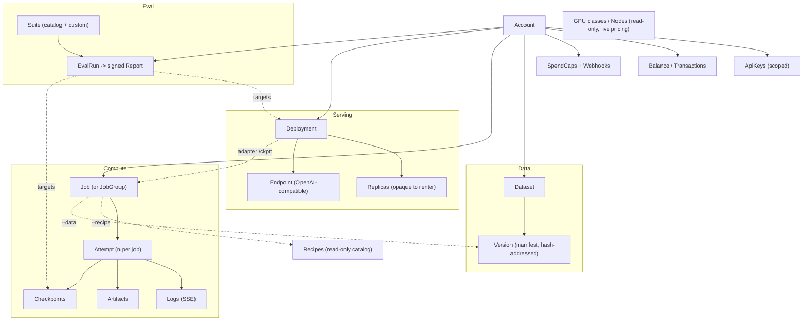

# Renter API

Status: design draft · July 2026 · owner: platform

This document specifies the **renter-facing API** — the REST + streaming surface that powers the `loom` CLI, the SDKs, and every renter integration. It is the concrete contract behind the [deployment UX](../product/deployment.md): every command in that doc's CLI tree maps onto endpoints here, and every narrative in [deployment.md §3](../product/deployment.md#3-renter-quickstarts--three-narratives) is expressible as SDK calls (§6).

It refines the API-surface sketch in [control-plane.md §7](./control-plane.md#7-api-surface-sketch) into a full renter contract. It does **not** own: the host/admin surfaces (control-plane's concern), the OpenAI-compatible *engine* semantics ([serving.md](../ml-lifecycle/serving.md)), identity-stripping rationale ([security.md](./security.md)), transport / relay tickets ([networking.md](./networking.md)), or pricing mechanics ([marketplace.md](../product/marketplace.md)). It owns the wire shapes a renter sees.

Two base URLs, deliberately separated:

| Surface | Base URL | Versioning | Auth |
|---|---|---|---|
| **Loom control API** | `https://api.loom.dev/v1` | Loom-owned `/v1` (§7) | `Authorization: Bearer loom_sk_…` |
| **Inference gateway** | `https://inference.loom.dev/v1` | **Mirrors OpenAI — not versioned by us** (§4) | same API keys |

The split is load-bearing. The control API is a resource-oriented Loom product surface we version and evolve on our schedule. The inference gateway is an OpenAI-compatible drop-in whose `/v1` tracks OpenAI's schema so existing SDKs work unmodified ([serving.md §3](../ml-lifecycle/serving.md#3-gateway-architecture)); we do not get to renumber it. Note that [deployment.md §3](../product/deployment.md#3-renter-quickstarts--three-narratives) shows `https://api.loom.dev/v1` as the inference base for brevity — the canonical inference host is `inference.loom.dev`, and `api.loom.dev` transparently routes OpenAI-shaped paths there.

---

## 1. API principles

### 1.1 Resource-oriented REST

Everything under `api.loom.dev/v1` is a resource with a stable ID and a small, predictable verb set. `POST` a collection to create; `GET` an item or collection to read; `PATCH` to mutate; `DELETE` to tear down. Actions that aren't CRUD are sub-resource `POST`s with an imperative segment (`/jobs/{id}/cancel`), never a verb-in-query. IDs are prefixed and opaque: `job_…`, `dep_…`, `ds_…`, `key_…`, `evalrun_…`, `txn_…`. Timestamps are RFC 3339 UTC. Money is integer **micro-USD** (`price_micro_usd`, 1 USD = 1,000,000) to avoid float drift — matching the per-second billing precision in [control-plane.md §6](./control-plane.md#6-metering--billing-pipeline).

### 1.2 Authentication & scopes

Auth is an API key: `Authorization: Bearer loom_sk_<random>`. Keys are minted per the key-management surface below (§3.9) and carry **scopes**. A request presenting a key that lacks the required scope gets `403` with error code `insufficient_scope`.

| Scope | Grants |
|---|---|
| `jobs:write` | submit / cancel jobs, exec/port-forward, read job status & logs |
| `data:write` | push / commit / delete datasets and versions |
| `deploy:write` | create / update / delete deployments, run eval-runs |
| `billing:read` | read balance, transactions, usage, spend caps |
| `admin` | manage API keys, spend-cap policy, webhooks, audit log |

Read of a resource requires the matching write scope or `billing:read` where noted; there is no separate `*:read` scope in v1 (write implies read of the same resource family). Inference gateway requests (§4) require **any valid key** — the gateway checks the account and per-key rate limits, not fine-grained scopes, matching OpenAI's key model. `admin` is the CI/rotation scope; issue narrow keys for pipelines (§7 security notes).

### 1.3 Idempotency

Every `POST` that creates or mutates state accepts an `Idempotency-Key: <client-uuid>` header. The server stores the `(account, idempotency_key)` → response mapping for **24 h**. A retry with the same key returns the original response (same status, same body, `Idempotency-Replayed: true`) and never creates a second resource. This is the renter-facing surface of the exactly-once machinery in [control-plane.md §3](./control-plane.md#3-job-lifecycle-state-machine); a flaky laptop uplink retrying `POST /v1/jobs` never double-submits. A key reused with a **different** request body returns `422` `idempotency_key_reused`.

### 1.4 Pagination & filtering

List endpoints are **cursor-paginated**:

```
GET /v1/jobs?limit=50&cursor=eyJvIjoxMjN9&state=running&gpu=rtx4090
```

Response envelope:

```json
{
  "data": [ { "…": "…" } ],
  "next_cursor": "eyJvIjoxNzN9",
  "has_more": true
}
```

`limit` defaults to 50, caps at 200. Cursors are opaque and forward-only. Filters are typed query params documented per endpoint (`state`, `gpu`, `created_after`, `deployment`, …); repeated params mean OR (`?state=running&state=queued`), distinct params mean AND. Sort is fixed newest-first by resource creation; no arbitrary sort in v1 (open question §8).

### 1.5 Errors — RFC 9457 problem+json

All errors are `application/problem+json` per RFC 9457, with a **stable `code`** from a closed taxonomy so clients branch on `code`, never on `detail` prose or HTTP status alone.

```json
{
  "type": "https://docs.loom.dev/errors/price_ceiling_unmet",
  "title": "No node matches your price ceiling",
  "status": 409,
  "code": "price_ceiling_unmet",
  "detail": "No rtx4090 node is listed at or below 300000 micro-USD/hr; lowest current ask is 340000.",
  "instance": "/v1/jobs",
  "request_id": "req_01J9…",
  "meta": { "lowest_ask_micro_usd_per_hr": 340000, "gpu": "rtx4090" }
}
```

Stable error-code taxonomy (extended additively — clients must tolerate unknown codes):

| `code` | HTTP | Meaning / renter action |
|---|---|---|
| `unauthenticated` | 401 | Missing/invalid key. |
| `insufficient_scope` | 403 | Key lacks the required scope. |
| `not_found` | 404 | No such resource (or not owned by this account). |
| `idempotency_key_reused` | 422 | Same key, different body. |
| `validation_failed` | 422 | Malformed request; `meta.errors[]` lists field paths. |
| `manifest_invalid` | 422 | Dataset manifest hash/schema mismatch on commit ([data.md §4](../ml-lifecycle/data.md#4-data-staging-architecture)). |
| `image_unknown` | 422 | Image digest not resolvable / not a curated image ([security.md §7](./security.md#7-platform-security)). |
| `recipe_unknown` | 422 | No such recipe in the read-only catalog. |
| `model_unavailable` | 422 | Model/adapter ref can't be resolved or architecture unsupported ([serving.md §5](../ml-lifecycle/serving.md#5-hugging-face-integration)). |
| `price_ceiling_unmet` | 409 | No node at/under `max_price_per_hour`; `meta` gives lowest ask. |
| `no_capacity` | 409 | No eligible node right now; queueable (`meta.queue_position`). |
| `quota_exceeded` | 429 | Account resource quota hit (concurrent jobs, deployments). |
| `rate_limited` | 429 | API rate limit; see `Retry-After` + `RateLimit-*` headers. |
| `insufficient_balance` | 402 | Balance below the required hold; top up or lower spend. |
| `spend_cap_exceeded` | 402 | A configured spend cap would be breached by this op. |
| `privacy_unavailable` | 409 | `privacy: strict` requested, no Tier C capacity — fails closed ([security.md §4](./security.md#4-gateway-identity-stripping--spec)). |
| `conflict` | 409 | State conflict (e.g. cancel a terminal job). |
| `internal` | 500 | Loom-side fault; safe to retry with backoff. |

`no_capacity` and `price_ceiling_unmet` are *not* hard failures for jobs — they surface the queue/price levers the CLI shows in [deployment.md §6](../product/deployment.md#6-failure-ux). A job may be accepted `queued` and later report these as status detail rather than a submit-time error, controlled by the `on_no_capacity` field (§3).

### 1.6 Rate limits

Per-key token-bucket, tier-aware ([networking.md §8](./networking.md#8-gateway-and-relay-abuse-resistance)). Every response carries:

```
RateLimit-Limit: 600
RateLimit-Remaining: 594
RateLimit-Reset: 12
Retry-After: 12          # only on 429
```

Control-API limits are per-account-per-route-class; inference-gateway limits are per-key-per-model (request-rate **and** token-rate), enforced at admission ([serving.md §3](../ml-lifecycle/serving.md#3-gateway-architecture)). Limits scale with billing tier; a `429 rate_limited` is always retryable after `Retry-After`.

---

## 2. Resource model



Notes on the model:

- **Job vs JobGroup.** A multi-GPU fan-out selector (e.g. `gpu: ["rtx4090","rtx5090"]`) produces a **job group** — one `POST /v1/jobs` returns a group with N child jobs, one per GPU class, mirroring the matrix result in [deployment.md §3(a)](../product/deployment.md#3-renter-quickstarts--three-narratives). A single-selector job is a group of one.
- **Attempts** are the retry unit ([control-plane.md §3](./control-plane.md#3-job-lifecycle-state-machine)). A job that gets requeued across three dead nodes has one job and four attempts, each with its own logs/cost segment.
- **Replicas are opaque.** A renter reads a deployment's *health, QPS, replica count, and autoscale bounds* but never a host, node ID, or replica address — symmetric privacy per [serving.md §7](../ml-lifecycle/serving.md#7-observability-for-renters).
- **Recipes** and **GPU classes** are read-only catalogs; the renter references them, doesn't create them.

---

## 3. Endpoint catalog

### 3.1 Jobs

| Method | Path | Purpose |
|---|---|---|
| `POST` | `/v1/jobs` | Submit a job (or fan-out job group). |
| `GET` | `/v1/jobs` | List jobs (filter by `state`, `gpu`, `group`, `created_after`). |
| `GET` | `/v1/jobs/{id}` | Job status: attempt history + live cost. |
| `GET` | `/v1/jobs/{id}/logs` | **SSE** log stream with resume token. |
| `GET` | `/v1/jobs/{id}/metrics` | **SSE** live GPU util / mem / power telemetry (powers `loom top`). |
| `GET` | `/v1/jobs/{id}/artifacts` | List output artifacts (checkpoints, files, pushed refs). |
| `POST` | `/v1/jobs/{id}/cancel` | Cancel from any non-terminal state. |
| `POST` | `/v1/jobs/{id}/sessions` | Bootstrap an exec / port-forward session (WS upgrade, §3.2). |
| `GET` | `/v1/job-groups/{id}` | Group rollup across child jobs. |

**`POST /v1/jobs` — full JobSpec.** The spec is `image-or-recipe + resource claim + isolation tier + max price` ([control-plane.md §2](./control-plane.md#2-data-model-sketch), CLAUDE-level invariant). Full example (the fine-tune from [deployment.md §3(b)](../product/deployment.md#3-renter-quickstarts--three-narratives), plus a fan-out illustration):

```json
{
  "recipe": "qlora-sft",                 // XOR with "image"
  "recipe_config": {
    "base": "hf:meta-llama/Llama-3.1-8B",
    "epochs": 3, "lora_r": 16
  },
  "gpu": ["rtx4090", "rtx5090"],         // list => job GROUP, one child per class
  "resource_claim": {
    "gpus": 1,
    "min_vram_mb": 24000,
    "min_driver": "550"
  },
  "isolation_tier": "B",                 // minimum acceptable tier: "B" | "A" | "C"
  "trust_tier": "B",                     // reserved; == isolation_tier today (see below)
  "max_price_per_hour": 400000,          // micro-USD ceiling; scheduler filters on it
  "max_duration_s": 21600,
  "region_pref": "us-east",
  "on_no_capacity": "queue",             // "queue" | "fail"
  "data": ["ds:my-sft@v1"],              // dataset version refs (data.md manifests)
  "env": {
    "HF_TOKEN": { "sealed_secret": "seal_01J9…" }   // never plaintext on host
  },
  "checkpoint_policy": {
    "enabled": true,                     // loom-ckpt; on by default for recipes
    "interval_s": 900,
    "keep_last": 3
  }
}
```

- `recipe` XOR `image`: `image` takes a content-addressed digest (`loom/torch@sha256:…` or `sha256:…`); unresolvable or non-curated → `image_unknown` ([security.md §7](./security.md#7-platform-security)). `recipe` references the read-only catalog (§3.4); unknown → `recipe_unknown`.
- **`gpu` fan-out**: a list produces a job group of N children run in parallel — the [deployment.md §3(a)](../product/deployment.md#3-renter-quickstarts--three-narratives) test-across-hardware story. A string is a single job.
- **`trust_tier` is reserved.** It mirrors `isolation_tier` today; the field exists in the wire format from day one so Tier C attestation ([security.md §6.5](./security.md#65-hardware-sourcing-reality)) slots in without a breaking change. Requesting `"C"` today may return `no_capacity` until Tier C supply exists.
- **`env` sealed secrets**: values are `{ "sealed_secret": "seal_…" }` handles, minted via the sealed-secret endpoint (§3.7). The plaintext never appears in a manifest, log, or heartbeat ([security.md §7](./security.md#7-platform-security), [training.md §6](../ml-lifecycle/training.md#6-hugging-face-integration)).
- **Billing**: a balance hold is placed at submit (`submitted → queued`, [control-plane.md §3](./control-plane.md#3-job-lifecycle-state-machine)); insufficient funds → `insufficient_balance`. The **prepare phase is billed at CPU rate**, GPU meter starts only at workload launch ([data.md §4](../ml-lifecycle/data.md#4-data-staging-architecture)).

Response `201`:

```json
{
  "id": "grp_01J9…",              // job group (single-child if gpu was a string)
  "kind": "job_group",
  "children": [
    { "id": "job_01J9…a", "gpu": "rtx4090", "state": "queued" },
    { "id": "job_01J9…b", "gpu": "rtx5090", "state": "queued" }
  ],
  "estimate": { "gpu_hours_low": 1.2, "gpu_hours_high": 2.4,
                "cost_micro_usd_low": 410000, "cost_micro_usd_high": 820000 }
}
```

The `estimate` echoes the [deployment.md §4](../product/deployment.md#4-cli-design) "cost estimate before it starts" contract; `--dry-run` in the CLI is `POST /v1/jobs?dry_run=true`, which returns the estimate and validation result with **no hold and no resource created**.

**`GET /v1/jobs/{id}` — status with attempt history + live cost:**

```json
{
  "id": "job_01J9…a",
  "group_id": "grp_01J9…",
  "state": "running",                    // control-plane job states
  "gpu": "rtx4090",
  "isolation_tier": "B",
  "cost": {
    "accrued_micro_usd": 21000,          // live; matches CLI "$0.021 · 00:47"
    "held_micro_usd": 610000,
    "billable_seconds": 47
  },
  "attempts": [
    { "attempt_no": 1, "state": "lost",    "exit_reason": "host_offline",
      "started_at": "…", "ended_at": "…", "billable_seconds": 130,
      "start_checkpoint": null,           "end_checkpoint": "ckpt:step4200" },
    { "attempt_no": 2, "state": "running", "started_at": "…",
      "start_checkpoint": "ckpt:step4200" }
  ],
  "created_at": "…"
}
```

The renter never sees which host ran an attempt (privacy symmetry, [serving.md §7](../ml-lifecycle/serving.md#7-observability-for-renters)); `exit_reason` is a coarse enum (`host_offline`, `owner_ejected`, `oom`, `nonzero_exit`, `cancelled`, `preempted`), enough to power the [deployment.md §6](../product/deployment.md#6-failure-ux) failure UX without leaking host identity.

**`POST /v1/jobs/{id}/cancel`** → `202`; transitions to `cancelled` per the state machine ([control-plane.md §3](./control-plane.md#3-job-lifecycle-state-machine)). Cancelling a terminal job → `409 conflict`.

### 3.2 Logs & interactive sessions

**`GET /v1/jobs/{id}/logs` — SSE with resume.** `Accept: text/event-stream`. Each event carries a monotonic `id:` usable as a resume token; reconnecting with `Last-Event-ID` (or `?since=<token>`) replays from the next line, so a closed laptop re-attaches cleanly ([deployment.md §4](../product/deployment.md#4-cli-design) resumable ops).

```
id: 4212
event: log
data: {"ts":"…","attempt_no":2,"stream":"stdout","line":"epoch 2 loss 1.84"}

id: 4213
event: status
data: {"state":"running","step":4213}
```

Event types: `log`, `status`, `cost` (periodic accrued-spend tick), `attempt` (requeue/failover boundary — the `↻ resuming from checkpoint` line in [deployment.md §6](../product/deployment.md#6-failure-ux)), `done`. Streams end with a `done` event; late subscribers still get full history via `?since=0`.

**`GET /v1/jobs/{id}/metrics` — SSE GPU telemetry.** A separate live-only stream (no history/resume) carrying the `nvtop`-style signals behind `loom top` — GPU utilization, VRAM used, and board power, derived from the same NVML samples the agent meters ([control-plane.md §6](./control-plane.md#6-metering--billing-pipeline)). Values are aggregate per attempt; the host is never identified (privacy symmetry, [serving.md §7](../ml-lifecycle/serving.md#7-observability-for-renters)):

```
event: metrics
data: {"attempt_no":2,"gpu_util_pct":97,"vram_used_mb":21440,"power_w":312}
```

**`POST /v1/jobs/{id}/sessions` — exec / port-forward bootstrap.** Interactive access (`loom ssh`, `loom exec`, `loom port-forward`, `loom notebook`) is a **relay-brokered stream**, never an inbound port ([deployment.md §4](../product/deployment.md#4-cli-design), [networking.md §3](./networking.md#3-nat-traversal-for-the-data-plane)). This endpoint returns a short-lived **relay ticket** the client then upgrades to a WebSocket against the relay:

Request:

```json
{ "kind": "exec", "command": ["nvidia-smi"], "tty": false }
// or: { "kind": "port_forward", "remote_port": 8888 }
// or: { "kind": "shell", "tty": true }
```

Response `201`:

```json
{
  "session_id": "sess_01J9…",
  "relay": {
    "url": "wss://relay.loom.dev/v1/sessions/sess_01J9…",
    "ticket": "rt_…",                    // one-time, short TTL
    "expires_at": "…"
  }
}
```

The client opens `Upgrade: websocket` to `relay.url` presenting `ticket`; the relay brokers the stream to the sandbox over the outbound WireGuard/DERP path. Ticket mechanics, punch-vs-relay selection, and abuse resistance are owned by [networking.md](./networking.md#3-nat-traversal-for-the-data-plane); this API only mints the ticket. `loom ssh` shells into the **sandbox**, never the host OS.

### 3.3 Datasets (push & pull flows)

| Method | Path | Purpose |
|---|---|---|
| `GET` | `/v1/datasets` | List datasets (`loom data ls`). |
| `POST` | `/v1/datasets` | Create a dataset (name → id). |
| `POST` | `/v1/datasets/{id}/versions` | Begin a version; returns presigned multipart PUT targets. |
| `POST` | `/v1/datasets/{id}/versions/{vid}/commit` | Commit the manifest (Merkle root). |
| `GET` | `/v1/datasets/{id}/versions/{vid}` | Version + manifest metadata; `?download=true` returns presigned chunk GET URLs (`loom data pull`). |
| `DELETE` | `/v1/datasets/{id}/versions/{vid}` | Delete chunks + issue cache-invalidation (`loom data rm`). |

The push flow is **create version → presigned multipart PUTs → commit manifest** — the CLI chunks, content-addresses, and uploads *directly* to object store; the control plane never proxies bytes ([data.md §4](../ml-lifecycle/data.md#4-data-staging-architecture)).

1. `POST /v1/datasets/{id}/versions` with the client-computed chunk manifest:

```json
{
  "name": "my-sft:v1",
  "chunks": [
    { "hash": "sha256:9f3c…", "size": 4194304 },
    { "hash": "sha256:1a2b…", "size": 3010112 }
  ],
  "meta": { "schema": "jsonl", "rows": 41207, "source_revision": "hf:…@a1b2c3" }
}
```

Response returns **only the chunks not already in the store** (dedup by hash — the "312 already in store, skipped" line in [data.md §7](../ml-lifecycle/data.md#7-worked-example)):

```json
{
  "version_id": "dsv_01J9…",
  "upload": [
    { "hash": "sha256:1a2b…",
      "parts": [ { "part_no": 1, "url": "https://s3…/…?X-Amz…" } ] }
  ],
  "already_present": ["sha256:9f3c…"]
}
```

2. Client `PUT`s each part directly to the presigned URLs.
3. `POST …/commit` with the Merkle root; the server revalidates chunk presence + hash tree. Mismatch → `manifest_invalid`. Success mints an **immutable, hash-addressed** version (`my-sft@v1` ⇒ a fixed hash tree — [data.md §5](../ml-lifecycle/data.md#5-versioning-and-lineage)):

```json
{ "version_id": "dsv_01J9…", "ref": "ds:my-sft@v1",
  "manifest_root": "sha256:…", "immutable": true }
```

The **pull flow** (`loom data pull`) is the mirror image: `GET /v1/datasets/{id}/versions/{vid}?download=true` returns the ordered chunk manifest with presigned **GET** URLs; the CLI fetches chunks directly from object store (never proxied through the control plane) and reassembles by hash, verifying against `manifest_root`. Like push, bytes move renter↔object-store, not through Loom.

`DELETE` removes the renter's chunks and issues cache-invalidation to nodes; shared chunks are refcounted, not orphaned ([data.md §6](../ml-lifecycle/data.md#6-privacy-and-policy)).

### 3.4 Catalogs — recipes & GPU classes (read-only)

| Method | Path | Purpose |
|---|---|---|
| `GET` | `/v1/recipes` | List managed recipes + config schemas. |
| `GET` | `/v1/recipes/{name}` | One recipe: pinned image, typed config schema, defaults. |
| `GET` | `/v1/gpu-classes` | GPU classes with **live price bands** per class+tier. |
| `GET` | `/v1/gpu-classes/{name}` | One class: VRAM, capabilities, live pricing. |

Recipes are the catalog behind `loom train --recipe` ([training.md §4](../ml-lifecycle/training.md#4-job-templates--managed-recipes)): `qlora-sft`, `lora-sft`, `full-ft-small`, `dpo`, `grpo`, `diffusion-lora`, `classifier-ft`, `embeddings-ft`, `whisper-ft`. Each returns a typed config schema for client-side validation.

**`GET /v1/gpu-classes`** is the renter marketplace view (the CLI's price levers, [deployment.md §6](../product/deployment.md#6-failure-ux)) — a per-class, per-tier price band, not individual nodes (nodes are host-side, [control-plane.md §7](./control-plane.md#7-api-surface-sketch)):

```json
{
  "data": [
    { "name": "rtx4090", "vram_mb": 24576,
      "tiers": {
        "B": { "price_low_micro_usd_per_hr": 300000, "price_median": 340000,
               "available": 812, "queue_depth": 0 },
        "A": { "price_low_micro_usd_per_hr": 420000, "price_median": 460000,
               "available": 74, "queue_depth": 2 }
      } },
    { "name": "rtx5090", "vram_mb": 32768, "tiers": { "…": {} } },
    { "name": "rx9070xt","vram_mb": 16384, "tiers": { "…": {} } }
  ]
}
```

### 3.5 Deployments (serving)

| Method | Path | Purpose |
|---|---|---|
| `POST` | `/v1/deployments` | Create an OpenAI-compatible endpoint. |
| `GET` | `/v1/deployments` | List deployments. |
| `GET` | `/v1/deployments/{id}` | Deployment state, health, live QPS, replica count. |
| `PATCH` | `/v1/deployments/{id}` | Update autoscale bounds, keep-warm, engine config. |
| `DELETE` | `/v1/deployments/{id}` | Tear down. |
| `GET` | `/v1/deployments/{id}/logs` | **SSE** deployment/replica health events. |

**`POST /v1/deployments`** — the `loom deploy` surface ([deployment.md §3(b)](../product/deployment.md#3-renter-quickstarts--three-narratives), [serving.md §5](../ml-lifecycle/serving.md#5-hugging-face-integration)):

```json
{
  "name": "my-model",
  "model": "adapter:my-sft-run-3f2a",    // hf:… | ckpt:… | adapter:…
  "base": "hf:meta-llama/Llama-3.1-8B",  // required for adapter refs
  "engine": { "kind": "vllm", "quant": "awq", "enforce_eager": false },
  "keep_warm": { "min_replicas": 1 },    // per-second floor vs scale-to-zero
  "autoscale": { "min_replicas": 0, "max_replicas": 8, "ttft_target_ms": 800 },
  "privacy": "standard"                  // "standard" | "strict" -> Tier C routing
}
```

- **Model ref forms**: `hf:<repo>[@rev]`, `ckpt:<id>`, `adapter:<id>` (LoRA on a shared base — the cheap path, [serving.md §5](../ml-lifecycle/serving.md#adapters--the-killer-cheap-path)). Unsupported architecture or unresolvable ref → `model_unavailable` at deploy time, not at runtime.
- **`keep_warm.min_replicas ≥ 1`** buys the always-hot floor; `autoscale.min_replicas: 0` is scale-to-zero with a minutes-scale cold start ([serving.md §4](../ml-lifecycle/serving.md#4-weight-cache--cold-starts)) — the endpoint reports `cold` and the first inference call gets a `warming` response.
- **`privacy: "strict"`** routes all inference for the deployment to **Tier C only**; if no Tier C capacity, requests fail closed with `privacy_unavailable` rather than landing on a snoopable node ([security.md §4](./security.md#4-gateway-identity-stripping--spec)).

Response `201`:

```json
{
  "id": "dep_01J9…", "name": "my-model", "state": "warming",
  "endpoint": { "base_url": "https://inference.loom.dev/v1", "model": "my-model" },
  "replicas": { "desired": 1, "ready": 0 }   // opaque count only
}
```

`GET` surfaces `health`, `live_qps`, TTFT/TPS percentiles ([serving.md §7](../ml-lifecycle/serving.md#7-observability-for-renters)) — never a host or replica address. `PATCH` mutates autoscale/keep-warm/engine; a promotion gate on eval results ([evaluation.md §1](../ml-lifecycle/evaluation.md#1-why-eval-is-a-stage)) is declared via `gate: { suite, min_score }` and the control plane refuses to flip traffic to a checkpoint that fails it.

### 3.6 Evaluation

| Method | Path | Purpose |
|---|---|---|
| `GET` | `/v1/suites` | List eval suites (catalog + registered custom). |
| `POST` | `/v1/eval-runs` | Launch an eval run against a checkpoint or endpoint. |
| `GET` | `/v1/eval-runs/{id}` | Run status. |
| `GET` | `/v1/eval-runs/{id}/report` | Signed report artifact. |

**`POST /v1/eval-runs`** — the `loom eval` surface ([deployment.md §3(b)](../product/deployment.md#3-renter-quickstarts--three-narratives), [evaluation.md §6](../ml-lifecycle/evaluation.md#6-regression-testing-for-models--eval-as-ci)):

```json
{
  "suite": "instruction-following",
  "target": { "kind": "checkpoint", "model": "adapter:my-sft-run-3f2a",
              "base": "hf:meta-llama/Llama-3.1-8B" },
  // or: { "kind": "endpoint", "deployment": "dep_01J9…" }
  "shards": 40,                          // embarrassingly parallel fan-out (eval §1)
  "judge": { "key": { "sealed_secret": "seal_…" } }   // sealed renter key if judged
}
```

The response is a run whose terminal artifact is a **signed report** ([evaluation.md §7](../ml-lifecycle/evaluation.md#7-leaderboard-and-report-artifacts)) carrying lineage, suite version, per-task scores, and a config hash. Sharding across N nodes divides wall-clock by ~N at constant GPU-seconds ([evaluation.md §8](../ml-lifecycle/evaluation.md#8-cost-model-of-eval-on-loom)).

### 3.7 Sealed secrets

| Method | Path | Purpose |
|---|---|---|
| `POST` | `/v1/sealed-secrets` | Seal a secret; returns an opaque handle. |
| `DELETE` | `/v1/sealed-secrets/{id}` | Revoke a handle. |

`POST` encrypts the value to the control plane and returns `{ "id": "seal_01J9…" }`. The plaintext is never stored on a host, logged, or placed in a manifest ([security.md §7](./security.md#7-platform-security)); handles are referenced from `env`, `judge.key`, and dataset creds. This is the renter-facing mint for the sealed-secret model used across [training.md §6](../ml-lifecycle/training.md#6-hugging-face-integration), [evaluation.md §3](../ml-lifecycle/evaluation.md#3-llm-as-judge-evals), and [data.md](../ml-lifecycle/data.md).

### 3.8 Billing

| Method | Path | Purpose |
|---|---|---|
| `GET` | `/v1/billing/balance` | Current balance + outstanding holds. |
| `GET` | `/v1/billing/transactions` | Ledger entries (paginated). |
| `GET` | `/v1/billing/usage` | Usage breakdown by job / deployment / eval-run. |
| `GET` | `/v1/billing/spend-caps` | List spend caps. |
| `PUT` | `/v1/billing/spend-caps/{scope}` | Set a spend cap (account / deployment / period). |

`billing:read` for reads; `admin` to set caps. `GET /v1/billing/usage?group_by=deployment&period=2026-07` returns per-resource spend for the [deployment.md §5](../product/deployment.md#5-web-dashboard-scope-v1) spend view. Balance/holds mirror [control-plane.md §6](./control-plane.md#6-metering--billing-pipeline). Spend caps enforce at submit/admission (`spend_cap_exceeded`) and fire the `balance.low` webhook (§5) as they approach.

### 3.9 API keys & account

| Method | Path | Purpose |
|---|---|---|
| `GET` | `/v1/account` | Caller's account + resolved key identity — powers `loom auth whoami` / `status`. |
| `POST` | `/v1/api-keys` | Mint a scoped key (`admin`); returns the `loom_sk_…` secret **once**. |
| `GET` | `/v1/api-keys` | List keys (id, name, scopes, `expires_at`, `last_used_at`) — powers `loom keys list`; secret never returned. |
| `DELETE` | `/v1/api-keys/{id}` | Revoke a key immediately. |

This is the `loom keys create / list / revoke` surface ([deployment.md §4](../product/deployment.md#4-cli-design)) and the read behind `loom auth whoami / status`. Key mint/list/revoke require `admin` (§1.2); `GET /v1/account` requires any valid key. Rotation is create-new → cut-over → revoke-old with both valid during overlap (§7). `last_used_at` powers staleness audits.

---

## 4. OpenAI-compatible surface

Base: `https://inference.loom.dev/v1`. **This surface is not versioned by Loom** — its `/v1` mirrors OpenAI's so unmodified OpenAI SDKs work with only a `base_url` change ([deployment.md §3(c)](../product/deployment.md#3-renter-quickstarts--three-narratives)).

**Routes at launch** (exactly what vLLM serves natively, [serving.md §3](../ml-lifecycle/serving.md#3-gateway-architecture)):

| Method | Path | Status |
|---|---|---|
| `POST` | `/v1/chat/completions` | GA (streaming + non-streaming). |
| `POST` | `/v1/completions` | GA. |
| `POST` | `/v1/embeddings` | GA. |
| `GET` | `/v1/models` | GA — lists curated + the account's deployments. |
| `POST` | `/v1/images/generations` | Fast-follow (diffusers engine, [serving.md §8](../ml-lifecycle/serving.md#8-non-llm-serving)). |
| `POST` | `/v1/audio/transcriptions` | Fast-follow (whisper engine, [serving.md §8](../ml-lifecycle/serving.md#8-non-llm-serving)). |

**Documented divergences from OpenAI** (additive, SDK-safe):

- **Extra request headers.** `x-loom-deployment: dep_…` pins a specific deployment when `model` is ambiguous; `x-loom-privacy: strict` forces Tier C routing for that single request (per-request equivalent of the deployment flag; no Tier C capacity → `privacy_unavailable`, [security.md §4](./security.md#4-gateway-identity-stripping--spec)). Both are optional; omitting them is standard OpenAI behavior.
- **Usage accounting in the stream tail.** For `stream: true`, Loom always emits a final chunk with `usage` populated (tokens + `x_loom` billing fields) before `[DONE]` — equivalent to OpenAI's `stream_options.include_usage`, on by default so per-second/per-token billing is always reconcilable client-side.
- **Failover visible as events.** When a node dies mid-stream, the gateway re-dispatches ([serving.md failover spec](../ml-lifecycle/serving.md#failover-spec), [networking.md §4](./networking.md#4-the-inference-path)). A well-behaved client sees a `x-loom-event: retry-after-restart` SSE comment/event carrying the one-time request ID; the default behavior is **restart-from-scratch on the replacement node**, so the client may see a regenerated tail and should dedupe on request ID. Seamless prefix-continuation is a narrow optimization only where the engine guarantees seeded determinism — the client must not assume it.

**Streaming error semantics mid-SSE.** Because headers (and `200`) are already sent once streaming starts, a mid-stream failure cannot use an HTTP status. Loom emits a terminal SSE `error` event carrying a problem+json body with the same `code` taxonomy (§1.5), then closes:

```
event: error
data: {"code":"internal","title":"stream aborted","request_id":"req_…"}
```

Clients treat a stream that ends without a `[DONE]`/final-usage chunk as failed. Pre-stream failures (auth, rate limit, budget) return normal HTTP `401` / `429` / `402` before any bytes stream ([serving.md admission](../ml-lifecycle/serving.md#3-gateway-architecture)).

---

## 5. Async & events

### 5.1 Webhooks

`admin`-scope endpoints register webhook endpoints; Loom `POST`s events to them:

| Event | Fires when |
|---|---|
| `job.completed` | A job reaches `succeeded`. |
| `job.failed` | A job reaches `failed` (terminal, non-requeueable). |
| `deployment.unhealthy` | A deployment drops below healthy replica threshold. |
| `balance.low` | Balance crosses a spend-cap / low-water threshold. |

Delivery: `POST` with `Content-Type: application/json` and an HMAC signature over the raw body:

```
Loom-Signature: t=1720368000,v1=<hex hmac-sha256(secret, "t.body")>
Loom-Event-Id: evt_01J9…
```

Clients verify `v1` against their per-endpoint signing secret and reject stale timestamps (replay defense). **Retry policy**: at-least-once with exponential backoff (base 10 s, ~6 attempts over ~1 h); a non-`2xx` or timeout retries. Consumers **dedupe on `Loom-Event-Id`** (idempotent, mirroring the outbox/event-ID discipline in [control-plane.md §3](./control-plane.md#3-job-lifecycle-state-machine)).

### 5.2 SSE per job & polling etiquette

Live streams are SSE (`/v1/jobs/{id}/logs`, `/v1/deployments/{id}/logs`) with resume tokens (§3.2) — the preferred low-latency path. Where a client polls instead (`GET /v1/jobs/{id}`), etiquette: honor `RateLimit-*` headers, back off on `429`, and poll no faster than ~1 Hz for a single job. **Webhooks + SSE are the intended path for state changes; polling is the fallback**, not the default, so a fleet of pollers doesn't hammer the control API.

---

## 6. Versioning, stability & SDKs

### 6.1 `/v1` stability contract

- **OpenAPI is the source of truth** ([control-plane.md §7](./control-plane.md#7-api-surface-sketch)); the spec generates request validation, docs, and SDKs.
- **Additive-only within `v1`.** New endpoints, new optional fields, new enum values, and new error `code`s may appear at any time. Clients **must tolerate unknown fields and unknown error codes**. We never remove a field, tighten a type, or change a `code`'s meaning within `v1`.
- **Deprecation**: a **12-month** window minimum. A deprecated endpoint/field returns a `Deprecation: true` header and a `Sunset: <RFC 1123 date>` header ([RFC 8594](https://www.rfc-editor.org/rfc/rfc8594)); the changelog and OpenAPI `deprecated: true` flag mark it. A breaking change is a new `/v2`, never an in-place mutation.
- The **inference surface (§4) is exempt** — it tracks OpenAI, not our version contract.

### 6.2 SDKs

Generated from the OpenAPI spec: **`loom` (Python)** and **`@loom/sdk` (TypeScript)** at launch. The three [deployment.md §3](../product/deployment.md#3-renter-quickstarts--three-narratives) narratives, as SDK calls:

**(a) Test fan-out across consumer hardware** ([§3(a)](../product/deployment.md#3-renter-quickstarts--three-narratives)):

```python
from loom import Loom
loom = Loom(api_key="loom_sk_…")
grp = loom.jobs.create(
    image="loom/torch@sha256:…",
    gpu=["rtx4090", "rtx5090", "rx9070xt"],   # -> job group
    repo=".", command=["pytest", "tests/gpu/", "-q"],
    isolation_tier="B", max_price_per_hour=300000,
)
for child in grp.children:
    for ev in loom.jobs.logs(child.id):       # SSE, tagged by GPU
        print(child.gpu, ev.line)
```

**(b) Train → eval → deploy loop** ([§3(b)](../product/deployment.md#3-renter-quickstarts--three-narratives)):

```python
dsv  = loom.datasets.push("./sft_data.jsonl", name="my-sft:v1")   # chunk+presigned+commit
job  = loom.jobs.create(recipe="qlora-sft",
         recipe_config={"base":"hf:meta-llama/Llama-3.1-8B","epochs":3,"lora_r":16},
         data=[dsv.ref], gpu="rtx4090")
run  = loom.eval_runs.create(suite="instruction-following",
         target={"kind":"checkpoint","model":f"adapter:{job.output}",
                 "base":"hf:meta-llama/Llama-3.1-8B"})
dep  = loom.deployments.create(name="my-model", model=f"adapter:{job.output}",
         base="hf:meta-llama/Llama-3.1-8B")
```

**(c) Pure inference — one-line diff from OpenAI** ([§3(c)](../product/deployment.md#3-renter-quickstarts--three-narratives)):

```python
from openai import OpenAI
client = OpenAI(base_url="https://inference.loom.dev/v1", api_key="loom_sk_…")
resp = client.chat.completions.create(
    model="llama-3.1-8b-instruct",
    messages=[{"role": "user", "content": "hello"}],
)
```

The inference user needs no Loom SDK at all — the whole point of the OpenAI-compatible surface (§4).

---

## 7. Security notes

- **Key rotation.** The key-management endpoints (§3.9) — `POST /v1/api-keys` mints a scoped key (`admin`), `GET /v1/api-keys` lists, `DELETE /v1/api-keys/{id}` revokes immediately. Keys support an optional `expires_at` and a `last_used_at` read for staleness audits. Rotation is create-new → cut-over → revoke-old, with both valid during overlap.
- **Scoped keys for CI.** A CI pipeline gets a narrow key — `jobs:write` for the [GitHub Action](../product/deployment.md#7-ecosystem-integrations) test-fan-out, `deploy:write` for a deploy step — never `admin`. Scopes (§1.2) exist precisely so a leaked CI key can't rotate keys or drain balance beyond its spend cap.
- **No PII required in the prompts path.** Identity-stripping ([security.md §3.2](./security.md#32-protection-1--gateway-identity-stripping--structural), [§4](./security.md#4-gateway-identity-stripping--spec)) means the account/key/IP terminate at the gateway; a node sees an orphan request ID. The API **never requires** PII in a prompt, and renters processing personal data are steered to `privacy: strict` → Tier C ([security.md §8](./security.md#8-compliance--policy-skeleton)). Sealed secrets (§3.7) keep credentials out of manifests and logs.
- **Audit log.** `GET /v1/audit-log` (`admin`) returns an append-only record of security-relevant actions — key mint/revoke, spend-cap changes, sealed-secret create/revoke, webhook registration — each with actor, timestamp, and `request_id`. Reads of the gateway linkage table are audited operator-side ([security.md §4](./security.md#4-gateway-identity-stripping--spec)) and are **not** exposed here (that store is operator-sensitive, not renter-readable).

---

## 8. Open questions

- **Rich filtering / sort.** v1 fixes newest-first sort and a small filter set (§1.4). Do renters need arbitrary sort and compound filters (a query DSL) before it's worth the surface-area and index cost?
- **Idempotency window vs. long jobs.** A 24 h idempotency window (§1.3) is shorter than some training jobs; is that the right boundary for retry-safety, or should job-submit idempotency be unbounded (keyed to the resource, not a TTL)?
- **Webhook vs. SSE as the canonical event path.** We ship both (§5). Should webhooks be the *primary* contract (with SSE a convenience), or vice-versa, and do we need a durable event-replay endpoint (`GET /v1/events?since=…`) for clients that miss a webhook?
- **`x-loom-privacy` granularity.** Per-request `strict` (§4) can fail closed mid-application if Tier C capacity is thin ([security.md §10](./security.md#10-open-questions)). Do we expose a capacity pre-check (`GET /v1/gpu-classes?tier=C`) prominently enough that clients avoid surprise `privacy_unavailable`?
- **SDK surface for interactive sessions.** The relay-ticket bootstrap (§3.2) is low-level; do the SDKs wrap `exec`/`port-forward` as first-class helpers, or leave the WebSocket upgrade to the CLI only?
- **Fan-out job-group semantics.** A `gpu` list (§3.1) creates a group; do partial failures (one GPU class has no capacity) fail the whole group, degrade to available classes, or queue the missing ones — and which is the least surprising default for the CI test-matrix story?

---

*Cross-references: [control-plane.md](./control-plane.md) (API-surface sketch, job lifecycle, billing) · [serving.md](../ml-lifecycle/serving.md) (gateway, OpenAI surface, failover) · [data.md](../ml-lifecycle/data.md) (manifests, push flow) · [training.md](../ml-lifecycle/training.md) (recipes, sealed secrets) · [evaluation.md](../ml-lifecycle/evaluation.md) (eval-runs, signed reports, gates) · [networking.md](./networking.md) (relay tickets, inference path) · [security.md](./security.md) (identity-stripping, sealed secrets, trust tiers) · [deployment.md](../product/deployment.md) (CLI surface, renter narratives).*
