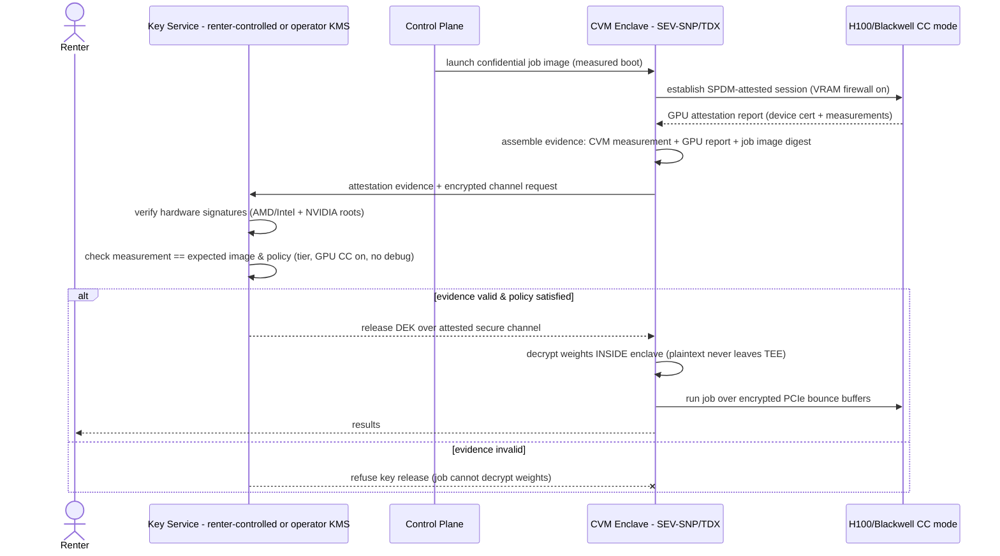

# Loom Security & Trust Model

This is the security keystone. Every other design document links here for the trust model, and this document does not repeat their mechanics — it states *what* must be true and *why*, and points to where each mechanism lives. [isolation.md](../platform/isolation.md) owns sandboxing internals; [host-agent.md](../platform/host-agent.md) owns the agent's lifecycle and metering; [serving.md](../ml-lifecycle/serving.md) owns the inference gateway; [marketplace.md](../product/marketplace.md) owns reputation, payouts, and work-verification economics.

Loom's defining constraint is that **supply runs on other people's machines**. That single fact splits security into two directions of trust that are equally first-class:

1. **Host-from-workload** — the host's machine must survive a malicious renter workload. This is sandboxing; mechanics live in [isolation.md](../platform/isolation.md).
2. **Renter-from-host** — the renter's data must survive a malicious host who owns the machine end to end. This is the hard direction, and it is the core of this document.

We do not pretend either direction is fully solved on consumer hardware. The value of Loom's trust model is that it is *honest per tier*: a renter can always tell exactly what a compromised host could do to their data, and the product UX never oversells it.

## 0. The hard truth, stated once

On a consumer GPU in a stranger's machine, **in-use encryption of renter data against the machine's owner is physically unavailable.** The owner sits at the bottom of the privilege stack — ring 0, hypervisor, firmware, and physical access to DRAM and the PCIe bus. Software running *above* an adversary in the privilege stack cannot hide a secret from that adversary. There is no software configuration of an ordinary RTX card that changes this.

The approaches that claim otherwise are dead ends we explicitly reject:

- **FHE / MPC** (computing on encrypted data) are real, but for dense ML workloads they are four to six orders of magnitude too slow — a fine-tune that takes an hour becomes months. Not a rounding error we can engineer away; a categorical mismatch.
- **White-box cryptography** and **weight obfuscation** attempt to hide a key or a model inside code the adversary fully controls. These are broken-by-design: every deployed white-box scheme of consequence has been extracted, because the adversary can single-step, dump memory, and diff. We will not ship security theater that a motivated host defeats in an afternoon.

The *only* mechanism that genuinely provides in-use confidentiality against the machine owner is hardware — a CPU TEE (AMD SEV-SNP / Intel TDX) paired with a confidential-computing GPU (NVIDIA H100/Blackwell). Consumer RTX cards have none of this silicon. That is why confidential compute is a **separate hardware tier (Tier C)**, not a feature flag on the mainstream marketplace. Everything before Tier C is structural privacy and hygiene, and we label it as exactly that.

---

## 1. Principals & assets

| Principal | Assets they own | What compromise costs them |
|---|---|---|
| **Renter** | Prompts / inference inputs; training datasets; **model weights** (often the crown jewel); API keys & platform credentials; job source code | Model theft, data leakage, prompt/PII exposure, credential replay, stolen compute |
| **Host** | Filesystem & personal data; LAN + other devices behind their router; **IP reputation** (blocklisting, abuse complaints); GPU/CPU/hardware (thermal, wear); their own account credentials | Machine takeover, lateral movement to home devices, IP getting a customer's traffic banned, hardware abuse, unpaid electricity |
| **Operator (Loom)** | Billing integrity & ledger; marketplace trust & brand; control-plane keys; the identity-linkage table (gateway) | Fraudulent payouts, ledger tampering, mass trust collapse, key compromise → fleet-wide job forgery, deanonymization breach |
| **End user** (a person using a *renter's* product built on Loom) | Their prompts/content flowing through a renter's app into Loom | Their data exposed on a host, even though they never chose Loom — the renter did on their behalf |

The end-user row is the one teams forget. A renter who builds a chatbot on Loom's serverless inference is a *data controller* for their users, and Loom is a sub-processor two hops down. Section 8 flags the GDPR reality of that chain honestly; Section 4's identity-stripping is what makes the middle hop defensible.

---

## 2. Threat model — Direction 1: malicious workload vs host

The renter's job is untrusted code running on the host's machine. The mechanics of containment — Tier B containers hardened with gVisor `runsc` + `nvproxy`, Tier A Cloud Hypervisor microVMs with VFIO passthrough — are specified in [isolation.md](../platform/isolation.md). This section only classifies the threats and, more importantly, names the ones that **isolation does not solve.**

**Attack classes isolation must contain** (see [isolation.md](../platform/isolation.md) for the defense of each):

- **Sandbox escape** → host root (container breakout, hypervisor CVE, GPU-driver escape via `nvproxy`/VFIO surface).
- **LAN pivot** — a job scanning `192.168.0.0/16`, hitting the host's router admin page, NAS, or other machines.
- **Resource abuse** — thermal/power abuse, VRAM exhaustion crashing the host's desktop, crypto-mining disguised as ML.
- **Data exfiltration from host** — reading the host's filesystem or credentials from inside the sandbox.

**What is NOT isolation's job** — these ship *through* a perfectly sound sandbox and need platform-level controls:

| Threat | Why isolation can't stop it | Mitigation (owner) |
|---|---|---|
| **Payment fraud / stolen-card compute** | A funded, sandboxed job is indistinguishable from a legitimate one at the isolation layer | Payment-risk scoring, hold-then-capture, velocity limits, chargeback reserves ([marketplace.md](../product/marketplace.md), §8) |
| **Free-compute abuse** (trial farming, credential-stuffed accounts) | Sandbox runs whatever it's told | **KYC-lite tiers**: anonymous accounts get tight egress + spend caps; verified accounts unlock more. Progressive trust, not a gate. |
| **Illegal content generation** (CSAM, targeted harassment, malware) | The bytes are just tensors to the sandbox | **Egress controls** (default-deny outbound, allowlisted registries — see below), model-level policy on serverless, and an **abuse-response process** (§8): report intake, rapid job kill, account ban, legal escalation |
| **The host's IP taking the blame** | The host's residential IP is the exit for job traffic | Egress proxying for risky classes so abuse attributes to *operator* infra, not the host's IP; per-job egress policy tied to the account's KYC tier |

**Egress posture** (default): job networking is **default-deny outbound**. Managed jobs reach only the object store (scoped, short-lived creds) and an operator-run package proxy (§7). General internet egress is an opt-in capability gated on account trust tier, and where granted for lower-trust accounts it routes through operator egress so the host's IP is never the abuse exit. This single policy neutralizes most of the "host's IP reputation" risk in the principals table.

---

## 3. Threat model — Direction 2: malicious host vs renter

This is the direction consumer hardware cannot win outright, so we state the adversary's full power before claiming any defense.

### 3.1 What a root + physical host owner can do (Tier A/B)

Assume the host is fully malicious: root on the machine, control of the hypervisor, a modified kernel, and physical access. At Tier A and Tier B, that host **can**:

- **Dump guest RAM.** A modified host kernel or hypervisor can read the sandbox's memory pages. Any renter plaintext resident in RAM — decrypted weights, dataset batches, activations — is readable. A microVM (Tier A) raises the effort (the attacker instruments the VMM or does a live-migration-style capture) but does not stop it; the host owns the VMM.
- **Snapshot VRAM.** On a consumer card with no confidential mode, GPU memory is readable from the host driver. Model weights and in-flight tensors can be pulled straight off the card.
- **MITM inside the node.** The host controls loopback, the sandbox's virtual NIC, and any bytes crossing the PCIe boundary. It can observe, replay, or alter traffic *inside* its own machine — including the sandbox's calls out to object storage before they hit Loom's encrypted transport.
- **Tamper with results.** The host can return garbage, a cheaper model's output, or fabricated training progress while billing for real work.

There is no software trick on this hardware that revokes these capabilities. Our job is to make each one either **structurally impossible to be useful** (identity-stripping), **economically unattractive** (ephemeral hygiene + result integrity), or **honestly disclosed** (tier labeling). We separate the three protections by the *strength* of guarantee they provide, and we never blur the line.

### 3.2 Protection 1 — Gateway identity-stripping — **STRUCTURAL**

**Guarantee: holds even against a fully malicious host.** This is the primary renter-from-host protection and applies to the **serverless inference product only** (full spec in §4).

The renter's identity — API key, account, source IP, billing linkage — **terminates at the operator-run gateway.** A serving host receives an anonymized prompt plus a one-time request ID and nothing else. Requests from one customer are scattered across many nodes, so no single host accumulates a coherent corpus tied to one buyer.

This does not encrypt the prompt (§4 limits). What it structurally guarantees is that a snooping host **cannot know whose data it is looking at.** A dumped prompt is an orphan: no key, no account, no way to correlate it across requests or sell "Customer X's traffic." The host's dump-VRAM capability is intact; its *value* is destroyed.

The guarantee is precisely about **linkage and identity, not content**: a malicious host still reads the prompt bytes; identity-stripping only denies it the *who*. Two residual re-linkage channels survive and are bounded, not eliminated: (a) **content self-identification** — a prompt whose text carries a stable identifier (a name, an API token echoed in-band, a distinctive corpus) re-links itself regardless of stripped headers, which is on the renter (§4 limits); and (b) **traffic/timing correlation** — an adversary observing arrival timing, request sizes, and per-node hit patterns can attempt to re-cluster one buyer's traffic across nodes. Request scattering (§4) raises the cost of (b); it does not make it information-theoretically impossible.

### 3.3 Protection 2 — Ephemeral everything — **HYGIENE (raises cost only)**

**Guarantee: defends against lazy / after-the-fact snooping. Does NOT defend against active memory dumping.** Full checklist in §5.

VRAM is scrubbed between tenants, scratch is `tmpfs`, no renter plaintext is ever written to the host's disk, and keys live only in guest RAM for the job's lifetime. This means a host who idly greps their disk after a job, or who resells the machine, or who cold-boots and picks through leftover storage, finds nothing.

It explicitly does **not** stop the adversary in §3.1 who is actively dumping live RAM/VRAM *during* the job. We say so, in the UX and here. Ephemerality raises the attacker's cost from "trivial, after the fact" to "must actively instrument a running job" — real, but a floor, not a ceiling.

### 3.4 Protection 3 — Honest tier labeling — **DISCLOSURE**

Every job and every serving route carries a visible trust tier. A renter running on Tier B sees, in plain language, that the workload executed on an unencryptable consumer card and that a malicious host could in principle have dumped its memory. A renter needing a real confidentiality guarantee is routed to (or told to request) **Tier C** (§6). The security model is only as good as the renter's understanding of it; burying the tier would make the honesty worthless. Marketplace UX for this is [marketplace.md](../product/marketplace.md); the `privacy: strict` flag that forces Tier C is in §4.

### 3.5 Result integrity — the host returns garbage or fakes work

Confidentiality is one axis; **correctness** is the other. A host that can't read your data can still lie about the work. Mitigations, layered:

- **Redundant spot-checking.** A fraction *p* of jobs (or job segments) is dispatched to a second, independent host and the outputs compared. Deterministic segments must match; stochastic ones must fall within tolerance.
- **Canary jobs.** Periodically inject jobs whose correct output is *known to the operator* but indistinguishable to the host from a real job. A host that fabricates results fails the canary and is caught without needing a second executor.
- **Loss-curve plausibility.** For training, the control plane checks the reported loss trajectory for physical plausibility — monotone-ish descent, sane gradient norms, no impossible jumps. Cheap, catches lazy fakery, defeated by a sophisticated adversary who simulates a believable curve (so it is a filter, not a proof).
- **Reputation stakes.** Detection feeds [marketplace.md](../product/marketplace.md): hosts post a stake / build reputation that is slashed or destroyed on a confirmed integrity failure. The point is to make one caught cheat cost more than a long tail of honest earnings.

**The sampling trade-off, quantified.** Redundant execution at rate *p* costs *p×* extra compute but bounds the fraction of undetected bad work. If a cheating host is caught with per-job probability *p* and one catch is terminal (stake slashed, banned), a rational host that cheats on fraction *c* of its jobs survives an expected *1/(p·c)* jobs before ejection. Set *p* so that the expected honest earnings before ejection are less than the stake at risk — then cheating is negative-EV even before we catch a specific instance. Concretely, canaries (near-free per job) let us push effective coverage up without paying full redundant-execution cost on every job; we reserve full duplication (large *p*) for high-value jobs and new/low-reputation hosts, and lean on canaries + plausibility for established ones. Exact numbers are a [marketplace.md](../product/marketplace.md) economics decision; the mechanism contract lives here.

---

## 4. Gateway identity-stripping — spec

Serverless inference only. The gateway is operator-run and is the single point where renter identity and host execution meet — and are severed.

**What is stripped** before a request leaves the gateway toward a node:

- API key and the account/organization it resolves to
- Source IP and all transport metadata (User-Agent, client headers)
- Billing linkage (the metering record stays gateway-side, keyed by an internal ID the node never sees)
- Any stable per-customer identifier

**What the node receives** (worked example):

Inbound to gateway:
```
POST /v1/chat/completions
Authorization: Bearer loom_sk_9f3a…            # real key
X-Forwarded-For: 203.0.113.44                   # renter IP
{ "model": "llama-3.1-70b", "messages": [ … ] }
```

Gateway → serving node:
```
{
  "request_id": "req_01J8Z…",   # one-time, unlinkable to account
  "model": "llama-3.1-70b",
  "trust_tier": "B",
  "privacy": "standard",
  "messages": [ … ]              # prompt text, verbatim
}
```

The node sees a model name, a tier, an orphan request ID, and the prompt. It cannot answer "who sent this?" or "what else did they send?"

**Request scattering.** Requests from a single account are load-balanced across the warm-node pool with an anti-affinity constraint: consecutive requests from the same customer are steered to *different* hosts where capacity allows. No host accumulates one buyer's conversation. (This trades against KV-cache prefix reuse; the policy caps how much continuity any one host gets, it does not forbid warm-cache hits entirely — a [serving.md](../ml-lifecycle/serving.md) tuning knob.)

**Logging discipline — we become the honeypot.** Identity-stripping *moves* the linkage; it doesn't delete it. The gateway holds the map from request ID → account (we need it for billing and abuse response), which makes the gateway the single most sensitive store in the system. We treat it as such:

- Linkage records are **encrypted at rest** with keys in KMS, separate from the ledger.
- **Short retention** — linkage is purged on a fixed short window (long enough for billing reconciliation and abuse investigation, no longer).
- **Access audit** — every read of the linkage table is logged and alertable; no standing human access, break-glass only.
- Prompt *content* is **not** logged at the gateway by default; metering records payload sizes and token counts, not text.

**Limits — stated plainly:**

- The serving host **sees the prompt text.** Identity-stripping hides *who*, not *what*. A prompt that contains "my name is Jane Doe, SSN …" leaks that PII to the host regardless — because the **PII is user-controlled content inside the payload**, which no amount of header-stripping touches.
- The renter is responsible for what they put in prompts. For workloads where the *content itself* is sensitive (not just the identity), standard-tier serving is the wrong tool.
- **Result integrity applies here too.** A serving host can also *tamper with the response* — return a cheaper model's output, inject content into the token stream, or degrade quality while billing for the advertised model. Identity-stripping does nothing against this. The §3.5 integrity machinery is the defense: canary requests with operator-known expected outputs, spot-check re-execution of a sampled fraction on a second node, and reputation stakes. Per-request streaming makes deterministic byte-matching harder than in batch jobs, so serverless leans on canaries + output-distribution/quality plausibility rather than exact-match comparison.
- **`privacy: strict`** on a request routes it to **Tier C only** (§6) — the sole configuration where the content is protected from the host. If no Tier C capacity is available, a `strict` request fails closed rather than silently falling back to a snoopable node.

---

## 5. Ephemeral-everything — spec

Hygiene layer (§3.3): raises the cost of after-the-fact snooping. Applies to both products at Tier A/B. Each item names what it defends and where it stops.

| Step | Mechanism | Defends against | Explicit non-goal |
|---|---|---|---|
| **VRAM zeroing** | On tenant teardown, agent runs a device-memory wipe: allocate-and-overwrite the full VRAM span (or `cudaMemset`/vendor scrub across all free + just-freed regions), then **verify** by reading back a sampled set of pages and asserting zero before the card is re-advertised as free | Next tenant (or the host) scraping *residual* weights/tensors from the previous job | Does not stop the host reading VRAM *during* the previous job |
| **tmpfs scratch** | All job scratch is RAM-backed `tmpfs`; nothing renter-owned touches a persistent block device | Post-job disk forensics; machine resale leaking data | RAM contents are still dumpable live |
| **No plaintext on host disk** | Datasets stream from object store into the sandbox; checkpoints write *out* to object store (content-addressed), never to host-local persistent storage | Cold-storage leakage, backup capture, drive theft | — |
| **Page-cache containment** | Because scratch is `tmpfs` and inputs are streamed, there is minimal host **page cache** holding renter file data; where unavoidable, we prefer `O_DIRECT`/uncached paths for renter data so it doesn't linger in host kernel caches after the job | Renter bytes surviving in the host's page cache after teardown | Kernel-resident data is readable by a malicious kernel while live |
| **Swap disabled in sandbox** | The guest/container is configured with swap off so renter memory is never paged to a host-visible backing store | Renter RAM being spilled to disk as plaintext by memory pressure | — |
| **Encrypted spill only** | If a workload genuinely must spill (e.g. optimizer offload), spill goes to an **encrypted** ephemeral volume whose key lives only in guest RAM and dies with the job | A spilled tensor being readable at rest | The key is in guest RAM, which a live host can dump |
| **Key lifecycle** | Any decryption keys (dataset creds, `privacy:strict` DEKs, spill keys) exist **only in guest RAM** for the job's lifetime, are never written to host disk, never logged, and are wiped on teardown | Key persistence / reuse across tenants | A live memory dump captures keys in use — this is why keys-in-RAM is hygiene, not a TEE |

**Overall non-goal, restated:** ephemeral-everything is defense against a **passive or after-the-fact** adversary. Against the active adversary of §3.1 it raises cost, nothing more. Only Tier C changes the guarantee class.

---

## 6. Tier C — confidential computing (phase 4)

Tier C is the only tier that provides **in-use confidentiality against the machine's owner**, and it requires hardware consumer rigs do not have. It is a distinct supply pool, not a checkbox on a gaming PC.

### 6.1 Architecture

- **CPU TEE:** the sandbox is a confidential VM on **AMD SEV-SNP** or **Intel TDX** — guest memory is hardware-encrypted and integrity-protected, opaque to the host hypervisor and to a host kernel. Both are supported as CVM guests in the ecosystem Loom already uses: **QEMU 10.1** ships TDX and SEV-SNP guest launch (IGVM-packaged firmware, plus VFIO device support for confidential guests) ([QEMU 10.1 release notes, Phoronix](https://www.phoronix.com/news/QEMU-10.1-Released); [QEMU TDX docs](https://www.qemu.org/docs/master/system/i386/tdx.html)), and **Cloud Hypervisor** launches SEV-SNP guests on KVM and MSHV using `guest_memfd`-backed private memory and IGVM firmware, with measured-boot parity to QEMU ([Cloud Hypervisor mshv docs](https://github.com/cloud-hypervisor/cloud-hypervisor/blob/main/docs/mshv.md)). TDX support in Cloud Hypervisor is less mature than SEV-SNP as of mid-2026 — *[unverified: exact Cloud Hypervisor TDX GA status; treat SEV-SNP as the lead path and TDX as tracking].*
- **GPU CC:** **NVIDIA H100 (Hopper)** was the first GPU with confidential computing — it boots into a mode where a hardware firewall blocks host access to VRAM and the on-die engines, establishes an SPDM-attested session, and moves data across PCIe through **encrypted bounce buffers** (host↔GPU DMA is encrypted and integrity-checked; plaintext exists only inside the GPU's protected memory) ([NVIDIA CC on H100 blog](https://developer.nvidia.com/blog/confidential-computing-on-h100-gpus-for-secure-and-trustworthy-ai/); [NVIDIA Hopper CC whitepaper](https://images.nvidia.com/aem-dam/en-zz/Solutions/data-center/HCC-Whitepaper-v1.0.pdf)).
- **Multi-GPU reality:** Hopper *does* support multi-GPU confidential computing via **Protected PCIe (PPCIe)** mode (HGX H100/H200 8-GPU), but PPCIe **leaves GPU-to-GPU NVLink traffic unencrypted** — NVIDIA deliberately removed NVLink encryption there for performance — so an HGX H100 box cannot form a *hardware-encrypted* cross-GPU confidential memory pool: inter-GPU P2P is a plaintext exposure to anyone tapping the NVLink/NVSwitch fabric. **Blackwell** fixes this with TEE-I/O and hardware-encrypted NVLink under **MPT CC** (Multi-GPU Passthrough Confidential Computing), enabling attested 1/2/4/8-GPU confidential configurations with an end-to-end-encrypted P2P domain ([NVIDIA Blackwell architecture](https://www.nvidia.com/en-us/data-center/technologies/blackwell-architecture/); [Blackwell platform announcement](https://nvidianews.nvidia.com/news/nvidia-blackwell-platform-arrives-to-power-a-new-era-of-computing)). Loom's first Tier C target is therefore **single-GPU H100** confidential jobs — where no cross-GPU NVLink exposure exists — with hardware-encrypted multi-GPU confidential arriving on Blackwell.

### 6.2 Attestation + key-release flow

The trust primitive is: **the renter (or a key service acting for them) releases the weight-decryption key only after verifying a hardware-signed measurement of the exact enclave that will run the job.** Attestation *also* solves work verification on this tier — a measurement that matches the expected job image is proof the right code ran on genuine confidential hardware, so the §3.5 spot-checking machinery is not needed at Tier C.



The weights arrive at the host **encrypted**; without a passing attestation the enclave never obtains the DEK, so a malicious host that swapped the image, disabled GPU CC, or ran on a spoofed platform simply gets ciphertext it cannot use.

### 6.3 What changes for the GPU

Versus a normal VFIO passthrough (Tier A): the GPU boots in CC mode with the **VRAM firewall** engaged (host cannot read device memory), all host↔GPU DMA crosses **encrypted bounce buffers**, and the session is **SPDM-attested** so the enclave knows it's talking to a genuine, correctly-configured GPU rather than a host-emulated shim. Plaintext weights and activations exist only inside GPU-protected memory and inside the CVM.

### 6.4 Honest bar & attack history

TEEs raise the bar from "any host root can dump your data" to "an adversary must defeat the hardware." That bar is **not infinite**, and we state it:

- **Attack history (one line):** CPU TEEs have a live research literature of side-channel and physical attacks — ciphertext side-channels on deterministic memory encryption, controlled-channel / access-pattern leaks, and hardware attacks such as **BadRAM** memory aliasing and the 2025 **TEE.fail** sub-$1,000 DDR5 memory-bus interposer that extracted secrets from SGX/TDX/SEV-SNP enclaves ([TEE.fail, The Hacker News](https://thehackernews.com/2025/10/new-teefail-side-channel-attack.html); [BadRAM](https://badram.eu/badram.pdf); [CounterSEVeillance, NDSS 2025](https://www.ndss-symposium.org/wp-content/uploads/2025-1038-paper.pdf)). Note this reaches our stack directly: TEE.fail forged valid attestation quotes by extracting the CPU-TEE provisioning key, and because NVIDIA GPU-CC attestation chains to the CPU-TEE root (§6.2), a forged CPU quote can undermine the GPU key-release decision as well — the attestation flow is only as strong as the weakest root it composes.
- **Our bar, stated to renters:** Tier C protects against a **snooping operator or a software-level malicious host** — the realistic Loom threat. It does **not** promise protection against a nation-state physical lab with a DRAM interposer on the specific machine your job landed on. A renter whose threat model includes that adversary should not run on a rented machine at all. We will not market Tier C as unbreakable.

### 6.5 Hardware sourcing reality

Tier C supply is **not gaming rigs.** SEV-SNP/TDX CPUs plus H100/Blackwell GPUs mean this tier is populated by **small operators, colocation tenants, and prosumers with datacenter-class hardware** — a different, smaller supply pool than the consumer marketplace, priced accordingly. Loom's role is to make that hardware *attestable and rentable* through the same control plane, not to conjure confidential capability onto RTX cards. The protocol reserves `trust_tier` and attestation fields from day one (§7) so Tier C slots into the existing wire format without a breaking change.

---

## 7. Platform security

The operator layer is small, but its compromise blast radius is the whole fleet. Controls:

- **Agent binary signing + update channel.** The Rust host agent ([host-agent.md](../platform/host-agent.md)) is distributed as a **signed** artifact; the updater verifies the signature against a pinned operator public key before applying any update, over TLS, with rollback protection (monotonic version, no downgrade). A compromised mirror cannot ship a trojaned agent without the signing key.
- **mTLS identity.** Every agent↔control-plane and agent↔gateway link is **mutually authenticated** — the agent presents a per-enrollment client certificate, the control plane presents its own. No unauthenticated node can join the fleet or receive jobs; a stolen agent identity is revocable.
- **Control-plane compromise blast radius — signed job manifests.** The nightmare is a control-plane / database compromise that lets an attacker push arbitrary jobs to every host (mass CSAM generation, crypto-mining, a fleet-wide exfiltration payload). Mitigation: **agents accept only job manifests signed by a control-plane job-signing key held in an HSM/KMS**, separate from the application database. The agent verifies the signature before launching anything. An attacker who pops the Postgres jobs table but not the HSM can corrupt records but **cannot forge a runnable manifest** — the blast radius of a DB breach is bounded to data integrity, not fleet-wide code execution. (This same signature is the enforcement point for `trust_tier` — a manifest can't lie about the tier it's authorized for.)
- **Secrets handling.** Renter secrets (dataset creds, model registry tokens, `privacy:strict` DEKs) are injected via a **sealed channel** directly into the sandbox's environment at launch — never written to host disk, never logged, never surfaced in job manifests or heartbeats. They live only in guest RAM (§5 key lifecycle) and die with the job.
- **Supply chain — curated images.** Managed jobs run **curated runtime images only** at launch ([environments.md](../ml-lifecycle/environments.md)): images are built by the operator, published with **pinned digests**, ship an **SBOM**, and are **vulnerability-scanned** in CI before promotion. The agent verifies the digest before running (per Flow A in [overview.md](../architecture/overview.md)).
- **Package-proxy policy for jobs.** Jobs that pull Python/JS dependencies do so through an **operator-run PyPI/npm proxy** (default-deny egress means they can't reach the public index directly). The proxy enforces allowlisting / known-good pinning and caches, which blocks typosquat and dependency-confusion attacks from executing on a host and keeps the host's IP out of the dependency-fetch path.

---

## 8. Compliance & policy skeleton

Brief but present — the full policy documents are product deliverables; this is the security-relevant skeleton.

- **Acceptable Use Policy (AUP).** Prohibited workloads: CSAM and other illegal content, targeted harassment, malware/exploit development, unauthorized intrusion/DDoS tooling, and non-ML abuse (e.g. undisclosed crypto-mining under an ML tier). AUP is enforced via §2 egress controls, serverless model-policy, and the abuse-response process.
- **DMCA / abuse handling.** A published intake channel, a defined SLA for takedown/kill, the ability to **kill a running job and ban an account fast**, and repeat-infringer termination. Because hosts' IPs can attract complaints, abuse response must be able to sever a job at the control plane without depending on the host.
- **Data-processing reality — consumer tier.** This must be said plainly: **on Tier A/B (consumer cards), Loom cannot offer a confidentiality guarantee against the host, so it cannot honestly sign a data-processing addendum that promises one.** Renters processing **personal data** (GDPR/CCPA-regulated) on the consumer tier are exposing that data to unencryptable execution on third-party machines — for many lawful bases that is **not defensible**, and we will flag it in-product rather than let a renter assume otherwise. Personal-data workloads with a real compliance requirement belong on **Tier C**, where an attestable enclave supports an honest DPA and sub-processor story. The end-user principal (§1) inherits this: a renter's users' data flowing through standard-tier serving is exposed to serving hosts (§4 limits) — `privacy: strict` → Tier C is the compliant path.
- **Payment-fraud controls.** Card-risk scoring, hold-then-capture, spend velocity limits per KYC tier, chargeback reserves, and linkage to the abuse process so a fraud signal can freeze compute. Detail in [marketplace.md](../product/marketplace.md).

---

## 9. Residual-risk register

The table a principal engineer signs. Each row is an **accepted** risk given the tier's hardware, with its mitigation and residual severity.

| # | Risk | Tier | Mitigation | Residual severity | Status |
|---|---|---|---|---|---|
| R1 | Malicious host dumps guest RAM / VRAM during a job (reads weights, data) | A / B | None possible on this HW; ephemeral hygiene + tier labeling; route sensitive → Tier C | **High** (confidentiality lost vs active host) | Accepted, disclosed |
| R2 | Prompt content (incl. user PII) visible to serving host | B (serverless) | Identity-stripping removes *who*; `privacy:strict`→Tier C for *what* | **Medium** | Accepted, disclosed |
| R3 | Host returns fabricated / low-quality results | A / B | Redundant spot-check, canaries, loss-curve checks, reputation stakes (§3.5) | **Low–Medium** (bounded by sampling *p* + stake) | Mitigated |
| R4 | Sandbox escape → host compromise | A / B | gVisor/nvproxy (B), CH+VFIO microVM (A) — [isolation.md](../platform/isolation.md) | **Medium** (B) / **Low** (A) | Mitigated |
| R5 | Gateway linkage table breach (deanonymization) | Operator | Encrypt-at-rest, short retention, access audit, break-glass only (§4) | **Medium** | Mitigated |
| R6 | Control-plane/DB compromise → fleet-wide malicious jobs | Operator | HSM-signed job manifests; agent verifies (§7) | **Medium** (bounded to data integrity) | Mitigated |
| R7 | Payment fraud / stolen-card compute | All | KYC-lite tiers, risk scoring, egress via operator (§2, §8) | **Medium** | Mitigated |
| R8 | Host IP blamed for renter abuse | A / B | Default-deny egress; risky classes via operator egress | **Low** | Mitigated |
| R9 | Tier C hardware attack (TEE.fail/BadRAM-class physical incl. forged CPU-TEE attestation reaching the GPU key-release chain) | C | Out of scope vs nation-state physical; honest bar (§6.4); attestation is only as strong as its weakest composed root | **Low** (narrow adversary) | Accepted, disclosed |
| R10 | Trojaned agent / malicious update | Host | Signed binary, pinned key, no-downgrade, mTLS (§7) | **Low** | Mitigated |
| R11 | Supply-chain (dependency confusion, poisoned image) | A / B | Curated digest-pinned images, SBOM+scan, package proxy (§7) | **Low** | Mitigated |
| R12 | Traffic/timing correlation re-links a buyer's scattered requests (defeats identity-stripping) | B (serverless) | Request scattering raises cost only; not information-theoretic (§3.2, §4) | **Low–Medium** | Accepted, disclosed |
| R13 | Serving host tampers with the response / token stream (wrong model, injected or degraded output) | B (serverless) | Canaries + spot-check re-execution + quality plausibility + reputation stakes (§3.5, §4) | **Low–Medium** (bounded by sampling + stake) | Mitigated |

The load-bearing acceptance is **R1**: on consumer hardware, confidentiality against an active malicious host is *not* achieved, only cost-raised and disclosed. Any renter whose threat model does not tolerate R1 must use Tier C. This is the honest bottom line of the whole trust model.

---

## 10. Open questions

- **Model sharding across hosts.** Deferred. Splitting a model across multiple hosts so no single host holds the whole model is an appealing renter-from-host protection (a host that can't reconstruct the weights can't steal them). But it multiplies the failure surface over residential links (contradicting whole-model-per-node in [serving.md](../ml-lifecycle/serving.md)), leaks structure/activations across the shard boundary, and doesn't by itself stop collusion. Open: is there a sharding scheme whose confidentiality gain justifies the availability and complexity cost, and does it beat simply using Tier C?
- **Result-integrity sampling rate.** What are the actual *p* values (redundant-execution rate) and canary frequencies per host-reputation band that make cheating negative-EV without pricing Loom out of the market? A [marketplace.md](../product/marketplace.md) economics calibration.
- **Request-scattering vs KV-cache efficiency.** How hard can we scatter one customer's requests across hosts (privacy) before we lose too much prefix-cache reuse (cost/latency)? Needs a measured trade-off in [serving.md](../ml-lifecycle/serving.md).
- **Cloud Hypervisor TDX maturity.** SEV-SNP is the confirmed lead path for Tier C on Cloud Hypervisor; TDX guest support maturity there needs re-checking before we commit a TDX-first Tier C. *[unverified as of mid-2026.]*
- **Attestation-gated custom images.** Can Tier C attestation be the escape valve for the curated-image restriction (§7) — i.e. allow renter custom images *only* on the attested tier, where the measurement proves what ran? This ties the [environments](../ml-lifecycle/environments.md) graduation path to the trust tier.
- **`privacy: strict` capacity.** `strict` fails closed if no Tier C node is free (§4). What's the right supply-provisioning and queuing model so failing closed doesn't make the strict tier unusable in practice?
